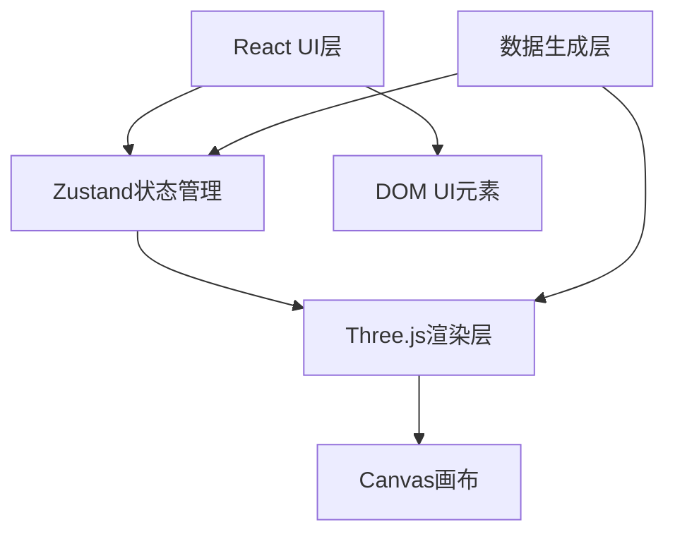

## 1. 架构设计



## 2. 技术说明
- **前端框架**：React@18 + TypeScript
- **构建工具**：Vite
- **3D引擎**：Three.js@0.162
- **状态管理**：Zustand
- **样式方案**：原生CSS + CSS变量
- **图标**：lucide-react

## 3. 项目结构
```
src/
├── App.tsx              # 根组件
├── store/
│   └── useStore.ts      # Zustand全局状态
├── data/
│   └── weatherGenerator.ts  # 气象数据生成
├── three/
│   ├── SceneManager.ts  # 3D场景管理
│   └── ParticleSystem.ts # 粒子系统
└── ui/
    ├── ControlPanel.tsx # 左侧控制面板
    ├── NavBar.tsx       # 顶部导航栏
    └── InfoPopup.tsx    # 信息弹窗
```

## 4. 核心模块说明

### 4.1 状态管理 (Zustand)
- 温度等级（-10°C ~ 40°C）
- 湿度等级（0% ~ 100%）
- 风力等级（0 ~ 12级）
- 当前时间（实时更新）
- 数据源（城市A/城市B）
- 温度单位（°C/°F）
- 播放状态
- 选中网格信息

### 4.2 数据生成模块
- `getGridData()`：返回温度、湿度、风向、风速矩阵
- `getHourlyForecast(gridX, gridY)`：返回指定网格2小时预报数据
- 纯函数，无渲染逻辑，可独立测试

### 4.3 渲染模块
- `SceneManager`：场景、相机、灯光、地形网格管理
- `ParticleSystem`：风力粒子生成、更新、销毁
- `updateWeather(params)`：接收数据参数更新视觉效果

### 4.4 UI组件
- `ControlPanel`：左侧控制面板，滑块与按钮
- `NavBar`：顶部导航栏，图标按钮
- `InfoPopup`：双击网格弹出的信息面板

## 5. 性能优化
- 粒子数量上限3000，动态LOD
- 地形使用PlaneGeometry，顶点着色
- 使用BufferGeometry和PointsMaterial
- requestAnimationFrame统一渲染循环
- 粒子池复用，避免频繁GC
