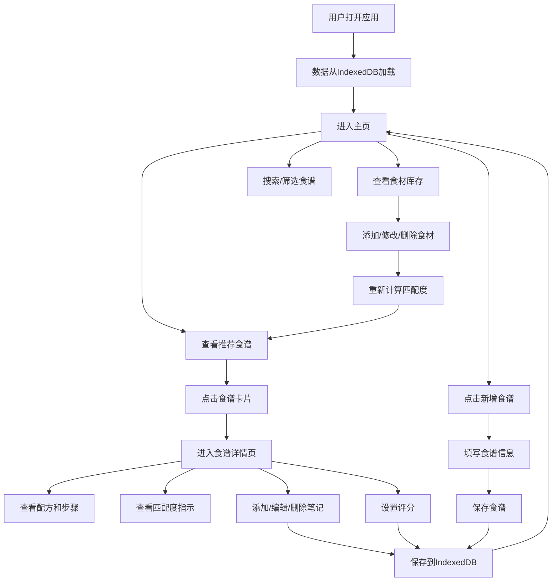

## 1. 产品概述

BakeMate是一款面向烘焙爱好者的在线食谱管理与智能推荐工具，帮助用户统一管理配方、记录个人制作心得和评分，并根据手边现有食材智能推荐可用食谱。

- **目标用户**：社区内的烘焙爱好者，需要管理个人食谱库并希望获得智能推荐
- **核心价值**：解决烘焙配方分散、制作记录缺失、食材利用效率低的痛点

## 2. 核心功能

### 2.1 功能模块

1. **主页**：食材库存面板、智能推荐食谱卡片流、快速添加按钮、搜索与筛选
2. **食谱详情页**：完整配方展示、制作步骤、个人笔记区、评分滑块、食材匹配度指示
3. **所有食谱页**：食谱分类浏览、全部食谱列表

### 2.2 页面详情

| 页面名称 | 模块名称 | 功能描述 |
|-----------|-------------|---------------------|
| 主页 | 食材库存面板 | 展示、添加、删除、更新库存食材（名称+数量+单位），带+/-按钮调节数量 |
| 主页 | 推荐食谱卡片流 | 按匹配度从高到低展示食谱卡片，完全匹配显示"可制作"徽章 |
| 主页 | 搜索与筛选栏 | 模糊匹配食谱名称或分类，分类下拉筛选器，实时更新结果 |
| 主页 | 快速添加按钮 | 一键跳转到新增食谱表单 |
| 食谱详情页 | 配方展示区 | 展示食谱照片、名称、分类、难度星级、预估时间、食材列表、制作步骤 |
| 食谱详情页 | 食材匹配度指示条 | 显示当前库存与食谱所需食材的匹配百分比 |
| 食谱详情页 | 笔记区 | 支持添加/编辑/删除制作心得笔记（最多500字），时间倒序展示 |
| 食谱详情页 | 评分滑块 | 1-5星半星粒度评分，拖动时实时显示数值并保存 |
| 所有食谱页 | 食谱列表 | 展示全部食谱，支持分类筛选 |

## 3. 核心流程

### 3.1 主要用户流程

用户打开应用后，可在主页查看食材库存和推荐食谱。用户可以管理库存食材，系统实时计算并更新推荐列表（按匹配度排序）。用户点击食谱卡片进入详情页，查看完整配方、记录笔记和评分。用户也可以创建新食谱，填写各项信息后保存，新食谱自动出现在主页卡片流中。

### 3.2 流程图

## 4. 用户界面设计

### 4.1 设计风格

- **主色调**：暖橙棕色系，主背景#FFF8F0，卡片#FFFFFF，边框浅棕#D4A373，强调色#C1121F
- **按钮样式**：圆角设计，强调色按钮带有微阴影，hover时有缩放反馈
- **字体**：使用Inter字体，标题加粗，正文常规字重
- **布局风格**：卡片式布局，顶部导航（毛玻璃效果），左侧固定侧边栏+右侧内容网格
- **图标风格**：使用emoji图标（面包🍞等），简洁直观

### 4.2 页面设计概览

| 页面名称 | 模块名称 | UI元素 |
|-----------|-------------|-------------|
| 主页 | 顶部导航栏 | 高度56px，半透明毛玻璃（backdrop-blur:10px），Logo+导航链接 |
| 主页 | 食材库存面板 | 宽度280px固定侧边栏，背景#FEF0E6，圆角12px，食材条目带+/-按钮 |
| 主页 | 推荐食谱网格 | 2列响应式grid（minmax(300px, 1fr)），gap:24px |
| 主页 | 食谱卡片 | 悬停上浮10px+阴影扩散+微旋转(-2deg)，0.3s ease-out过渡 |
| 食谱详情页 | 页面转场 | 从右向左滑入（translateX(100%)→0），0.4s cubic-bezier |
| 食谱详情页 | 评分滑块 | 轨道渐变色#E63946→#2A9D8F，滑块圆点带光晕效果 |
| 食谱详情页 | 笔记条目 | 左侧显示静态星标和日期，背景微黄 |

### 4.3 响应式设计

- 桌面端优先设计，侧边栏固定宽度280px
- 中等屏幕（<1024px）：食谱网格改为单列
- 移动端（<640px）：侧边栏改为可折叠抽屉，导航简化

### 4.4 动画与交互

- 所有交互在200ms内给出视觉反馈（颜色变化、缩放或过渡动画）
- 搜索筛选结果带淡入过渡动画
- 卡片悬停：上浮+阴影扩散+微旋转
- 页面切换：右向左滑入动画，保持60FPS
