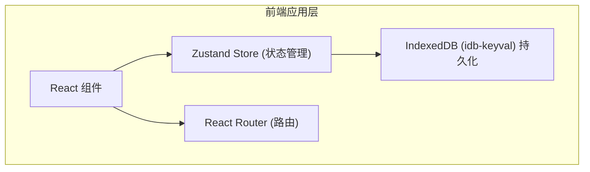
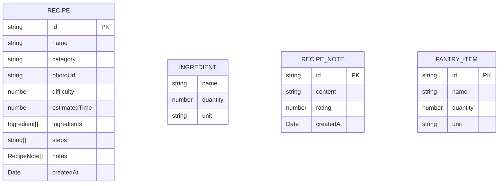

## 1. 架构设计



## 2. 技术栈说明

- **前端框架**：React@18 + ReactDOM@18
- **构建工具**：Vite（路径别名@配置）
- **语言**：TypeScript（严格模式，ESNext模块）
- **状态管理**：Zustand
- **路由**：React Router DOM@6
- **数据持久化**：IndexedDB（idb-keyval库）
- **工具库**：uuid（唯一ID生成）
- **字体**：@fontsource/inter

## 3. 路由定义

| 路由 | 用途 |
|-------|---------|
| / | 主页：食材库存面板 + 推荐食谱卡片流 + 搜索筛选 |
| /recipes | 所有食谱页：分类浏览全部食谱 |
| /recipes/:id | 食谱详情页：完整配方 + 笔记 + 评分 |
| /recipes/new | 新增食谱页：表单创建新食谱 |

## 4. 数据模型

### 4.1 数据模型定义



### 4.2 TypeScript类型定义

```typescript
interface Ingredient {
  name: string;
  quantity: number;
  unit: string;
}

interface RecipeNote {
  id: string;
  content: string;
  rating: number;
  createdAt: string;
}

interface Recipe {
  id: string;
  name: string;
  category: string;
  photoUrl: string;
  difficulty: number;
  estimatedTime: number;
  ingredients: Ingredient[];
  steps: string[];
  notes: RecipeNote[];
  createdAt: string;
}

interface PantryItem {
  id: string;
  name: string;
  quantity: number;
  unit: string;
}
```

## 5. 文件结构与调用关系

```
src/
├── App.tsx                      # 根组件，组合导航+路由，注入全局样式
├── store/
│   └── recipeStore.ts          # Zustand状态仓库（食谱/库存/推荐逻辑）
├── pages/
│   ├── HomePage.tsx            # 主页组件
│   ├── AllRecipesPage.tsx      # 所有食谱页
│   ├── RecipeDetailPage.tsx    # 食谱详情页
│   └── NewRecipePage.tsx       # 新增食谱页
├── components/
│   ├── Navbar.tsx              # 顶部导航栏
│   ├── RecipeCard.tsx          # 食谱卡片
│   ├── RecipeDetail.tsx        # 食谱详情（内容组件）
│   ├── PantryPanel.tsx         # 食材库存面板
│   ├── SearchFilter.tsx        # 搜索筛选栏
│   └── NoteItem.tsx            # 笔记条目
└── types/
    └── index.ts                # 类型定义
```

### 调用关系与数据流向

1. **App.tsx** → 导入并渲染 Navbar、Router、初始化store数据
2. **各页面组件** → 通过 `useRecipeStore()` 订阅状态，调用actions修改数据
3. **recipeStore.ts** → 内部调用 idb-keyval 与 IndexedDB 同步，计算推荐匹配度
4. **RecipeCard.tsx** ← 接收 recipe 对象，点击时触发路由跳转
5. **RecipeDetail.tsx** ← 接收 recipeId，从 store 获取详情，渲染笔记和评分
6. **PantryPanel.tsx** ← 从 store 获取 pantry 列表，调用 actions 增删改食材
7. **SearchFilter.tsx** → 将搜索词和筛选分类传回 HomePage 过滤卡片流

**数据流向**：UI组件 → 调用store actions → 更新内存状态 → 自动持久化到IndexedDB → 订阅组件重新渲染
