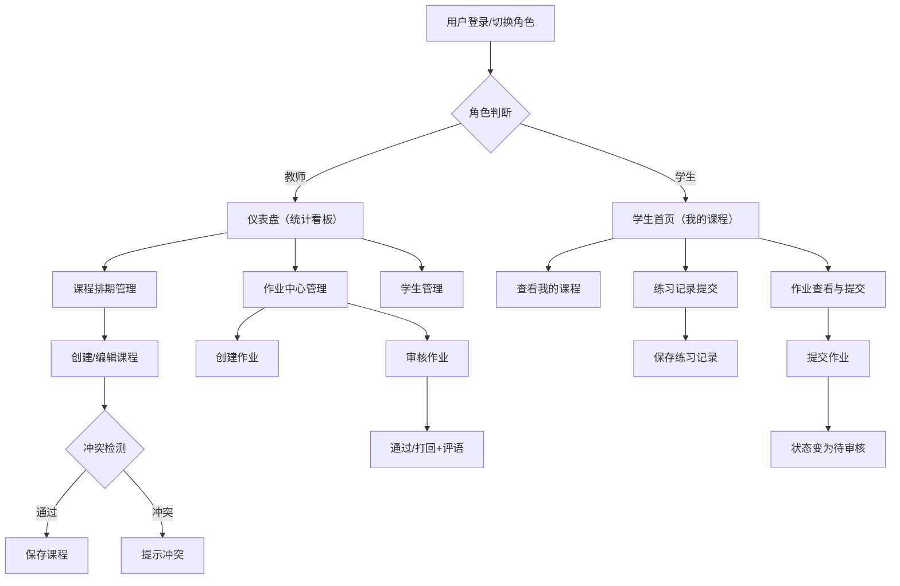

## 1. 产品概述

TuneTracker 是一款面向社区音乐教学场景的管理应用，帮助音乐老师和学生高效协调上课时间、记录练习进度并管理课后作业，解决传统微信沟通和纸质记录混乱且缺乏规划的问题。

- **目标用户**：音乐教师（教师端）和音乐学生（学生端）
- **核心价值**：统一的教学管理平台，提升教学效率和学习体验
- **部署方式**：纯前端应用，数据本地持久化，无需后端服务

## 2. 核心功能

### 2.1 用户角色

| 角色 | 登录方式 | 核心权限 |
|------|----------|----------|
| 教师 | 模拟用户切换 | 课程排期管理、作业下发与批改、学生管理、统计看板查看 |
| 学生 | 模拟用户切换 | 课程查看、练习记录提交、作业查看与提交 |

### 2.2 功能模块

1. **仪表盘**：本周课程概览、待批改作业、练习时长统计、学习数据看板
2. **课程排期**：月历视图、课程创建/编辑/删除、冲突检测
3. **学生管理**：学生列表、学生详情、练习记录查看
4. **作业中心**：作业下发、作业提交、作业审核（通过/打回）

### 2.3 页面详情

| 页面名称 | 模块名称 | 功能描述 |
|----------|----------|----------|
| 仪表盘 | 统计卡片 | 展示本周上课总时长、作业通过率、活跃学生数三个核心指标 |
| 仪表盘 | 本周课程列表 | 展示本周所有课程卡片，含学生姓名、乐器类型、课程时长 |
| 仪表盘 | 练习时长折线图 | 过去30天累计练习时长变化趋势，带hover提示和渐变填充 |
| 课程排期 | 月历视图 | 按月展示课程分布，支持月份切换 |
| 课程排期 | 课程创建 | 点击日期创建课程，自动检测时间冲突 |
| 课程排期 | 课程编辑 | 点击已有课程编辑详情 |
| 学生管理 | 学生列表 | 展示所有学生卡片/列表 |
| 学生管理 | 学生详情面板 | 查看选中学生的练习记录和作业提交状态 |
| 作业中心 | 作业列表 | 展示所有作业，按状态分类 |
| 作业中心 | 作业创建 | 教师创建新作业，含标题、描述、截止日期、附件 |
| 作业中心 | 作业审核 | 教师查看提交作业，通过或打回并填写评语 |

## 3. 核心流程

### 3.1 教师排课流程
教师进入课程排期页面 → 在月历中选择日期 → 填写课程信息（学生、乐器、时长） → 系统检测时间冲突 → 无冲突则保存课程 → 课程显示在日历上

### 3.2 学生练习记录流程
学生切换用户登录 → 进入练习记录 → 填写练习时长、自评星级 → 可选上传音频/文字笔记 → 保存记录 → 记录显示在时间轴上

### 3.3 作业流转流程
教师创建作业 → 分配给学生 → 学生查看待完成作业 → 学生提交作业 → 状态变为待审核 → 教师审核（通过/打回+评语）→ 学生查看结果

### 3.4 核心流程Mermaid图

## 4. 用户界面设计

### 4.1 设计风格
- **整体风格**：柔和哑光暖色调，温暖舒适的学习氛围
- **主背景色**：#F9F4EF（米白色）
- **主文字色**：#2D2A32（深棕灰）
- **强调色**：#D98A4A（暖橙色，用于按钮、链接、进度指示器）
- **侧边栏背景**：#4A3B32 到 #6B5847 垂直渐变
- **卡片样式**：白色背景，圆角16px，box-shadow: 0 2px 12px rgba(0,0,0,0.06)

### 4.2 页面设计概述

| 页面名称 | 模块名称 | UI元素 |
|----------|----------|--------|
| 全局布局 | 侧边栏 | 240px宽，渐变背景，白色文字，4px激活左边框 |
| 全局布局 | 顶部导航 | 毛玻璃效果，用户头像切换，通知铃铛 |
| 全局布局 | 内容区域 | 卡片式布局，卡片间距24px |
| 仪表盘 | 统计卡片 | 三张核心指标卡片，数值+副标题+图标 |
| 仪表盘 | 折线图 | 渐变填充区域，点状hover提示 |
| 课程排期 | 月历 | 月视图网格，课程色块标记 |
| 学生管理 | 学生列表 | 卡片/列表双视图，头像+姓名+乐器 |
| 作业中心 | 作业列表 | 按状态分组，进度指示 |

### 4.3 响应式设计
- **桌面端**：左侧固定侧边栏240px + 右侧内容区
- **移动端**（<768px）：侧边栏折叠为底部标签栏（60px高，图标+文字），内容区全宽单列
- **交互优化**：所有页面切换和状态变化带0.3秒ease-in-out过渡动画
- **悬停效果**：列表行悬停背景色变为#FEF5E7

### 4.4 交互动效
- 页面切换：0.3秒ease-in-out过渡
- 模态框弹出：缩放+淡入动画
- 通知红点：2秒周期脉冲动画
- 用户菜单：0.2秒透明度过渡
- 卡片展开：平滑高度过渡
