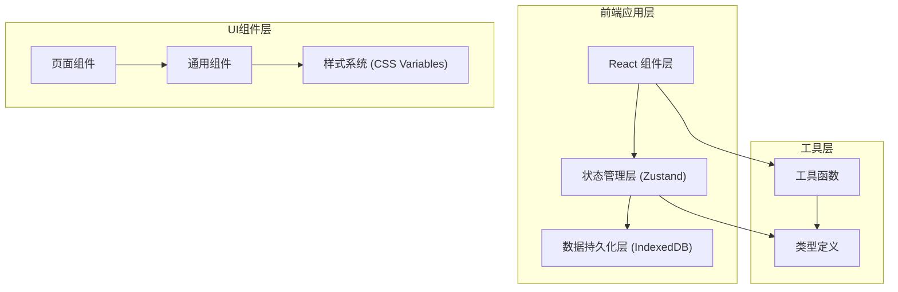
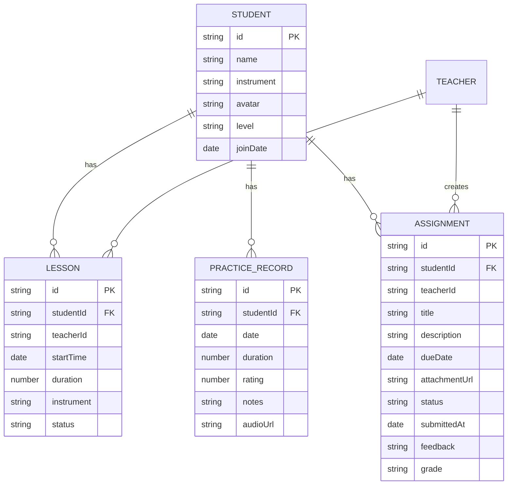

## 1. 架构设计



## 2. 技术描述

- **前端框架**：React@18 + TypeScript
- **构建工具**：Vite
- **路由管理**：react-router-dom@6
- **状态管理**：zustand
- **数据持久化**：idb-keyval（IndexedDB封装）
- **唯一ID生成**：uuid
- **字体**：@fontsource/poppins
- **图标**：lucide-react

## 3. 目录结构

```
src/
├── components/          # 通用组件
│   ├── Layout.tsx       # 布局组件（侧边栏+顶栏+内容区）
│   ├── Sidebar.tsx      # 侧边栏导航
│   ├── TopNav.tsx       # 顶部导航栏
│   ├── Card.tsx         # 卡片容器组件
│   ├── Modal.tsx        # 模态框组件
│   ├── Button.tsx       # 按钮组件
│   ├── LineChart.tsx    # 折线图组件
│   ├── Calendar.tsx     # 月历组件
│   └── StarRating.tsx   # 星级评分组件
├── pages/               # 页面组件
│   ├── Dashboard.tsx    # 仪表盘页
│   ├── Schedule.tsx     # 课程排期页
│   ├── Students.tsx     # 学生管理页
│   └── Assignments.tsx  # 作业中心页
├── store/
│   └── useStore.ts      # Zustand全局状态管理
├── types/
│   └── index.ts         # TypeScript类型定义
├── utils/
│   ├── dateUtils.ts     # 日期工具函数
│   ├── mockData.ts      # 模拟数据
│   └── db.ts            # IndexedDB封装
├── App.tsx              # 根组件
├── main.tsx             # 入口文件
└── index.css            # 全局样式
```

## 4. 路由定义

| 路由路径 | 页面组件 | 说明 |
|---------|----------|------|
| / | Dashboard.tsx | 仪表盘（默认首页） |
| /schedule | Schedule.tsx | 课程排期 |
| /students | Students.tsx | 学生管理 |
| /assignments | Assignments.tsx | 作业中心 |

## 5. 数据模型

### 5.1 实体关系图



### 5.2 数据切片（Zustand Store）

- **courses 切片**：课程管理（增删改查、冲突检测）
- **students 切片**：学生管理（学生列表、详情）
- **assignments 切片**：作业管理（创建、提交、审核）
- **practiceRecords 切片**：练习记录管理
- **user 切片**：当前用户（角色切换）

## 6. 数据流向

### 6.1 整体数据流

```
用户交互 → 组件事件 → Zustand actions → 更新 store → 触发组件重渲染
                           ↓
                        IndexedDB 持久化
```

### 6.2 各页面数据流向

1. **Dashboard**：调用 useStore 获取课程、作业、练习记录数据 → 计算统计指标 → 渲染统计卡片和图表

2. **Schedule**：监听日历组件交互 → 调用 useStore 课程actions → 更新课程数据 → 日历视图刷新

3. **Students**：从 useStore 获取学生列表 → 用户选择学生 → 过滤该学生的练习记录和作业 → 展示详情面板

4. **Assignments**：根据用户角色过滤作业列表 → 教师创建/审核作业 → 学生提交作业 → 状态流转

## 7. 性能优化

- **数据持久化**：使用 IndexedDB 异步存储，不阻塞主线程
- **状态选择**：使用 Zustand selector 精确订阅需要的状态，避免不必要重渲染
- **列表虚拟化**：长列表考虑虚拟滚动（视数据量决定）
- **性能测量**：使用 performance.mark 测量首屏渲染时间
- **帧率监控**：日历月切换时监控 FPS，确保 55fps 以上

## 8. 文件间调用关系

```
App.tsx
  ├─ Layout.tsx
  │   ├─ Sidebar.tsx (调用 useStore.user)
  │   ├─ TopNav.tsx (调用 useStore.user)
  │   └─ <Outlet /> (页面路由)
  ├─ Dashboard.tsx
  │   ├─ Card.tsx
  │   └─ LineChart.tsx
  ├─ Schedule.tsx
  │   ├─ Calendar.tsx
  │   └─ Modal.tsx
  ├─ Students.tsx
  │   ├─ Card.tsx
  │   └─ StarRating.tsx
  └─ Assignments.tsx
      ├─ Card.tsx
      └─ Modal.tsx

useStore.ts
  ├─ db.ts (IndexedDB操作)
  └─ types/index.ts (类型定义)

各组件 → useStore.ts → db.ts → IndexedDB
```
