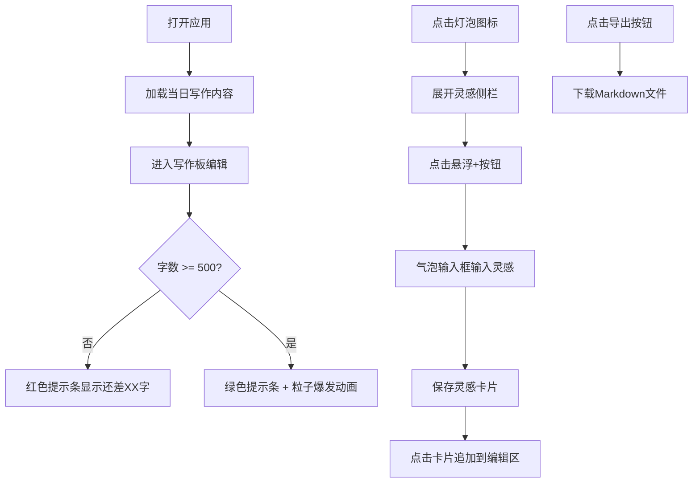

## 1. 产品概述

每日写作习惯应用，帮助写作者系统整理灵感碎片、坚持每日500字写作目标、通过数据统计持续获得创作动力。
- 目标用户：有写作习惯或希望培养写作习惯的创作者、作家、博主
- 核心价值：降低写作门槛，提供即时反馈，用数据驱动坚持

## 2. 核心特性

### 2.1 功能模块

1. **写作板模块**：富文本编辑器、Markdown实时渲染、字数统计、环形进度条、达标动画
2. **灵感捕捉侧栏**：灵感卡片列表、悬浮新增按钮、气泡输入框、一键插入编辑区
3. **写作统计看板**：本月总字数、连续创作天数、本周每日字数柱状图
4. **数据持久化与导出**：IndexedDB自动保存、Markdown批量导出

### 2.3 页面详情

| 页面名称 | 模块名称 | 功能描述 |
|-----------|-------------|---------------------|
| 主页面 | 顶部导航栏 | 应用名称、灯泡图标（切换灵感侧栏）、导出按钮 |
| 主页面 | 写作板 | Markdown编辑区（自动拉伸）、实时字数统计、环形进度条、达标提示条 |
| 主页面 | 灵感侧栏 | 可收起/展开、毛玻璃效果、灵感卡片（时间倒序）、悬浮新增按钮 |
| 主页面 | 统计面板 | 本月总字数、连续创作天数徽章、本周柱状图 |

## 3. 核心流程

用户打开应用 → 自动加载当日写作内容 → 在编辑区写作（实时字数统计和进度反馈）→ 点击灯泡图标查看/添加灵感 → 点击灵感卡片追加到编辑区 → 达到500字触发庆祝动画 → 随时导出全部写作记录为Markdown

## 4. 用户界面设计

### 4.1 设计风格
- 主背景：柔和奶油白 #FFF8E7
- 标题栏：深灰 #2C3E50
- 强调色：绿色 #27AE60（达标）、金色 #F39C12（超目标）、浅橙 #FFE0B2（按钮悬停）
- 按钮样式：圆角8px，悬停背景渐变为浅橙色
- 字体：Merriweather（优雅的衬线字体，适合写作场景）
- 布局：顶部固定导航栏（56px）、左侧灵感侧栏、中间写作板、右侧统计面板
- 分隔线：1px实线 #E0DACD

### 4.2 页面设计概览

| 页面名称 | 模块名称 | UI元素 |
|-----------|-------------|-------------|
| 主页面 | 写作板 | 自动拉伸textarea、右侧字数动画计数器、环形SVG进度条（1.2s旋转一圈）、底部提示条 |
| 主页面 | 灵感侧栏 | 毛玻璃效果（12px模糊、#FFFFFFCC半透明白）、卡片圆角12px、左边框随机渐变、悬停上浮4px |
| 主页面 | 统计面板 | 大号字体数字翻转动画、绿色圆角徽章、柱状图（金色超目标/灰色未达标、0.5s延时逐根升起） |
| 主页面 | 动画效果 | 淡入淡出0.3s、字数递增动画、粒子爆发3s、按钮旋转加载0.5s |

### 4.3 响应式
- 桌面端（≥900px）：左-中-右三栏布局
- 移动端（<900px）：右侧统计面板折叠为顶部抽屉（从上方滑入、半透明黑遮罩），左侧灵感侧栏宽度缩为240px

## 5. 性能指标
- 打字输入延迟 ≤ 50ms
- 统计面板每5秒自动刷新
- 灵感列表无限滚动加载（每次20条）
