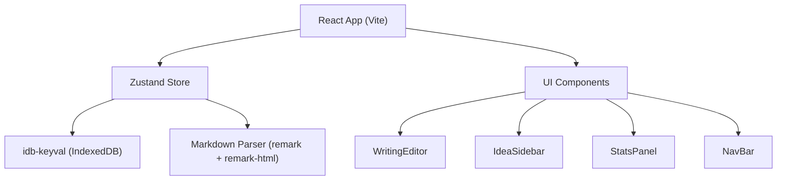
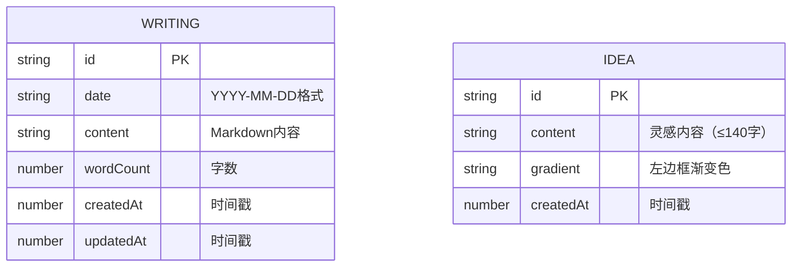

## 1. 架构设计

## 2. 技术说明

- 前端：React@18 + TypeScript + Vite
- 状态管理：Zustand
- 数据持久化：IndexedDB (idb-keyval)
- Markdown解析：remark + remark-html
- 字体：@fontsource/merriweather
- ID生成：uuid

## 3. 文件结构

| 文件路径 | 用途 |
|---------|------|
| package.json | 依赖和脚本配置 |
| index.html | 入口HTML，加载字体和全屏容器 |
| vite.config.js | Vite配置，React插件和@路径别名 |
| tsconfig.json | TypeScript严格模式配置 |
| src/App.tsx | 根组件，布局容器，管理侧栏显示状态 |
| src/store/writingStore.ts | Zustand Store，数据读写和状态管理 |
| src/components/WritingEditor.tsx | 写作板组件 |
| src/components/IdeaSidebar.tsx | 灵感侧栏组件 |
| src/components/StatsPanel.tsx | 统计看板组件 |

## 4. 数据模型

### 4.1 数据模型定义

### 4.2 IndexedDB存储键
- `writings`: Map<dateString, Writing> - 按日期存储每日写作
- `ideas`: Idea[] - 灵感列表数组

## 5. 关键技术实现

### 5.1 字数统计与动画
- 使用`requestAnimationFrame`实现数字递增动画
- 环形进度条使用SVG stroke-dasharray + stroke-dashoffset实现

### 5.2 Markdown实时渲染
- 使用remark + remark-html将Markdown转为HTML
- 编辑与预览区域分离，通过CSS实现并排布局

### 5.3 粒子爆发动画
- 使用CSS @keyframes + 多个span元素实现彩色粒子效果
- 触发3秒后自动清理DOM

### 5.4 响应式布局
- 使用CSS媒体查询 + CSS变量实现断点切换
- 移动端抽屉使用transform + transition实现滑入效果

### 5.5 性能优化
- 编辑内容使用useDeferredValue延迟非关键渲染
- 统计面板数据使用setInterval每5秒刷新
- 灵感列表使用IntersectionObserver实现无限滚动
