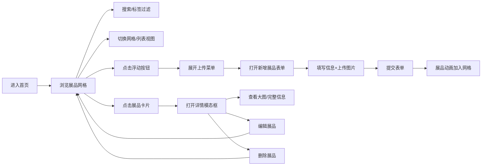

## 1. 产品概述

ExhibitionHub 是一款虚拟展会数字展品管理与展示应用，为策展人和艺术家提供便捷的展品上传、分类和浏览体验。

- **核心价值**：让数字艺术作品和展品的管理与展示变得简单、高效、美观
- **目标用户**：策展人、艺术家、画廊管理者
- **核心问题**：传统展品管理方式繁琐，缺乏现代化的数字展示和检索手段

## 2. 核心功能

### 2.1 用户角色

| 角色 | 注册方式 | 核心权限 |
|------|----------|----------|
| 策展人/艺术家 | 本地使用（无需注册） | 上传、编辑、删除展品，浏览与搜索展品 |

### 2.2 功能模块

1. **展品列表展示**：网格/列表双视图，响应式卡片布局，流畅动画
2. **搜索与过滤**：关键词搜索，标签筛选，防抖优化
3. **展品上传管理**：拖拽上传图片，表单填写，标签管理
4. **展品详情模态框**：大图展示，完整信息，编辑删除操作

### 2.3 页面详情

| 页面名称 | 模块名称 | 功能描述 |
|-----------|-------------|---------------------|
| 首页 | 顶部导航栏 | Logo展示，固定定位，底部浅阴影 |
| 首页 | 搜索过滤栏 | 视图切换按钮，搜索输入框，标签筛选按钮 |
| 首页 | 展品网格/列表 | 响应式卡片布局，交错淡入动画，悬停效果 |
| 首页 | 浮动操作按钮 | 旋转展开动画，上传图片/添加展品子菜单 |
| 首页 | 展品详情模态框 | 右侧滑入动画，大图预览，编辑删除按钮 |
| 首页 | 新增展品表单 | 拖拽上传区，缩略图预览，标签输入 |

## 3. 核心流程

用户打开应用后，首页展示所有展品的网格视图。用户可以通过搜索框输入关键词或点击标签按钮进行筛选，点击视图切换按钮在网格和列表视图间切换。点击右下角浮动按钮可展开上传菜单，选择添加展品后弹出表单，填写信息并上传图片后提交，新展品以动画形式加入网格顶部。点击任意展品卡片打开详情模态框，可查看大图、完整描述，并进行编辑或删除操作。

## 4. 用户界面设计

### 4.1 设计风格

- **主色调**：主题蓝色 `#0D6EFD`，浅蓝 `#E7F1FF`
- **背景色**：浅灰白色 `#F8F9FA`，卡片纯白 `#FFFFFF`
- **文字色**：标题深灰 `#212529`，描述中灰 `#6C757D`
- **按钮风格**：圆角设计，按下缩放反馈（scale 0.96）
- **字体**：Inter 字体家族
- **布局风格**：卡片式布局，顶部固定导航栏
- **装饰元素**：右侧垂直渐变色装饰线（蓝到紫）
- **图标风格**：Lucide 图标库

### 4.2 页面设计概览

| 页面名称 | 模块名称 | UI 元素 |
|-----------|-------------|-------------|
| 首页 | 导航栏 | 白色背景、56px 高度、底部阴影、Logo 文字 |
| 首页 | 搜索栏 | 固定顶部、搜索图标+清除按钮、焦点发光效果 |
| 首页 | 展品卡片 | 图片+标题+描述+标签、悬停上移+阴影、圆角 |
| 首页 | 浮动按钮 | 圆形白色、加号图标、悬停旋转90度、展开子菜单 |
| 首页 | 详情模态框 | 半透明遮罩、右侧滑入、左图右文布局 |
| 首页 | 标签按钮 | 浅色边框/深色填充、圆角矩形 |

### 4.3 响应式设计

- **桌面端**：3列网格，搜索栏+标签按钮完整展示
- **平板端（<768px）**：2列网格
- **移动端（<576px）**：搜索栏和标签折叠为汉堡菜单

### 4.4 动画与交互

- 卡片交错淡入（每个间隔 0.05s，最长 0.8s）
- 悬停上移 4px + 阴影加深
- 视图切换透明度渐变（0.2s）
- 模态框右侧滑入（0.35s）
- 新展品底部滑入（0.3s 缓出）
- 所有按钮按下缩放反馈（0.1s）
