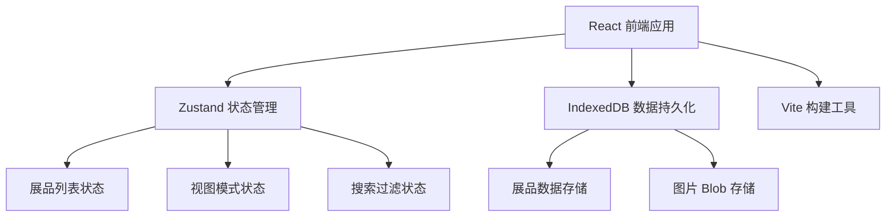

## 1. 架构设计



## 2. 技术说明

- **前端框架**：React 18 + TypeScript
- **构建工具**：Vite
- **状态管理**：Zustand
- **数据持久化**：IndexedDB（idb 库封装）
- **样式方案**：原生 CSS + CSS Modules
- **图标库**：Lucide React
- **字体**：Inter（@fontsource/inter）
- **唯一标识**：uuid

## 3. 路由定义

本应用为单页应用，无路由跳转，所有功能在首页完成。

| 路由 | 用途 |
|-------|---------|
| / | 首页，包含所有功能模块 |

## 4. 数据模型

### 4.1 展品数据结构

```typescript
interface Exhibit {
  id: string;
  title: string;
  description: string;
  tags: string[];
  imageUrl: string;
  createdAt: number;
}
```

### 4.2 应用状态

```typescript
interface AppState {
  exhibits: Exhibit[];
  viewMode: 'grid' | 'list';
  searchKeyword: string;
  selectedTags: string[];
  isLoading: boolean;
}
```

### 4.3 IndexedDB 设计

- **数据库名**：ExhibitionHubDB
- **版本**：1
- **对象仓库**：
  - `exhibits`：存储展品信息，主键 `id`
  - `images`：存储图片 Blob，主键 `id`

## 5. 项目文件结构

```
.
├── package.json
├── index.html
├── vite.config.js
├── tsconfig.json
├── src/
│   ├── App.tsx              # 根组件
│   ├── main.tsx             # 入口文件
│   ├── index.css            # 全局样式
│   ├── store.ts             # Zustand store
│   ├── components/
│   │   ├── Navbar.tsx       # 顶部导航栏
│   │   ├── SearchBar.tsx    # 搜索与过滤栏
│   │   ├── ExhibitionGrid.tsx # 展品网格组件
│   │   ├── ExhibitCard.tsx  # 展品卡片组件
│   │   ├── ExhibitModal.tsx # 展品详情模态框
│   │   ├── ExhibitForm.tsx  # 展品表单（新增/编辑）
│   │   ├── FloatingButton.tsx # 浮动操作按钮
│   │   └── TagBadge.tsx     # 标签徽章组件
│   ├── hooks/
│   │   ├── useDebounce.ts   # 防抖 hook
│   │   └── useIndexedDB.ts  # IndexedDB hook
│   └── utils/
│       └── idb.ts           # IndexedDB 工具函数
```

## 6. 性能优化策略

- **虚拟列表**：展品数量大时考虑虚拟滚动（初期 100 条无需）
- **防抖搜索**：搜索输入 300ms 防抖
- **图片优化**：图片上传时生成缩略图，列表显示缩略图
- **状态选择器**：Zustand 使用 selector 避免不必要重渲染
- **CSS 动画**：优先使用 transform 和 opacity 动画保证 60fps
- **IndexedDB 索引**：为常用查询字段建立索引
