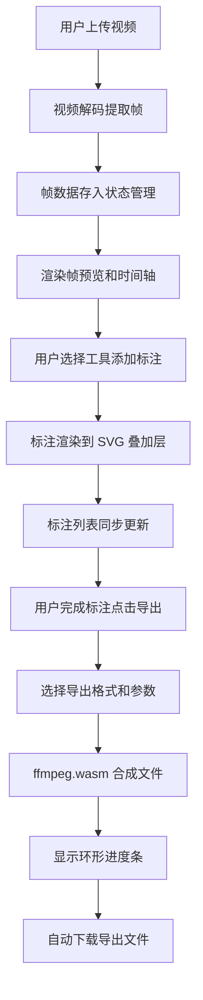

## 1. 产品概述
SnapScape 是一款浏览器端视频逐帧标注工具，用户可将慢动作视频拆解为逐帧图像，在每帧上添加矩形框、箭头、文字备注等标注，最终合成带注释的动态 GIF 或视频片段。适用于体育动作分析、教学演示、表情包制作等场景。

## 2. 核心功能

### 2.1 功能模块
1. **视频上传与帧提取**：支持拖拽/点击上传视频，自动解码生成帧缓冲区
2. **帧预览与时间轴**：中央预览区显示当前帧，下方帧轨道支持逐帧浏览
3. **标注编辑器**：矩形框、箭头、文字备注，支持拖拽、缩放、旋转、删除
4. **标注列表面板**：当前帧标注列表，点击聚焦高亮
5. **导出功能**：支持 GIF（循环/单次）和 WebM 视频（带/不带标注）导出

### 2.2 页面详情
| 页面名称 | 模块名称 | 功能描述 |
|-----------|-------------|---------------------|
| 主工作区 | 视频上传区 | 左上角区域，支持拖拽和点击选择文件 |
| 主工作区 | 帧预览区 | 中央区域，最大 800x400px，帧切换 0.2s 淡入淡出 |
| 主工作区 | 帧时间轴 | 预览区下方，canvas 绘制缩略图，滚轮逐帧浏览 |
| 主工作区 | 侧边工具面板 | 左侧 350px 宽，画笔颜色、线宽滑块、撤销重做 |
| 主工作区 | 标注列表面板 | 左侧展示当前帧所有标注，点击聚焦闪烁 |
| 主工作区 | 导出按钮 | 右下角深青蓝渐变按钮，悬停亮度提高 10% |
| 导出模态框 | 格式选择 | 半透明毛玻璃模态框，GIF/WebM 选项 |
| 导出模态框 | 进度显示 | 环形进度条，中心向外填充动画 |

## 3. 核心流程

## 4. 用户界面设计

### 4.1 设计风格
- **主题**：暗色毛玻璃极简设计
- **主背景**：#121212
- **卡片背景**：#1E1E1E
- **强调色**：青蓝 #00BCD4
- **边框/拖拽动画**：弹性虚线
- **按钮风格**：圆角，悬停 0.15s 缩放+颜色过渡 ease-out
- **字体**：Inter（用户指定，保持默认规范兼容）
- **模态框**：背景模糊 16px，圆角 24px
- **侧边栏**：350px 宽，背景模糊 12px，半透明

### 4.2 页面设计概览
| 页面名称 | 模块名称 | UI 元素 |
|-----------|-------------|-------------|
| 主工作区 | 上传区 | 弹性虚线边框、拖拽动画、青蓝强调色 |
| 主工作区 | 预览区 | 最大 800x400px、交叉淡入淡出 0.2s |
| 主工作区 | 时间轴 | Canvas 缩略图 80x45px、水平滚动、当前帧青蓝高亮 |
| 主工作区 | 标注工具 | 8 锚点旋转手柄、右上角红圆删除按钮 |
| 主工作区 | 导出按钮 | 深青蓝渐变、悬停亮度 +10% |
| 导出模态框 | 进度条 | 环形由内向外填充、帧数越多越慢 |

### 4.3 响应式设计
- **桌面端**：主预览区与帧轨道并排，侧边栏展开
- **平板端**：帧轨道置于预览区下方
- **手机端**：垂直堆叠，侧边栏隐藏到汉堡菜单

### 4.4 性能指标
- 500 帧以内滚动/缩放保持 60FPS
- 标注拖拽/缩放响应延迟 < 50ms
