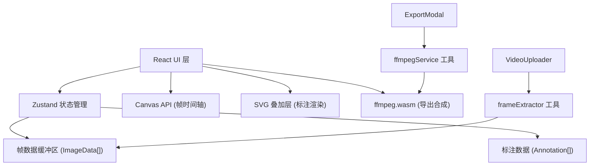

## 1. 架构设计



## 2. 技术说明
- **前端框架**：React 18 + TypeScript
- **构建工具**：Vite
- **状态管理**：Zustand
- **帧处理**：Canvas API
- **导出合成**：@ffmpeg/ffmpeg@0.12.6 + @ffmpeg/util
- **文件上传**：react-dropzone
- **图标**：lucide-react
- **字体**：@fontsource/inter
- **ID 生成**：uuid

## 3. 项目结构
```
├── package.json
├── index.html
├── vite.config.js
├── tsconfig.json
└── src/
    ├── App.tsx              # 根组件，全局样式初始化
    ├── store.ts             # Zustand store
    ├── components/
    │   ├── VideoUploader.tsx     # 视频上传组件
    │   ├── FrameTimeline.tsx     # 帧时间轴 Canvas
    │   ├── AnnotationCanvas.tsx  # SVG 标注叠加层
    │   ├── ExportModal.tsx       # 导出配置模态框
    │   └── AnnotationList.tsx    # 标注列表面板
    ├── utils/
    │   ├── frameExtractor.ts     # 视频帧提取工具
    │   ├── ffmpegService.ts      # ffmpeg.wasm 封装
    │   └── types.ts              # TypeScript 类型定义
    └── styles/
        └── global.css            # 全局样式和主题变量
```

## 4. 状态管理 (Zustand Store)

### 状态机
- `idle`：初始状态，等待上传视频
- `processing`：正在处理视频/提取帧
- `ready`：帧提取完成，可进行标注
- `exporting`：正在导出文件

### Store 数据结构
- `videoFile: File | null` - 上传的视频文件
- `frames: ImageData[]` - 提取的帧数据
- `currentFrameIndex: number` - 当前帧索引
- `annotations: Record<number, Annotation[]>` - 按帧索引存储的标注
- `selectedAnnotationId: string | null` - 当前选中的标注
- `appStatus: 'idle' | 'processing' | 'ready' | 'exporting'`
- `toolColor: string` - 当前画笔颜色
- `lineWidth: number` - 当前线宽
- `history: AnnotationSnapshot[]` - 撤销历史
- `historyIndex: number` - 历史指针

## 5. 数据模型

```typescript
// 标注基础类型
interface BaseAnnotation {
  id: string;
  type: 'rectangle' | 'arrow' | 'text';
  x: number;
  y: number;
  rotation: number;
  createdAt: number;
}

// 矩形标注
interface RectangleAnnotation extends BaseAnnotation {
  type: 'rectangle';
  width: number;
  height: number;
  borderColor: string;
  borderWidth: number;
}

// 箭头标注
interface ArrowAnnotation extends BaseAnnotation {
  type: 'arrow';
  endX: number;
  endY: number;
  color: string;
  lineWidth: number;
}

// 文字标注
interface TextAnnotation extends BaseAnnotation {
  type: 'text';
  content: string;
  fontSize: number;
  italic: boolean;
  color: string;
}

type Annotation = RectangleAnnotation | ArrowAnnotation | TextAnnotation;

// 导出参数
interface ExportParams {
  format: 'gif' | 'webm';
  loop: boolean;           // GIF 是否循环
  withAnnotations: boolean; // WebM 是否带标注
  fps: number;
}
```

## 6. 关键实现说明

### 6.1 帧提取 (frameExtractor.ts)
- 创建隐藏的 `<video>` 元素
- 通过 `seeked` 事件逐帧定位
- 使用 `canvas.drawImage + getImageData` 捕获帧
- 支持进度回调

### 6.2 帧时间轴 (FrameTimeline.tsx)
- Canvas 批量绘制缩略图，避免 DOM 节点过多
- 虚拟滚动：仅绘制可视区域内的缩略图
- `requestAnimationFrame` 保证 60FPS 滚动

### 6.3 标注交互 (AnnotationCanvas.tsx)
- SVG 渲染保证矢量清晰度
- 拖拽/缩放：计算指针偏移量实时更新坐标
- 8 锚点缩放手柄，支持约束比例
- 旋转：基于中心点计算角度
- 选中态：闪烁聚焦动画（CSS keyframes）

### 6.4 导出服务 (ffmpegService.ts)
- 懒加载 ffmpeg.wasm core
- 逐帧将 ImageData 渲染到 canvas，编码为 PNG
- 通过 FFmpeg 合成 GIF/WebM
- 进度回调：每处理 N 帧更新进度百分比

### 6.5 Vite 配置要点
- 路径别名 `@` → `src/`
- worker 类型配置
- ffmpeg 相关资源的 crossOrigin 配置
