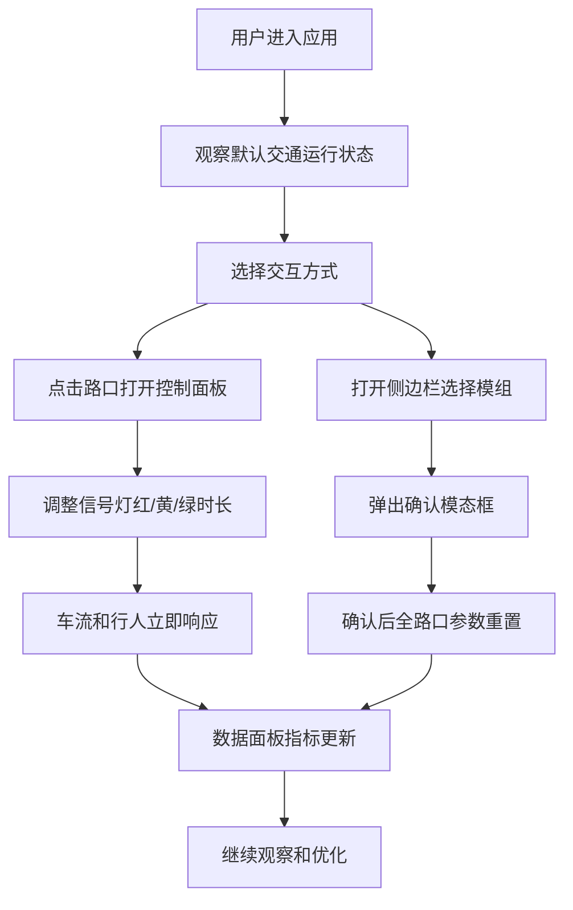

## 1. 产品概述

TrafficPulse 是一款像素风格城市交通沙盘模拟游戏，让用户直观观察交通信号灯策略对通勤效率的影响，并手动调整灯控方案优化整体车流。

- 目标用户：交通规划爱好者、游戏玩家、教育场景用户
- 核心价值：以可视化、交互化的方式展示信号灯策略对城市交通的影响

## 2. 核心功能

### 2.1 用户角色

| 角色 | 注册方式 | 核心权限 |
|------|----------|----------|
| 普通用户 | 无需注册，直接使用 | 观察交通流、调整信号灯参数、切换预设模组、查看实时数据 |

### 2.2 功能模块

1. **主场景画布**：俯视2D网格城市（10×10街区），包含道路、车辆、行人、信号灯
2. **信号灯控制面板**：点击任意路口弹出，可调整红黄绿三种信号灯时长
3. **数据统计面板**：实时显示车辆平均等待时间、行人过街平均时间、路口通行效率评分
4. **模组管理器**：侧边栏展示三种预设模组，一键切换信号灯策略

### 2.3 页面详情

| 页面名称 | 模块名称 | 功能描述 |
|----------|----------|----------|
| 主游戏页面 | 主画布区 | Canvas绘制城市道路网络、车辆、行人、信号灯；支持鼠标滚轮缩放（0.5-2.0倍）和拖拽平移 |
| 主游戏页面 | 信号灯控制面板 | 点击路口弹出，滑块控制各颜色灯时长，实时显示剩余秒数，调整立即生效 |
| 主游戏页面 | 数据统计面板 | 右下角半透明浮动面板，5秒刷新一次数据，带渐变进度条可视化 |
| 主游戏页面 | 模组管理器侧边栏 | 左上角可折叠侧边栏，三种预设模组（均衡模式、行人优先、车流优先），点击激活确认后全路口重置 |
| 主游戏页面 | 顶部任务栏 | 左侧显示"TrafficPulse"霓虹标题，右侧实时显示FPS帧率 |

## 3. 核心流程

用户进入应用 → 观察默认参数下车流运行状态 → 通过以下任一方式交互：
1. 点击任意路口打开控制面板 → 调整信号灯时长 → 观察车流和数据面板变化
2. 打开侧边栏 → 选择预设模组 → 确认激活 → 观察全局变化和数据平滑过渡

## 4. 用户界面设计

### 4.1 设计风格

- **主题风格**：暗色赛博朋克
- **主背景色**：深蓝黑 #0A0E27
- **道路颜色**：深灰 #2A2D3E
- **信号灯霓虹色**：红 #FF0055、黄 #FFAA00、绿 #00FFAA
- **标题霓虹色**：蓝色 #00D4FF
- **按钮交互**：悬停放大1.05倍+发光边框，点击下沉2px弹性动画

### 4.2 页面设计总览

| 页面名称 | 模块名称 | UI元素 |
|----------|----------|--------|
| 主游戏页面 | 主画布区 | 10×10街区网格，道路宽20px，路口40×40px；车辆（红/黄/蓝长方形10×20px）、行人（白色圆点直径6px）；发光粒子尾迹；信号灯指示 |
| 主游戏页面 | 信号灯控制面板 | 模态浮层；三个滑块（红/黄/绿）+ 实时秒数显示；关闭按钮 |
| 主游戏页面 | 数据统计面板 | 毛玻璃背景（模糊10px、圆角12px、#00000080）；24px白色大字指标；红→绿渐变进度条 |
| 主游戏页面 | 模组管理器 | 侧边栏（300px宽，0.3秒滑入滑出动画）；三个模组卡片（名称+描述+激活按钮）；汉堡图标切换 |
| 主游戏页面 | 顶部任务栏 | monospace字体"TrafficPulse"标题（0.5秒闪烁动画）；FPS实时显示（<30变红脉冲闪烁） |

### 4.3 响应式

- 桌面端优先：左侧300px侧边栏 + 主画布区（最小800×600px）+ 右下角280×200px数据面板
- 屏幕宽度 < 1024px 时：侧边栏自动折叠为汉堡图标，数据面板变为底部横条（高80px，宽100%）

### 4.4 动画效果

- 侧边栏展开/折叠：0.3秒向右滑入/向左滑出
- 模组激活确认模态框：0.3秒淡入
- 数据面板数值变化：0.5秒平滑过渡
- 按钮悬停：0.15秒过渡放大1.05倍+发光边框
- 按钮点击：0.1秒下沉2px弹性动画
- FPS低于30：红色脉冲闪烁
- TrafficPulse标题：0.5秒闪烁动画
