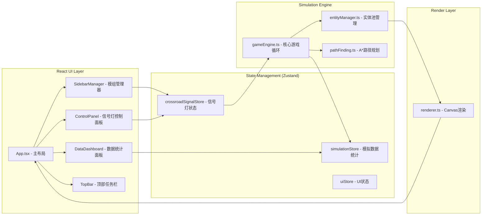

## 1. 架构设计



## 2. 技术说明

- **前端框架**：React 18 + TypeScript + Vite
- **状态管理**：Zustand
- **渲染方式**：原生 Canvas 2D API（自定义 requestAnimationFrame 循环）
- **UI样式**：原生 CSS（带赛博朋克主题变量）
- **工具库**：uuid（生成唯一实体ID）
- **初始化工具**：vite-init（react-ts 模板）

## 3. 路由定义

| 路由 | 用途 |
|------|------|
| / | 主游戏页面（单页应用，无额外路由） |

## 4. 数据模型

### 4.1 核心类型定义

```typescript
// 信号灯颜色
type SignalColor = 'red' | 'yellow' | 'green';

// 单个路口信号灯配置
interface CrossroadSignal {
  id: string;
  x: number;  // 网格坐标
  y: number;
  redDuration: number;    // 秒
  yellowDuration: number; // 秒
  greenDuration: number;  // 秒
  currentColor: SignalColor;
  remainingTime: number;  // 秒
}

// 车辆实体
interface Vehicle {
  id: string;
  x: number;  // 像素坐标
  y: number;
  angle: number;  // 行驶方向（弧度）
  speed: number;
  maxSpeed: number;
  color: 'red' | 'yellow' | 'blue';
  width: number;  // 10px
  height: number; // 20px
  path: { x: number; y: number }[];
  pathIndex: number;
  waitingTime: number;  // 累计等待秒数
  isWaiting: boolean;
  trail: { x: number; y: number; alpha: number }[];
  active: boolean;
}

// 行人实体
interface Pedestrian {
  id: string;
  x: number;
  y: number;
  speed: number;
  radius: number;  // 3px（直径6px）
  path: { x: number; y: number }[];
  pathIndex: number;
  crossingTime: number;  // 累计过街秒数
  isCrossing: boolean;
  trail: { x: number; y: number; alpha: number }[];
  active: boolean;
}

// 模拟统计数据
interface SimulationStats {
  avgVehicleWaitTime: number;
  avgPedestrianCrossTime: number;
  efficiencyScore: number;  // 0-100
  vehicleCount: number;
  pedestrianCount: number;
  fps: number;
}

// 预设模组
interface PresetModule {
  id: string;
  name: string;
  description: string;
  signalConfig: {
    redDuration: number;
    yellowDuration: number;
    greenDuration: number;
  };
}
```

### 4.2 Zustand Stores

```typescript
// crossroadSignalStore - 管理所有路口信号灯配置和当前状态
interface CrossroadSignalStore {
  crossroads: Map<string, CrossroadSignal>;
  setSignalDuration: (id: string, color: SignalColor, duration: number) => void;
  applyPreset: (config: PresetModule['signalConfig']) => void;
  updateSignalStates: (deltaTime: number) => void;
}

// simulationStore - 管理模拟运行时统计数据
interface SimulationStore {
  stats: SimulationStats;
  updateStats: (stats: Partial<SimulationStats>) => void;
}

// uiStore - 管理UI交互状态
interface UIStore {
  sidebarCollapsed: boolean;
  selectedCrossroadId: string | null;
  showControlPanel: boolean;
  pendingPreset: PresetModule | null;
  showConfirmModal: boolean;
  toggleSidebar: () => void;
  selectCrossroad: (id: string | null) => void;
  requestPresetActivation: (preset: PresetModule) => void;
  confirmPresetActivation: () => void;
  cancelPresetActivation: () => void;
}
```

## 5. 核心模块职责

### 5.1 gameEngine.ts
- 管理 requestAnimationFrame 游戏循环（目标60FPS）
- 每帧更新：信号灯状态 → 车辆位置/速度 → 行人位置 → 统计数据
- 碰撞检测：车辆红灯排队、车距保持、行人信号灯等待
- 调用 entityManager 获取实体列表，调用 pathFinding 生成路径
- 输出渲染数据给 renderer

### 5.2 entityManager.ts
- 对象池实现（最大200车辆 + 200行人）
- 随机生成车辆/行人（从边界生成）
- 实体回收（移出画面或达到实体上限时回收最远实体）
- 提供实体数组给 gameEngine 和 renderer

### 5.3 pathFinding.ts
- A* 路径规划算法
- 输入：起点终点（像素坐标）、道路网格
- 输出：最短路径坐标数组
- 车辆沿道路行驶，行人使用斑马线过街

### 5.4 renderer.ts
- 单例 Canvas 渲染器
- 绘制顺序：背景 → 道路 → 斑马线 → 信号灯 → 车辆尾迹 → 车辆 → 行人尾迹 → 行人
- 支持缩放（滚轮0.5-2.0倍）和平移（鼠标拖拽）
- 赛博朋克风格：霓虹色、发光效果、粒子尾迹

## 6. 性能保证

- 对象池复用实体，避免GC
- Canvas脏矩形优化（或全量绘制，200实体完全可承受）
- requestAnimationFrame 固定时间步长更新
- 信号灯参数变更后1帧内响应
- 内存目标：10分钟运行 < 100MB
