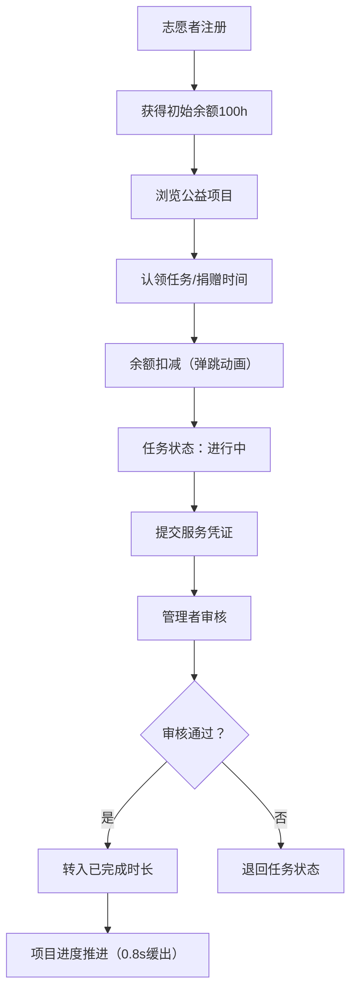

## 1. 产品概述

TimeGift是一个志愿者时间银行管理平台，让志愿者登记空闲时间并捐赠给公益项目，项目管理者可发布任务并记录服务时长。

- 主要目标：构建一个无后端依赖的纯前端志愿者时间捐赠与管理平台，支持时间银行模式的公益服务对接
- 目标用户：志愿者（登记时间、认领任务、记录服务）、项目管理者（发布项目、审核服务、管理进度）

## 2. 核心功能

### 2.1 用户角色

| 角色 | 权限说明 |
|------|----------|
| 志愿者 | 注册登记、时间捐赠、认领任务、提交服务凭证、查看排行榜 |
| 项目管理者 | 发布公益项目、创建子任务、审核服务凭证、管理项目进度 |

### 2.2 功能模块

1. **首页仪表盘**：统计卡片展示、捐赠趋势折线图、志愿者排行榜
2. **志愿者管理**：志愿者列表、新增志愿者、时间捐赠记录抽屉、捐赠历史时间线
3. **项目管理**：项目网格卡片、项目详情模态框、任务认领、时间录入表单

### 2.3 页面详情

| 页面名称 | 模块名称 | 功能描述 |
|---------|----------|----------|
| 仪表盘Dashboard | 统计卡片 | 总捐赠时间（环形进度条+滚动数字）、活跃项目数（渐变背景）、今日新增（跳动计数器）、个人排名（百分比+升降箭头） |
| 仪表盘Dashboard | 趋势图表 | 过去7天捐赠时间趋势折线图（Chart.js） |
| 仪表盘Dashboard | 志愿者排行榜 | 按累计时长降序，前三名金银铜牌SVG，点击查看时间线 |
| 志愿者管理VolunteerManager | 志愿者列表 | 虚拟列表，卡片悬浮上移效果，头像缩写+姓名+累计时长+最后活动日期 |
| 志愿者管理VolunteerManager | 新增表单 | 姓名、联系方式、兴趣标签、初始余额（默认100h），毛玻璃边框 |
| 志愿者管理VolunteerManager | 捐赠记录抽屉 | 从右侧滑入，毛玻璃背景模糊12px，显示该志愿者所有时间交易记录 |
| 项目管理ProjectManager | 项目网格 | 响应式网格（桌面3列/平板2列/手机1列），封面+名称+总时长+进度条 |
| 项目管理ProjectManager | 项目详情模态框 | 子任务列表、认领按钮（圆形头像堆叠显示认领人数）、时间录入表单 |

## 3. 核心流程

### 3.1 志愿者时间捐赠流程
志愿者注册 → 获得初始时间余额100h → 选择项目 → 输入捐赠小时数 → 余额实时扣减（弹跳动画） → 生成交易记录 → 项目进度更新

### 3.2 任务认领与完成流程
项目管理者发布项目+子任务 → 志愿者认领任务（状态变为"进行中"） → 完成后提交服务凭证（文本+图片链接） → 管理者审核通过 → 从"已捐赠"转入"已完成"时长 → 项目进度条动画推进

### 3.3 Mermaid流程图

## 4. 用户界面设计

### 4.1 设计风格
- **主色调**：琥珀色#FF8F00（温暖、活力）+ 深蓝色#2C3E50（专业、稳重）
- **背景色**：浅米色#FDF6E3（柔和、非营利氛围）
- **卡片样式**：白色底 + 阴影`0 4px 20px rgba(44, 62, 80, 0.08)` + 圆角14px
- **导航栏**：琥珀色渐变`#FF8F00 → #FFC107`，高度64px，沙漏Logo每5秒旋转
- **输入框**：毛玻璃边框`1px solid rgba(255, 143, 0, 0.3)`，聚焦时琥珀色光晕动画
- **字体**：Inter（通过@fontsource引入）

### 4.2 页面设计概览

| 页面名称 | 模块名称 | UI元素/动画 |
|---------|----------|------------|
| 仪表盘 | 总捐赠卡片 | 环形进度条灰→琥珀渐变，数字滚动动画 |
| 仪表盘 | 活跃项目卡片 | 线性渐变#667eea→#764ba2背景 |
| 仪表盘 | 今日新增卡片 | 数字放大1.2倍再缩小的跳动计数器 |
| 仪表盘 | 个人排名 | 百分比数字+排名升降箭头 |
| 排行榜 | 前三名 | 金色/银色/铜色2px边框+微弱发光动画，SVG奖牌3D旋转悬停 |
| 排行榜 | 行点击 | 展开时间线（左侧竖线+圆点+右侧事件详情） |
| 志愿者 | 卡片悬浮 | 上移-4px+加深阴影 |
| 志愿者 | 余额变化 | 数字缩小→放大弹跳动画0.3s，不足时红色提示 |
| 志愿者 | 抽屉面板 | 右滑入，毛玻璃backdrop-blur: 12px |
| 项目 | 进度条 | 进度变化时0.8s缓出填充动画 |
| 全局 | 页面切换 | 淡入淡出opacity 0→1，0.3s |

### 4.3 响应式设计
- **桌面端（≥1024px）**：项目卡片每行3张，侧边栏展开
- **平板端（768-1023px）**：项目卡片每行2张
- **手机端（<768px）**：项目卡片每行1张，侧边栏折叠为底部Tab栏

### 4.4 性能要求
- 首屏加载时间（除IndexedDB首次打开）< 1.5秒
- 图表重渲染 ≤ 15帧/秒，FPS ≥ 60
- 志愿者列表：虚拟列表实现，仅渲染可视区域节点
