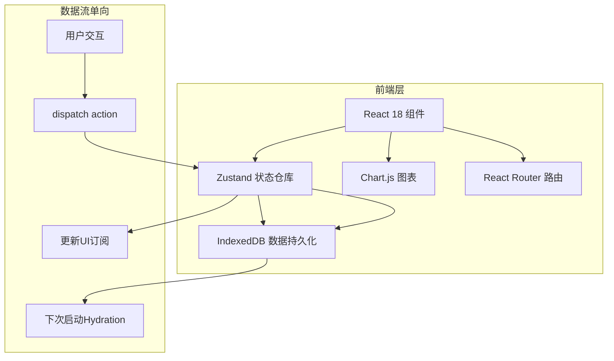
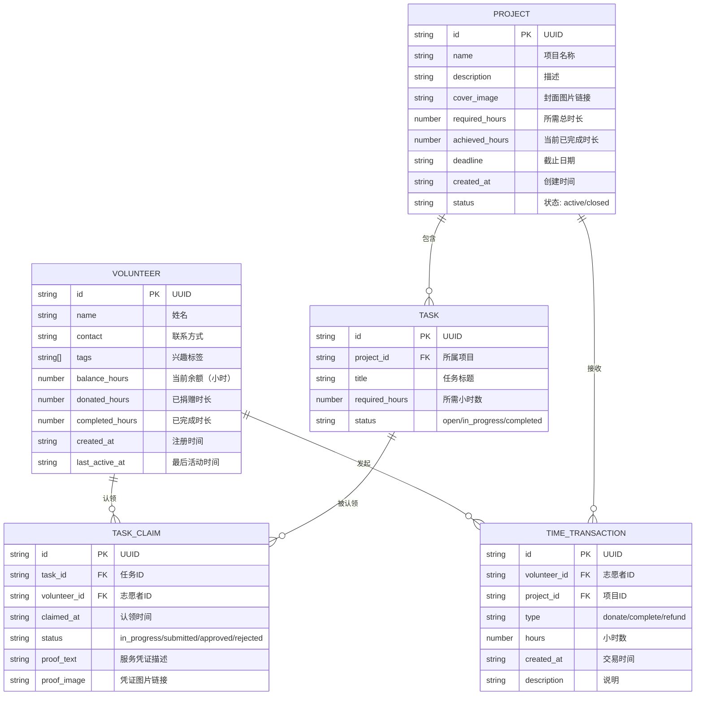

## 1. 架构设计



## 2. 技术描述

- **前端框架**：React@18 + TypeScript@5
- **构建工具**：Vite@5（路径别名@ -> src/）
- **路由管理**：react-router-dom@6
- **状态管理**：zustand@4（含persist中间件+IndexedDB适配器）
- **唯一ID**：uuid@9
- **图表渲染**：chart.js@4 + react-chartjs-2@5
- **字体资源**：@fontsource/inter@5
- **数据持久化**：IndexedDB（localStorage作为fallback）
- **后端依赖**：无，纯前端架构

## 3. 路由定义

| 路由 | 页面组件 | 用途 |
|------|----------|------|
| `/` | Dashboard | 首页仪表盘：统计卡片、趋势图、排行榜 |
| `/volunteer` | VolunteerManager | 志愿者管理：列表、新增、捐赠记录抽屉 |
| `/project` | ProjectManager | 项目管理：网格卡片、详情模态框、任务认领 |

## 4. 数据模型

### 4.1 ER图



### 4.2 Store状态结构

```typescript
interface AppState {
  // 数据集合
  volunteers: Volunteer[];
  projects: Project[];
  tasks: Task[];
  taskClaims: TaskClaim[];
  transactions: TimeTransaction[];
  
  // 当前登录志愿者ID
  currentVolunteerId: string | null;
  
  // 计算属性
  statistics: {
    totalDonatedHours: number;
    activeProjectCount: number;
    todayNewVolunteers: number;
    volunteerRankPercentile: number | null;
    weekDonationTrend: { date: string; hours: number }[];
  };
  rankedVolunteers: Volunteer[]; // 按completed_hours降序
  
  // Actions
  addVolunteer: (data: Omit<Volunteer, 'id' | 'created_at' | 'last_active_at'>) => void;
  donateTime: (volunteerId: string, projectId: string, hours: number, desc: string) => { success: boolean; error?: string };
  createProject: (data: Omit<Project, 'id' | 'created_at' | 'achieved_hours' | 'status'>) => void;
  claimTask: (taskId: string, volunteerId: string) => void;
  submitProof: (claimId: string, proofText: string, proofImage: string) => void;
  approveClaim: (claimId: string) => void;
  setCurrentVolunteer: (id: string | null) => void;
}
```

## 5. 文件结构与调用关系

```
src/
├── App.tsx                        # 根组件：路由配置、全局样式、DB初始化
│   ├── <BrowserRouter>
│   ├── <NavBar />
│   └── <Routes> → Dashboard/VolunteerManager/ProjectManager
│
├── store/
│   └── useAppStore.ts             # Zustand仓库
│       ├── 状态：volunteers/projects/tasks/...
│       ├── 持久化：IndexedDB via idb-keyval
│       └── 计算属性：statistics/rankedVolunteers
│
├── pages/
│   ├── Dashboard.tsx              # 仪表盘（读取 statistics + rankedVolunteers）
│   │   ├── StatCard × 4           # 统计卡片组件
│   │   ├── DonationTrendChart     # Chart.js折线图
│   │   └── Leaderboard            # 排行榜 + Timeline
│   │
│   ├── VolunteerManager.tsx       # 志愿者管理
│   │   ├── AddVolunteerForm       # 新增表单（dispatch addVolunteer）
│   │   ├── VolunteerList          # 虚拟列表（dispatch setCurrentVolunteer）
│   │   └── DonationDrawer         # 捐赠记录抽屉
│   │
│   └── ProjectManager.tsx         # 项目管理
│       ├── CreateProjectForm      # 发布项目表单
│       ├── ProjectGrid            # 响应式卡片网格
│       ├── ProjectModal           # 详情模态框
│       │   ├── TaskList           # 子任务列表（dispatch claimTask）
│       │   └── TimeEntryForm      # 时间录入（dispatch donateTime）
│       │   └── ProofForm          # 服务凭证（dispatch submitProof）
│       │   └── ApproveButton      # 审核按钮（dispatch approveClaim）
│
├── components/
│   ├── NavBar.tsx                 # 顶部导航（Logo旋转动画+用户信息）
│   ├── StatCard.tsx               # 统计卡片（环形进度/数字滚动）
│   ├── Leaderboard.tsx            # 排行榜（SVG奖牌、Timeline展开）
│   ├── VolunteerCard.tsx          # 志愿者卡片（悬浮上移效果）
│   ├── ProjectCard.tsx            # 项目卡片（进度条动画）
│   ├── Avatar.tsx                 # 圆形头像（缩写首字母）
│   ├── AvatarStack.tsx            # 认领人数堆叠头像
│   ├── Drawer.tsx                 # 抽屉组件（毛玻璃背景）
│   ├── Modal.tsx                  # 模态框组件
│   ├── Timeline.tsx               # 时间线组件
│   └── inputs/                    # 毛玻璃输入框（聚焦光晕动画）
│       ├── GlassInput.tsx
│       └── GlassTextarea.tsx
│
├── hooks/
│   ├── useVirtualList.ts          # 虚拟列表Hook
│   ├── useAnimatedNumber.ts       # 数字滚动动画Hook
│   └── useIndexedDB.ts            # IndexedDB操作封装
│
├── utils/
│   ├── db.ts                      # IndexedDB初始化与CRUD
│   ├── formatters.ts              # 日期/时间格式化
│   └── mockData.ts                # 初始示例数据
│
├── types/
│   └── index.ts                   # 全局类型定义（Volunteer/Project/Transaction...）
│
└── styles/
    ├── global.css                 # 全局样式（CSS变量、动画、响应式断点）
    └── animations.css             # 动画关键帧（弹跳/光晕/发光）
```

### 数据流向说明

```
用户操作(组件交互)
    ↓
dispatch action（e.g. donateTime）
    ↓
Zustand reducer 更新内存状态（balance_hours↓, transactions↑）
    ↓
├→ 触发 Zustand persist 中间件 → IndexedDB 持久化
└→ 触发 useAppStore 订阅的组件 → React 重渲染
    ↓
更新UI：余额弹跳动画 / 进度条缓出 / 统计数字滚动
```
