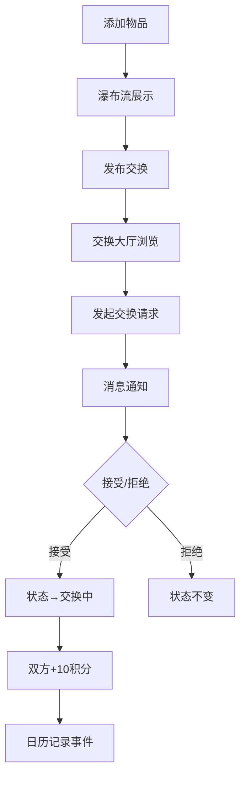

## 1. 产品概述

闲置物品循环利用管理平台——帮助个人和小团队高效管理闲置物品（书籍、数码、家电等），实现物品的登记、交换、追踪与日历管理，让闲置资源流动起来。

- 解决痛点：家里闲置物品无处存放、转让/交换流程繁琐、缺乏物品去向追踪与共享日历
- 目标用户：有闲置物品需要管理、交换或转让的个人及小型团队

## 2. 核心功能

### 2.1 用户角色

| 角色 | 注册方式 | 核心权限 |
|------|----------|----------|
| 普通用户 | 本地注册/模拟 | 添加物品、浏览交换大厅、发起/接受交换、查看消息和日历、查看个人仪表盘 |

### 2.2 功能模块

1. **物品管理模块**：添加/编辑/删除闲置物品，瀑布流卡片展示，详情模态框
2. **交换大厅模块**：浏览待交换物品，分类筛选+关键词搜索，发起交换请求
3. **消息系统模块**：收件箱列表，对话气泡视图，接受/拒绝交换，积分自动更新
4. **共享日历模块**：月视图日历，事件圆点标记，毛玻璃事件卡片，手动添加备忘
5. **个人仪表盘模块**：物品统计、交换统计、积分进度条、排行榜排名

### 2.3 页面详情

| 页面名称 | 模块名称 | 功能描述 |
|----------|----------|----------|
| 主页（物品列表） | 瀑布流卡片网格 | 展示所有物品卡片，卡片含分类图标📘💻🔌📦、五星新旧等级（金色★/灰色☆）、预估价值（¥加粗），点击展开详情模态框（半透明蒙版+弹性滑入），支持添加物品 |
| 物品详情模态框 | 详情/编辑/删除 | 从左向右弹性滑入动画，半透明黑色蒙版，含编辑、删除、"发布交换"按钮 |
| 交换大厅 | 筛选+搜索+列表 | 分类标签筛选（选中绿色#27AE60高亮），关键词搜索（300ms防抖+清除按钮+搜索图标），点击他人物品发起交换请求 |
| 交换请求弹窗 | 消息+选择物品 | 消息文本框（默认80px，自动撑高≤300px），选择自己的物品作为交换物 |
| 消息收件箱 | 消息列表 | 未读蓝色圆点标记，已读圆点消失，点击展开对话视图 |
| 对话视图 | 气泡消息+操作 | 对方灰色左对齐，自己绿色右对齐，支持纯文本+物品卡片链接，接受/拒绝交换按钮 |
| 共享日历 | 月视图+事件 | 日期格子显示事件数量圆点，点击弹毛玻璃事件卡片（背景模糊12px），事件可跳转物品详情，支持添加备忘 |
| 个人仪表盘 | 侧边栏统计 | 用户头像/首字母图标（主色#3498DB），一句话简介，物品总数、成功交换数、积分进度条（灰→金渐变）、排行榜排名 |

## 3. 核心流程

**物品发布到交换完成流程**：

1. 用户在主页添加闲置物品（名称、照片、价值、新旧等级、分类、备注）
2. 物品以卡片形式展示在瀑布流列表中
3. 用户点击"发布交换"将物品发布到交换大厅
4. 其他用户在交换大厅浏览、筛选、搜索物品
5. 点击感兴趣的物品，发起交换请求（附消息+选择自己的物品）
6. 物品拥有者收到消息通知，查看对话详情
7. 拥有者接受或拒绝交换请求
8. 接受后双方物品状态变更为"交换中"，双方各获10积分
9. 日历自动记录交换日期事件

## 4. 用户界面设计

### 4.1 设计风格

- **主背景色**：#F8F4E8（暖米色大地色系）
- **卡片/侧边栏**：#FFFFFF（纯白）
- **强调色**：暖橙色#E67E22（主要交互）、柔和绿色#27AE60（成功/选中状态）
- **文字主色**：#2D2D2D（深灰）
- **按钮风格**：圆角8px，hover上浮3px阴影过渡（0.3s cubic-bezier）
- **字体**：Inter（正文），系统字体回退
- **布局**：侧边栏+内容区，瀑布流卡片网格
- **分类图标**：📘书籍、💻数码、🔌家电、📦其他
- **星级评价**：金色实心★/灰色☆

### 4.2 页面设计概览

| 页面名称 | 模块名称 | UI元素 |
|----------|----------|--------|
| 主页 | 瀑布流卡片网格 | 三列/两列/单列响应式，卡片hover上浮，左上角分类emoji，底部星级+价格，淡入动画0.4s |
| 物品详情模态框 | 模态弹窗 | 半透明黑色蒙版，内容左→右弹性滑入，编辑/删除/发布交换按钮 |
| 交换大厅 | 筛选栏+列表 | 标签按钮（选中#27AE60），搜索框（清除+搜索图标），物品卡片列表 |
| 交换请求弹窗 | 表单弹窗 | 消息文本框（80px→300px自动撑高），物品选择列表 |
| 消息收件箱 | 消息列表 | 未读蓝点标记，点击展开对话，缩放动画0.2s |
| 对话视图 | 气泡消息 | 左灰右绿气泡，物品卡片链接嵌入，接受/拒绝按钮 |
| 共享日历 | 月视图 | 日期格子+事件圆点，毛玻璃弹出卡片（blur 12px），备忘添加入口 |
| 个人仪表盘 | 侧边栏 | 头像/首字母圆，积分进度条（灰→金），统计数字，排行榜排名 |

### 4.3 响应式适配

- **桌面端**（≥1024px）：三列瀑布流，侧边栏常驻左侧
- **平板端**（768px-1023px）：两列瀑布流，侧边栏可折叠
- **手机端**（<768px）：单列瀑布流，侧边栏变为底部导航栏

### 4.4 性能要求

- 列表首次渲染≤300ms
- 瀑布流无限滚动，每次加载20条，三点脉冲加载动画
- 搜索输入300ms防抖
