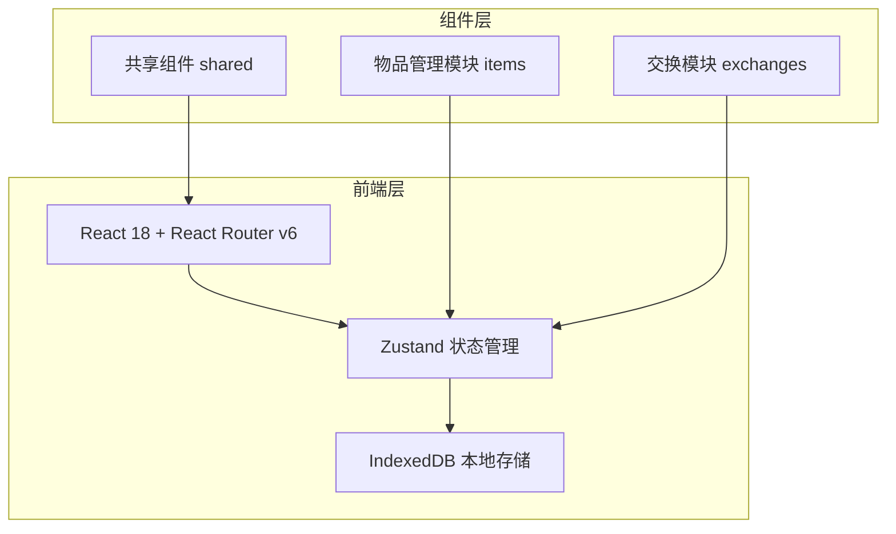
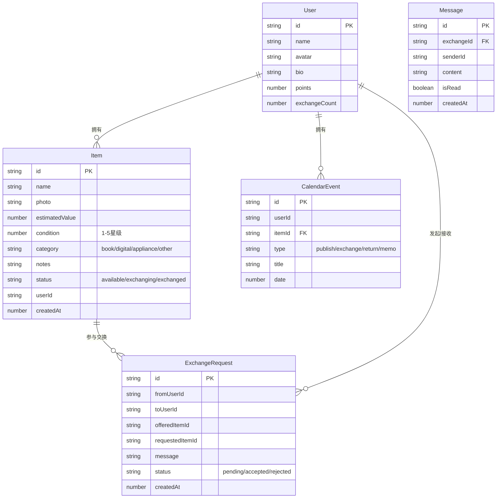

## 1. 架构设计



纯前端应用，无后端服务。所有数据持久化至浏览器 IndexedDB，状态管理使用 Zustand。

## 2. 技术说明

- **前端框架**：React@18 + React Router v6 + Zustand
- **构建工具**：Vite
- **样式方案**：CSS Modules + CSS Variables（大地色系主题）
- **本地存储**：IndexedDB（via idb-keyval）
- **唯一标识**：uuid
- **语言**：TypeScript（严格模式，ESNext模块）
- **包管理**：npm

## 3. 路由定义

| 路由 | 用途 |
|------|------|
| `/` | 主页——物品瀑布流列表 |
| `/exchange` | 交换大厅——浏览待交换物品 |
| `/messages` | 消息收件箱——交换请求与对话 |
| `/calendar` | 共享日历——月视图与事件管理 |

侧边栏/底部导航栏始终可见，个人仪表盘作为侧边栏组件嵌入全局布局。

## 4. 数据模型

### 4.1 数据模型定义



### 4.2 数据定义

所有数据存储于 IndexedDB，使用 idb-keyval 进行键值存取：

- **items** 存储键：`items` — Item[]
- **exchanges** 存储键：`exchanges` — ExchangeRequest[]
- **messages** 存储键：`messages` — Message[]
- **calendarEvents** 存储键：`calendarEvents` — CalendarEvent[]
- **currentUser** 存储键：`currentUser` — User
- **users** 存储键：`users` — User[]

## 5. 文件组织结构

```
src/
├── App.tsx                          # 根组件，路由+全局布局
├── main.tsx                         # 入口
├── index.css                        # 全局样式+CSS变量
├── modules/
│   ├── items/
│   │   ├── ItemStore.ts             # 物品Zustand store
│   │   ├── ItemService.ts           # IndexedDB CRUD服务
│   │   ├── types.ts                 # 物品类型定义
│   │   └── pages/
│   │       └── ItemListPage.tsx     # 瀑布流列表页
│   └── exchanges/
│       ├── ExchangeStore.ts         # 交换+消息+积分store
│       ├── ExchangeService.ts       # 交换数据服务
│       ├── types.ts                 # 交换/消息类型定义
│       └── pages/
│           ├── ExchangeHallPage.tsx  # 交换大厅
│           └── MessagePage.tsx       # 消息收件箱+对话
├── shared/
│   ├── components/
│   │   ├── CalendarWidget.tsx       # 共享日历组件
│   │   ├── Sidebar.tsx              # 侧边栏+仪表盘
│   │   ├── ItemCard.tsx             # 物品卡片组件
│   │   ├── ItemDetailModal.tsx      # 物品详情模态框
│   │   ├── BottomNav.tsx            # 移动端底部导航
│   │   └── LoadingDots.tsx          # 三点脉冲加载动画
│   └── utils/
│       └── db.ts                    # IndexedDB初始化
├── types.ts                         # 全局类型
```
