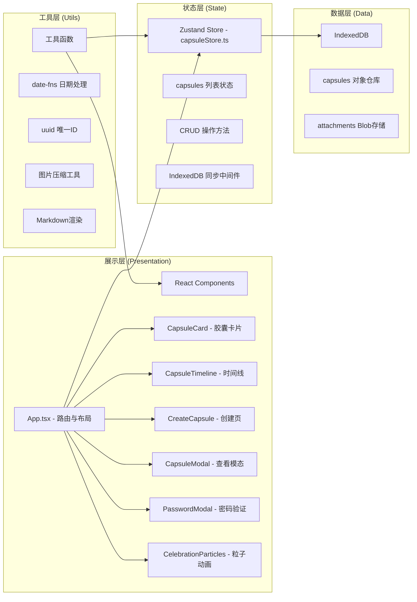
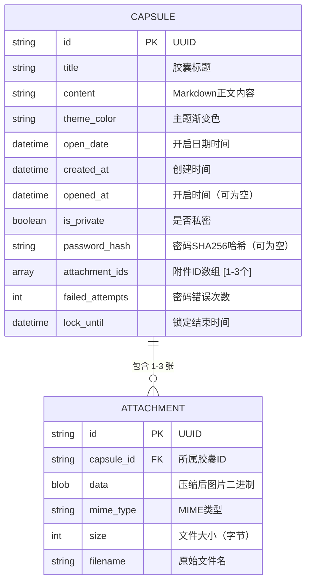

## 1. 架构设计



## 2. 技术说明

- **前端框架**：React@18 + TypeScript
- **构建工具**：Vite
- **路由管理**：react-router-dom@6
- **状态管理**：Zustand
- **数据持久化**：IndexedDB（原生API封装）
- **日期处理**：date-fns
- **唯一标识**：uuid
- **字体**：@fontsource/inter + Google Fonts Inter
- **Markdown渲染**：自定义轻量Markdown解析器
- **动画**：CSS Keyframes + Canvas粒子动画
- **样式方案**：原生CSS（CSS Modules），无Tailwind依赖

## 3. 路由定义

| 路由 | 页面组件 | 用途 |
|-------|---------|------|
| / | CapsuleTimeline | 时间线首页，展示所有未开启胶囊 |
| /create | CreateCapsule | 创建胶囊表单页 |
| /private | PrivateCapsules | 私密胶囊列表页 |
| /opened | OpenedCapsules | 已开启胶囊回顾页 |

## 4. 数据模型

### 4.1 数据模型定义



### 4.2 IndexedDB 配置

- **数据库名**：memoryvault_db
- **版本**：1
- **对象仓库**：
  - `capsules`：主键 `id`，索引 `open_date`、`is_private`、`opened_at`
  - `attachments`：主键 `id`，索引 `capsule_id`

## 5. 项目文件结构

```
auto167/
├── package.json
├── index.html
├── vite.config.js
├── tsconfig.json
├── tsconfig.node.json
├── .gitignore
└── src/
    ├── main.tsx
    ├── App.tsx
    ├── index.css
    ├── types/
    │   └── index.ts           # 全局类型定义
    ├── store/
    │   └── capsuleStore.ts    # Zustand 全局状态
    ├── components/
    │   ├── Sidebar.tsx        # 侧边导航栏
    │   ├── BottomTabs.tsx     # 移动端底部Tab
    │   ├── CapsuleCard.tsx    # 胶囊卡片
    │   ├── CapsuleTimeline.tsx# 时间线容器
    │   ├── CapsuleModal.tsx   # 胶囊查看模态
    │   ├── PasswordModal.tsx  # 密码验证模态
    │   ├── CelebrationParticles.tsx # 庆祝粒子Canvas
    │   ├── ImageUploader.tsx  # 图片上传组件
    │   ├── DatePicker.tsx     # 日期选择器
    │   ├── Countdown.tsx      # 倒计时组件
    │   └── MarkdownRenderer.tsx # Markdown渲染器
    ├── pages/
    │   ├── CreateCapsule.tsx  # 创建胶囊页
    │   ├── PrivateCapsules.tsx# 私密胶囊页
    │   └── OpenedCapsules.tsx # 已开启回顾页
    ├── hooks/
    │   ├── useCountdown.ts    # 倒计时Hook
    │   ├── useScrollAnimation.ts # 滚动动画Hook
    │   └── useIntersectionObserver.ts # 交叉观察Hook
    └── utils/
        ├── db.ts              # IndexedDB封装
        ├── imageCompressor.ts # 图片压缩工具
        ├── crypto.ts          # 密码哈希工具
        ├── colors.ts          # 主题色池
        └── markdown.ts        # Markdown解析器
```

## 6. 主题渐变色池（8种）

| 编号 | 渐变值 |
|------|--------|
| 1 | linear-gradient(135deg, #667eea 0%, #764ba2 100%) |
| 2 | linear-gradient(135deg, #f093fb 0%, #f5576c 100%) |
| 3 | linear-gradient(135deg, #4facfe 0%, #00f2fe 100%) |
| 4 | linear-gradient(135deg, #43e97b 0%, #38f9d7 100%) |
| 5 | linear-gradient(135deg, #fa709a 0%, #fee140 100%) |
| 6 | linear-gradient(135deg, #30cfd0 0%, #330867 100%) |
| 7 | linear-gradient(135deg, #a8edea 0%, #fed6e3 100%) |
| 8 | linear-gradient(135deg, #ff9a9e 0%, #fecfef 100%) |

## 7. 性能优化策略

1. **列表虚拟化**：时间线列表对非可视区域卡片使用轻量占位
2. **动画优化**：使用 `transform` 和 `opacity` 属性，触发GPU合成层
3. **图片优化**：上传时Canvas压缩至最大边1920px，质量0.8
4. **内存管理**：
   - 模态关闭时 revokeObjectURL 释放Blob URL
   - 大图片列表延迟加载（IntersectionObserver）
5. **渲染优化**：
   - CapsuleCard 使用 React.memo 包装
   - 倒计时使用 requestAnimationFrame 批处理更新
   - Zustand 选择器精确订阅状态
