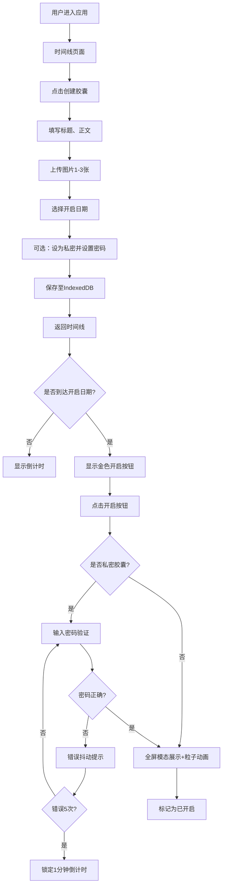

## 1. 产品概述

MemoryVault是一款线上数字时间胶囊应用，允许用户将记忆、文字和图片封装为数字胶囊，设定未来开启日期，到时自动提醒开启并回顾。

- 核心价值：帮助用户保存珍贵时刻，在未来特定时间点重温回忆，创造情感仪式感
- 目标用户：所有希望珍藏回忆、给未来的自己或他人留下信息的用户

## 2. 核心功能

### 2.1 功能模块

1. **时间线页面**：按开启日期排列的胶囊时间线视图
2. **创建胶囊页面**：表单填写、附件上传、日期选择
3. **胶囊查看模态**：全屏毛玻璃效果的胶囊内容展示
4. **私密胶囊空间**：密码保护的私密胶囊入口
5. **已开启回顾**：展示所有已开启过的胶囊

### 2.2 页面详情

| 页面名称 | 模块名称 | 功能描述 |
|-----------|-------------|---------------------|
| 时间线页 | 侧边导航栏 | 磨砂玻璃效果，三个入口导航，选中高亮 |
| 时间线页 | 时间线胶囊列表 | 按开启日期排序，滚动入场动画，倒计时实时更新 |
| 时间线页 | 胶囊卡片 | 主题色标签条、标题、倒计时、锁定状态、悬停动效 |
| 创建胶囊页 | 表单区 | 标题输入、Markdown正文编辑、私密开关、密码设置 |
| 创建胶囊页 | 附件上传 | 1-3张图片，单张5MB限制，上传进度条动画 |
| 创建胶囊页 | 日期选择器 | 禁用过去日期，剩余天数倒计时显示 |
| 胶囊查看模态 | 内容展示区 | 毛玻璃背景，Markdown渲染，图片画廊轮播 |
| 胶囊查看模态 | 粒子庆祝动画 | 金色彩色粒子从中心扩散，2秒消散 |
| 私密胶囊页 | 密码验证 | 毛玻璃输入框，错误抖动，5次错误锁定1分钟 |
| 已开启回顾页 | 回顾列表 | 已开启胶囊列表，显示开启时间 |

## 3. 核心流程

用户创建胶囊 → 填写内容与上传图片 → 设定开启日期 → 自动分配主题色 → 保存至IndexedDB
时间线实时展示胶囊 → 每秒更新倒计时 → 到达开启日期 → 卡片显示金色开启按钮 → 点击开启 → 全屏模态展示 → 播放粒子动画
私密胶囊点击 → 弹出密码输入 → 密码正确 → 展示内容；密码错误 → 抖动提示；5次错误 → 锁定1分钟

## 4. 用户界面设计

### 4.1 设计风格

- **主色调**：深色主题，主背景 #0F0F23，卡片背景 #1A1A3E
- **主文字**：#E0E0FF，强调色 #7C5CFC
- **主题色池**：8种柔和渐变色，每个胶囊随机分配
- **按钮风格**：圆角设计，hover放大1.05倍，金色渐变开启按钮带脉冲动画
- **字体**：Google Fonts Inter
- **布局风格**：左侧磨砂玻璃导航栏 + 右侧内容区；移动端底部Tab栏
- **动效**：卡片浮入动画、悬停上移加深阴影、模态右侧滑入、粒子庆祝动画

### 4.2 页面设计概览

| 页面名称 | 模块名称 | UI元素 |
|-----------|-------------|-------------|
| 时间线页 | 侧边导航 | rgba(26,26,62,0.8)背景，backdrop-filter:blur(12px)，选中项左侧3px渐变高亮条 |
| 时间线页 | 胶囊卡片 | 圆角12px，阴影0 4px 12px rgba(0,0,0,0.08)，hover上移4px加深阴影0.3s过渡，左侧5px主题色竖条 |
| 时间线页 | 滚动动效 | translateY(30px)→0，opacity 0→1，0.5s，依次延迟0.1s |
| 创建胶囊页 | 表单 | 深色输入框，聚焦渐变边框，Markdown编辑区 |
| 创建胶囊页 | 上传组件 | 拖拽区+进度条，文件大小校验 |
| 创建胶囊页 | 日期选择 | 禁用过去日期，底部显示剩余天数 |
| 胶囊模态 | 背景 | backdrop-filter: blur(20px)毛玻璃，内容右侧0.4s缓出滑入 |
| 胶囊模态 | 画廊 | 图片轮播，左右切换箭头 |
| 胶囊模态 | 粒子 | Canvas金色彩色粒子从中心向外扩散，2秒后淡出 |
| 私密验证 | 输入框 | 毛玻璃效果，聚焦边框渐变，错误时抖动动画 |

### 4.3 响应式设计

- **桌面端**（≥1024px）：左侧260px导航栏固定，右侧内容区自适应
- **平板端**（768-1023px）：导航栏折叠为图标模式，宽度80px
- **移动端**（<768px）：导航栏变为底部Tab栏，胶囊卡片宽度100%单列布局

### 4.4 性能设计

- 100个胶囊渲染帧率≥55fps：使用IntersectionObserver触发入场动画，仅渲染可视区域附近卡片
- 图片上传压缩：Canvas压缩处理，质量0.8，最大边1920px
- 内存控制：图片使用Blob URL，关闭模态时释放，单页内存≤300MB
