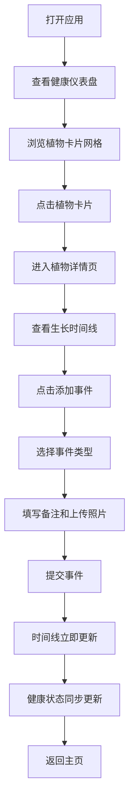

## 1. 产品概述
GrowLog是一款面向社区花园爱好者的植物生长日记应用，帮助用户记录和分享植物从种子到成熟的完整生长过程。

- **核心价值**：让植物养护变得可追踪、可视化，通过时间线记录和健康仪表盘，帮助用户建立科学的养护习惯，同时在社区内分享种植经验。
- **目标用户**：社区花园成员、家庭园艺爱好者、植物种植初学者。
- **核心解决问题**：传统植物养护依赖记忆，难以追踪浇水/施肥周期，无法直观看到植物成长轨迹。

## 2. 核心功能

### 2.1 用户角色
| 角色 | 注册方式 | 核心权限 |
|------|----------|----------|
| 普通用户 | 本地使用，无需注册 | 创建植物档案、记录生长事件、查看时间线、健康仪表盘 |

### 2.2 功能模块
1. **植物档案管理**：创建/编辑/删除植物卡片，包含名称、品种、种植日期、预期成熟天数、主图。
2. **生长事件记录**：记录播种、发芽、浇水、施肥、修剪、收获、病虫害等事件，支持文字备注和照片上传（最多3张）。
3. **成长时间线可视化**：按日期降序展示垂直时间线，不同事件类型用彩色图标区分，节点间用渐变线连接。
4. **健康状态仪表盘**：圆形卡片展示所有植物，根据最近事件自动更新健康状态外圈颜色，快速预览植物状态。

### 2.3 页面详情
| 页面名称 | 模块名称 | 功能描述 |
|----------|----------|----------|
| 主页(植物列表) | 健康仪表盘 | 左侧边栏/顶部展示植物圆卡，点击跳转详情 |
| 主页(植物列表) | 植物卡片网格 | CSS Grid布局展示所有植物卡片，显示缩略图和生长天数 |
| 植物详情页 | 添加事件表单 | 底部滑入表单，选择事件类型、填写备注、上传照片 |
| 植物详情页 | 时间线组件 | 垂直时间线展示所有事件，支持展开查看完整备注 |
| 植物详情页 | 植物信息头 | 展示植物主图、名称、品种、种植天数等基本信息 |

## 3. 核心流程
用户打开应用 → 查看健康仪表盘了解所有植物状态 → 在主页浏览植物卡片 → 点击进入某植物详情 → 查看生长时间线 → 记录新的生长事件（选择类型、添加备注、上传照片）→ 事件立即更新到时间线和健康状态 → 返回主页查看更新后的仪表盘。

## 4. 用户界面设计

### 4.1 设计风格
- **主题**：浅色自然主题，营造清新、有机的视觉感受
- **主色**：苔绿 #5B8C5A（代表生命力、自然）
- **强调色**：暖杏 #E8A87C（代表温暖、收获）
- **背景色**：米白 #F9F6F0
- **卡片色**：纯白 #FFFFFF
- **文字色**：深灰蓝 #2C3E50
- **按钮样式**：圆角8px，悬停时颜色加深10%，按压时缩放0.95倍
- **字体**：Google Fonts - Inter（清晰现代的无衬线字体）
- **布局风格**：卡片式布局，柔和阴影，圆角设计
- **图标风格**：彩色SVG图标，不同事件类型对应不同颜色

### 4.2 页面设计概述
| 页面名称 | 模块名称 | UI Elements |
|----------|----------|-------------|
| 主页 | 健康仪表盘 | 圆形卡片（直径50px）、渐变外圈、悬停放大1.15倍、tooltip显示植物名、flex-wrap布局 |
| 主页 | 植物卡片网格 | CSS Grid（min 240px, max 280px）、gap 1.5rem、圆角12px、柔和box-shadow、悬停上移4px并加深阴影 |
| 详情页 | 添加事件表单 | 底部滑入动画（translateY 50px → 0，0.3s ease-out）、事件类型图标按钮组、照片预览区 |
| 详情页 | 时间线组件 | 左侧垂直轴线、节点右对齐、彩色渐变连接线、80字截断+展开全文、圆角8px事件卡片 |
| 详情页 | 植物信息头 | 大图展示、名称标题、品种标签、生长天数统计徽章 |

### 4.3 响应式设计
- **Desktop-first** 设计思路
- **断点**：900px
- **>900px**：健康仪表盘固定左侧边栏（宽度280px），主内容区在右侧
- **<900px**：健康仪表盘变为顶部水平滚动胶囊式布局，内容区垂直排列
- **触摸优化**：所有可点击元素最小尺寸44x44px，手势友好

### 4.4 动效设计
- **页面加载**：卡片依次淡入（staggered animation）
- **卡片悬停**：translateY(-4px) + 阴影加深（0.3s ease-out）
- **按钮交互**：hover时颜色加深，active时scale(0.95)
- **表单滑入**：从底部translateY(50px)滑入，0.3s ease-out
- **时间线展开**：高度过渡动画，平滑展开全文
- **仪表盘悬停**：scale(1.15) 放大效果，0.2s ease-out
