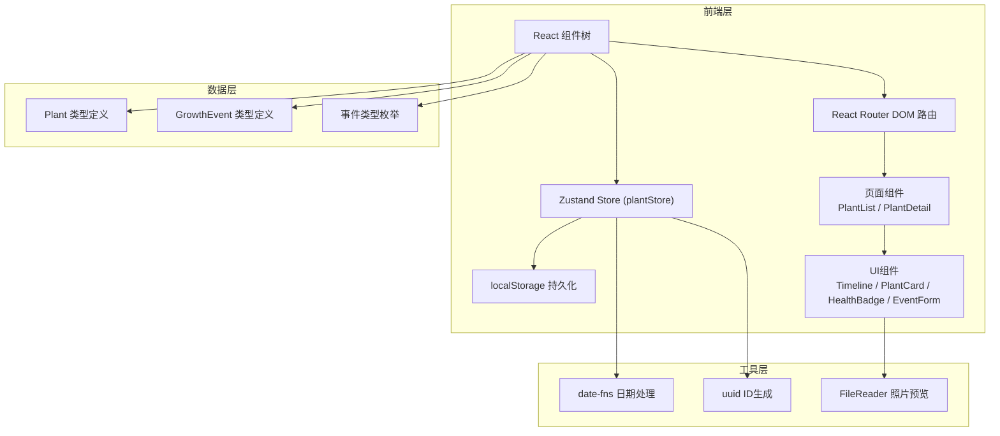
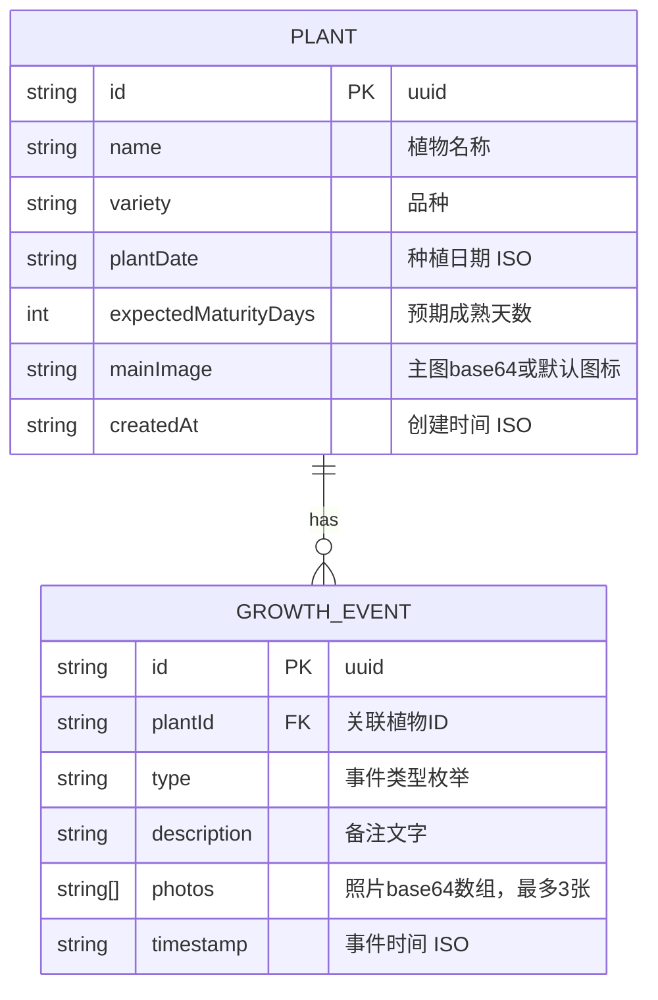

## 1. 架构设计



## 2. 技术描述

- **前端框架**：React@18 + TypeScript
- **构建工具**：Vite 5.x
- **状态管理**：Zustand 4.x + persist 中间件（数据持久化到localStorage）
- **路由**：React Router DOM 6.x
- **日期处理**：date-fns 3.x
- **ID生成**：uuid 9.x
- **字体**：@fontsource/inter 5.x
- **无后端依赖**：纯前端应用，数据存储在浏览器localStorage

### 项目初始化
- 使用 `react-ts` 模板初始化 Vite 项目
- 路径别名：`@/` 指向 `src/` 目录
- TypeScript 严格模式开启

## 3. 路由定义

| 路由路径 | 页面组件 | 用途 |
|----------|----------|------|
| `/` | PlantList | 主页：健康仪表盘 + 植物卡片网格 |
| `/plant/:id` | PlantDetail | 植物详情页：时间线 + 添加事件表单 |
| `*` | PlantList | 404重定向到主页 |

## 4. 数据模型

### 4.1 数据模型定义



### 4.2 类型定义（TypeScript）

```typescript
// 事件类型枚举
export type EventType = 
  | 'sowing'      // 播种
  | 'germination' // 发芽
  | 'watering'    // 浇水
  | 'fertilizing' // 施肥
  | 'pruning'     // 修剪
  | 'harvest'     // 收获
  | 'pests';      // 病虫害

// 生长事件
export interface GrowthEvent {
  id: string;
  plantId: string;
  type: EventType;
  description: string;
  photos: string[];
  timestamp: string;
}

// 植物
export interface Plant {
  id: string;
  name: string;
  variety: string;
  plantDate: string;
  expectedMaturityDays: number;
  mainImage: string;
  createdAt: string;
  events: GrowthEvent[];
}

// Store状态
export interface PlantStore {
  plants: Plant[];
  selectedPlantId: string | null;
  addPlant: (plant: Omit<Plant, 'id' | 'createdAt' | 'events'>) => void;
  updatePlant: (id: string, updates: Partial<Plant>) => void;
  deletePlant: (id: string) => void;
  selectPlant: (id: string | null) => void;
  addEvent: (plantId: string, event: Omit<GrowthEvent, 'id' | 'plantId' | 'timestamp'>) => void;
}
```

## 5. 文件结构与调用关系

```
src/
├── main.tsx               # React入口 → 渲染App.tsx
├── App.tsx                # 顶层布局 → Header + Router Outlet
│                          # 数据流向：从plantStore读取plants和selectedPlantId
│
├── store/
│   └── plantStore.ts      # Zustand Store → 定义类型、状态、actions
│                          # 被所有组件通过usePlantStore钩子调用
│
├── pages/
│   ├── PlantList.tsx      # 主页 → 读取plants，渲染健康仪表盘+卡片网格
│   │                      # 数据流向：store → 组件 → 分发导航动作
│   └── PlantDetail.tsx    # 详情页 → 读取路由参数+植物数据+事件列表
│                          # 数据流向：路由参数 → store查询 → 传递给子组件
│
├── components/
│   ├── Timeline.tsx       # 时间线组件 → 接收events数组props
│   │                      # 数据流向：props → 渲染时间线节点
│   ├── PlantCard.tsx      # 植物卡片 → 展示植物信息
│   ├── HealthBadge.tsx    # 健康圆卡 → 仪表盘组件
│   ├── EventForm.tsx      # 添加事件表单 → 提交后调用store.addEvent
│   ├── Header.tsx         # 导航头部
│   └── EventIcon.tsx      # 事件类型SVG图标
│
├── types/
│   └── index.ts           # 全局类型定义（Plant, GrowthEvent等）
│
└── utils/
    ├── dateUtils.ts       # 日期计算工具（生长天数、格式化）
    └── eventUtils.ts      # 事件类型配置（颜色、图标映射）
```

### 数据流向说明
1. **Store → 组件**：所有组件通过 `usePlantStore` 钩子读取状态，Zustand自动处理订阅更新。
2. **组件 → Store**：组件调用 `addPlant` / `addEvent` 等actions更新状态，persist中间件自动同步到localStorage。
3. **路由 → 组件**：`PlantDetail` 通过 `useParams()` 获取植物ID，从store筛选对应植物数据。
4. **父子组件**：`PlantDetail` 将events数组传递给 `Timeline` 组件（props down），`EventForm` 提交后直接调用store action。

## 6. 性能优化策略

### 6.1 首屏渲染 (<400ms)
- 植物数量控制在<100，无需虚拟列表
- 使用CSS Grid原生布局，避免重排重绘
- Zustand 细粒度订阅：组件只订阅所需状态片段

### 6.2 时间线流畅滚动 (FPS ≥ 55)
- 使用 `contain: layout paint` 隔离时间线渲染区域
- 图片使用 `loading="lazy"` 懒加载
- 避免长列表渲染时的复杂计算，日期格式化提前完成

### 6.3 Store更新 (<16ms)
- Zustand 内置浅比较，避免不必要重渲染
- 使用 Immer 风格的状态更新（Zustand支持）
- 照片压缩：上传前使用canvas压缩到合适尺寸
- 状态更新是同步的，无异步开销

## 7. 依赖清单

```json
{
  "dependencies": {
    "react": "^18.2.0",
    "react-dom": "^18.2.0",
    "react-router-dom": "^6.22.0",
    "zustand": "^4.5.0",
    "uuid": "^9.0.1",
    "date-fns": "^3.3.0",
    "@fontsource/inter": "^5.0.16"
  },
  "devDependencies": {
    "@types/react": "^18.2.0",
    "@types/react-dom": "^18.2.0",
    "@types/uuid": "^9.0.8",
    "@vitejs/plugin-react": "^4.2.0",
    "typescript": "^5.3.0",
    "vite": "^5.1.0"
  }
}
```
