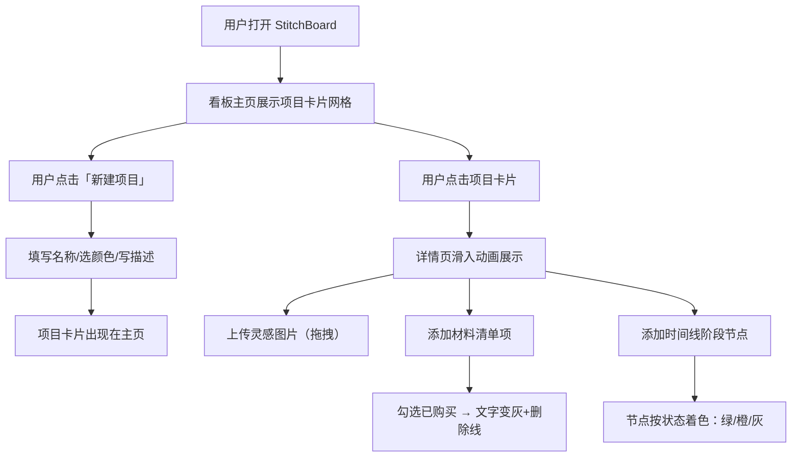

## 1. 产品概述

StitchBoard 是一款面向 DIY 手工艺爱好者的数字看板应用，帮助用户管理手工艺项目、收集灵感图片、记录材料清单和追踪项目进度，并生成可视化项目时间线。

- 核心目标：让手工艺爱好者拥有一个温暖、直觉化的数字工作台，从灵感到完成一站式管理
- 目标用户：织毛衣、刺绣、拼布、手工首饰等 DIY 手工艺爱好者

## 2. 核心功能

### 2.1 用户角色

| 角色 | 注册方式 | 核心权限 |
|------|----------|----------|
| 普通用户 | 无需注册，本地使用 | 创建/编辑/删除项目，上传图片，管理材料和时间线 |

### 2.2 功能模块

1. **看板主页**：项目卡片网格展示、新建项目、项目进度总览
2. **项目详情页**：灵感图片上传区、材料清单管理、时间线组件

### 2.3 页面详情

| 页面名称 | 模块名称 | 功能描述 |
|----------|----------|----------|
| 看板主页 | 新建项目表单 | 输入项目名称、选择封面颜色、添加简短描述，创建后以卡片形式展示 |
| 看板主页 | 项目卡片网格 | 卡片左上角彩色圆点、底部进度标签（计划中/进行中/已完成）、hover阴影动画 |
| 看板主页 | 分页组件 | 超过30个项目时分页显示 |
| 项目详情页 | 详情滑入动画 | 点击卡片从左向右滑入，背景蒙版带模糊效果 |
| 项目详情页 | 灵感图片区 | 拖拽上传、图片淡入动画、hover放大1.05倍并显示删除按钮、懒加载 |
| 项目详情页 | 材料清单 | 添加材料（名称/数量/单位/复选框），已购买项文字变灰加删除线 |
| 项目详情页 | 时间线组件 | 添加阶段节点（名称/日期/备注），竖线连接，节点颜色按状态区分，入场从右侧滑入 |

## 3. 核心流程

## 4. 用户界面设计

### 4.1 设计风格

- 主色调：暖色调 — 背景 `#FFF7ED`、卡片 `#FFFFFF`、强调色橙色 `#F97316`
- 按钮样式：圆角 8px，轻微盒阴影，hover 时阴影加深并上移 2px
- 字体：Inter（Google Fonts），多层级字号
- 布局：卡片网格布局，响应式
- 动画：所有交互 `transition 0.3s ease`，详情页从左向右滑入，时间线节点从右侧滑入

### 4.2 页面设计概览

| 页面名称 | 模块名称 | UI 元素 |
|----------|----------|---------|
| 看板主页 | 顶部操作栏 | 标题 "StitchBoard" + 新建项目按钮 |
| 看板主页 | 新建项目模态框 | 输入框（名称/描述）+ 颜色选择器 + 创建按钮 |
| 看板主页 | 项目卡片 | 白色卡片、左上角彩色圆点、项目名称、描述摘要、底部进度标签 |
| 看板主页 | 分页控件 | 上一页/下一页按钮 + 页码 |
| 项目详情页 | 顶部导航 | 返回按钮 + 项目名称 + 进度切换 |
| 项目详情页 | 灵感图片网格 | 拖拽上传区 + 图片网格（hover放大+删除按钮） |
| 项目详情页 | 材料清单 | 添加表单 + 材料列表（名称/数量/单位/复选框） |
| 项目详情页 | 时间线 | 竖线连接的节点列表，节点圆形图标按状态着色 |

### 4.3 响应式设计

- 桌面优先设计，网格布局自动适应列数
- 卡片网格：桌面3-4列，平板2列，手机1列
- 图片网格：桌面4列，平板2列，手机2列

### 4.4 3D 场景指引

不适用
