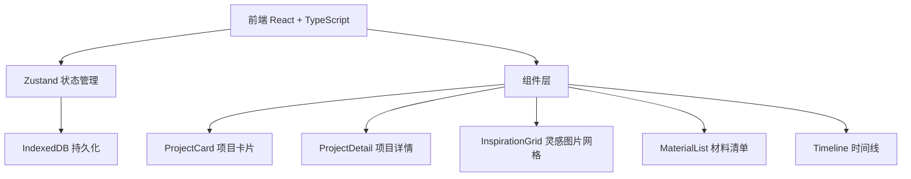
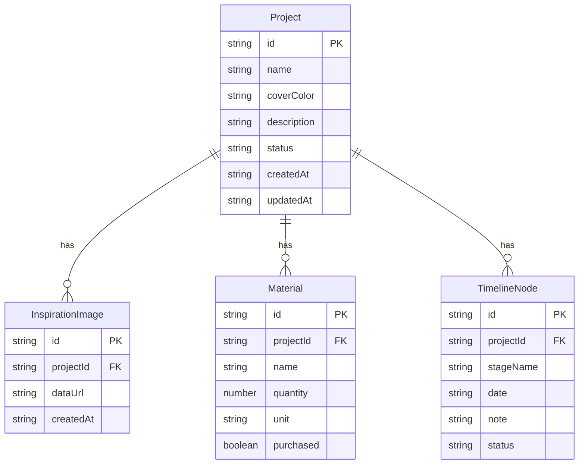

## 1. 架构设计

## 2. 技术说明

- 前端：React@18 + TypeScript + Vite
- 状态管理：Zustand（含 persist 中间件 → IndexedDB）
- 样式方案：Tailwind CSS + 自定义 CSS 动画
- 初始化工具：Vite（react-ts 模板）
- 后端：无
- 数据库：IndexedDB（通过 Zustand persist 中间件）

## 3. 路由定义

| 路由 | 用途 |
|------|------|
| `/` | 看板主页，展示项目卡片网格 |
| `/project/:id` | 项目详情页，含图片/材料/时间线 |

## 4. API 定义

无后端 API，所有数据本地存储。

## 5. 服务端架构图

不适用

## 6. 数据模型

### 6.1 数据模型定义

### 6.2 数据定义语言

不适用（IndexedDB 为 NoSQL 存储，通过 Zustand persist 中间件自动序列化/反序列化）
