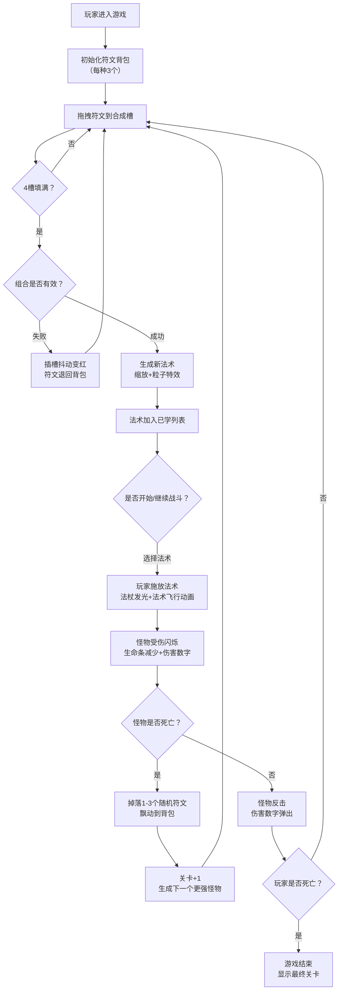

## 1. 产品概述

SpellForge是一款符文法术合成与回合制战斗模拟游戏，玩家通过收集6种基础符文（火、水、土、风、光、暗），在合成面板中组合创造新法术，并与随机生成的怪物进行策略性回合制战斗。

- 主要目标：为玩家提供兼具策略深度（符文组合、法术选择）与视觉乐趣（战斗动画、粒子特效）的单页Web游戏体验
- 目标用户：喜爱卡牌/RPG合成玩法、像素/奇幻风格的休闲游戏玩家
- 市场价值：低门槛、高重复可玩性，纯前端实现无后端依赖，可直接部署运行

---

## 2. 核心功能

### 2.1 功能模块

1. **符文背包系统**：展示6种基础符文的堆叠数量，支持拖拽操作
2. **符文合成面板**：4个六边形插槽，拖拽填入符文后自动判定合成结果
3. **法术列表与选择**：已学法术展示，包含冷却回合数显示与选择交互
4. **战斗场景**：玩家与怪物的回合制战斗，包含法术动画、伤害计算、状态反馈
5. **怪物生成与难度递增**：随机怪物生成、Boss关卡、属性递增机制
6. **符文掉落系统**：战斗胜利后掉落符文，带飘动收集动画

### 2.2 页面详情

| 页面名称 | 模块名称 | 功能描述 |
|-----------|-------------|---------------------|
| 主游戏界面 | 符文背包区 | 展示6种符文的数量，悬停显示名称，支持拖拽 |
| 主游戏界面 | 合成面板 | 4个六边形插槽，拖拽放入，填满自动合成，成功/失败反馈动画 |
| 主游戏界面 | 法术结果展示 | 合成成功后法术图标缩放动画+粒子爆炸特效 |
| 主游戏界面 | 已学法术列表 | 展示所有合成的法术，冷却状态显示，点击选择施放 |
| 主游戏界面 | 战斗场景 | 左右分栏：玩家（左）vs 怪物（右），生命条、角色像素图、回合指示器 |
| 主游戏界面 | 战斗日志 | 显示回合记录、伤害数值、法术施放信息 |
| 主游戏界面 | 关卡/Boss信息 | 当前关卡数、怪物属性、Boss特殊状态提示 |

---

## 3. 核心流程

---

## 4. 用户界面设计

### 4.1 设计风格

- **整体风格**：深色奇幻中世纪风格，神秘魔法氛围
- **主色调**：深蓝紫渐变背景（#0F0C29 → #302B63 → #24243E）
- **符文颜色**：
  - 火：#FF4500（橙红）
  - 水：#1E90FF（道奇蓝）
  - 土：#8B4513（马鞍棕）
  - 风：#98FB98（苍绿）
  - 光：#FFD700（金色）
  - 暗：#4B0082（靛青）
- **战斗背景**：深紫→黑色渐变（#2C003E → #000000）
- **分界线**：蓝紫渐变垂直光带（#00BFFF → #8A2BE2，4px宽）
- **字体**：MedievalSharp（中世纪哥特风格），Google Fonts
- **按钮/交互**：悬停时box-shadow发光过渡（0.3s），对应主题色光晕

### 4.2 页面设计概述

| 页面名称 | 模块名称 | UI元素 |
|-----------|-------------|-------------|
| 主游戏界面 | 符文卡片 | 六边形（边长40px），悬停上浮+旋转5°，名称淡入提示，堆叠数量角标 |
| 主游戏界面 | 合成插槽 | 六边形虚线边框，半透明黑底，拖入高亮蓝色光晕，失败抖动+红边框 |
| 主游戏界面 | 战斗角色 | 像素风格（玩家16x16/怪物48x48/Boss64x64），受伤闪红震动 |
| 主游戏界面 | 法术图标 | 合成成功时0→1缩放动画，冷却时灰色+剩余回合数 |
| 主游戏界面 | 生命条 | 渐变填充，数值变化跳跃动画，红色伤害数字弹出渐隐 |
| 主游戏界面 | 粒子特效 | 合成成功彩色碎片飞散（1s），法术命中爆炸效果 |

### 4.3 响应式设计

- **桌面端（≥768px）**：左右分栏布局（合成区左 | 战斗区右），垂直魔法分界线
- **移动端（<768px）**：上下堆叠布局（合成区上 | 战斗区下），水平魔法分界线
- **触控优化**：增大可点击区域，支持触摸拖拽
- **所有过渡动画**：统一0.3s过渡，包含符文数量、生命值、回合切换

### 4.4 动画与性能

- **动画驱动**：使用requestAnimationFrame，避免setTimeout/setInterval
- **帧率目标**：战斗/粒子动画稳定30FPS
- **状态优化**：Zustand批量更新，减少不必要重渲染
