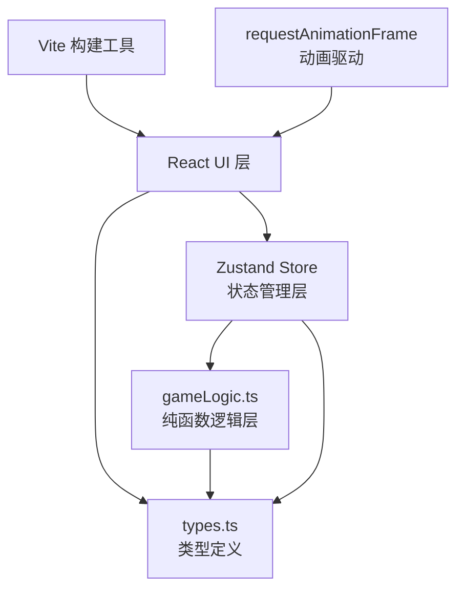
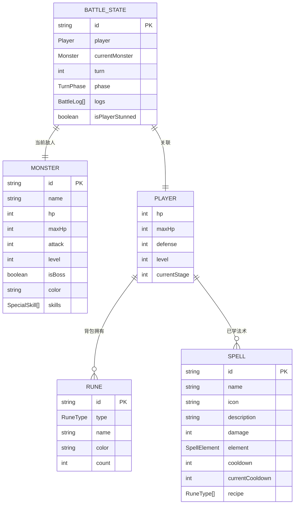

## 1. 架构设计



整体采用三层架构：
- **UI渲染层（React组件）**：负责DOM渲染、用户交互、动画展示
- **状态管理层（Zustand）**：集中管理游戏全局状态，支持批量更新
- **纯函数逻辑层（gameLogic.ts）**：所有游戏规则、战斗计算、合成判定均为纯函数，无副作用，易测试

---

## 2. 技术描述

| 分类 | 技术选型 | 说明 |
|------|---------|------|
| 前端框架 | React@18 + ReactDOM@18 | 函数式组件 + Hooks |
| 构建工具 | Vite（最新版） | 极速HMR，@vitejs/plugin-react |
| 语言 | TypeScript | strict严格模式，ES模块 |
| 状态管理 | Zustand | 轻量级，支持批量更新、中间件 |
| 唯一ID | uuid | 符文/法术/怪物实例ID |
| 字体 | @fontsource/medievalsharp | 中世纪风格字体，本地加载 |
| 动画引擎 | 自定义 requestAnimationFrame | 法术飞行、粒子特效、伤害数字 |
| 样式方案 | CSS Modules / 原生CSS + CSS变量 | 零额外依赖，高性能 |
| 拖拽交互 | HTML5 Drag & Drop API | 原生支持，轻量高效 |

**启动方式**：`npm run dev` 启动Vite开发服务器

---

## 3. 路由定义

本游戏为**单页应用（SPA）**，无多页面路由：

| 路由 | 用途 |
|------|------|
| `/` | 唯一入口，渲染GameBoard主游戏界面 |

---

## 4. API定义

无后端API，所有数据与逻辑均在前端纯函数中实现：

```typescript
// 核心纯函数签名（gameLogic.ts）

// 符文合成判定
function tryCraftRunes(slots: (Rune | null)[]): 
  { success: true; spell: Spell } | 
  { success: false; reason: string }

// 法术效果计算
function calculateSpellDamage(
  spell: Spell, 
  monster: Monster, 
  playerLevel: number
): { damage: number; effects: StatusEffect[] }

// 怪物伤害计算
function calculateMonsterDamage(
  monster: Monster, 
  playerDefense: number
): number

// 生成随机怪物
function generateMonster(
  level: number, 
  isBoss: boolean
): Monster

// 战斗状态下一回合
function nextTurn(
  state: BattleState, 
  playerAction: PlayerAction
): BattleState

// 战斗胜利掉落
function generateRuneDrops(
  monsterLevel: number, 
  isBoss: boolean
): RuneType[]
```

---

## 5. 数据模型

### 5.1 ER图



### 5.2 类型定义（types.ts）

```typescript
// 符文类型
type RuneType = 'fire' | 'water' | 'earth' | 'wind' | 'light' | 'dark';

interface Rune {
  id: string;
  type: RuneType;
  name: string;      // 如"烈焰符文"
  color: string;     // 十六进制颜色
  count: number;     // 堆叠数量，上限9
  icon: string;      // emoji或svg标识
}

// 法术元素类型
type SpellElement = 
  | 'fire' | 'water' | 'earth' | 'wind' 
  | 'light' | 'dark' | 'combo' | 'chaos';

interface Spell {
  id: string;
  name: string;
  icon: string;
  description: string;
  baseDamage: number;
  element: SpellElement;
  cooldown: number;       // 冷却回合数
  currentCooldown: number;
  recipe: RuneType[];     // 合成配方（4个）
  isAoe?: boolean;
  effects?: StatusEffect[];
}

// 状态效果
interface StatusEffect {
  type: 'burn' | 'freeze' | 'stun' | 'poison' | 'heal' | 'shield';
  duration: number;    // 剩余回合
  value: number;       // 数值（伤害/治疗量）
}

// 怪物
interface Monster {
  id: string;
  name: string;
  hp: number;
  maxHp: number;
  attack: number;
  level: number;
  isBoss: boolean;
  color: string;
  shape: MonsterShape;
  specialSkills: BossSkill[];
  statusEffects: StatusEffect[];
}

type MonsterShape = 'slime' | 'bat' | 'spider' | 'skeleton' | 'cyclops';
type BossSkill = 'stun_all' | 'heavy_smash' | 'summon_minions';

// 玩家状态
interface Player {
  hp: number;
  maxHp: number;
  defense: number;
  level: number;
  currentStage: number;
  statusEffects: StatusEffect[];
}

// 战斗状态
type TurnPhase = 'player_turn' | 'player_animating' | 'enemy_turn' | 'enemy_animating' | 'victory' | 'defeat';

interface BattleState {
  player: Player;
  monster: Monster | null;
  turn: number;
  phase: TurnPhase;
  isPlayerStunned: boolean;
  bossSkillCooldown: number;  // Boss特殊技能冷却
}

// 战斗日志
interface BattleLogEntry {
  id: string;
  turn: number;
  actor: 'player' | 'monster' | 'system';
  message: string;
  damage?: number;
  timestamp: number;
}

// 游戏全局状态
interface GameState {
  runes: Record<RuneType, Rune>;       // 符文背包
  learnedSpells: Spell[];              // 已学法术
  battle: BattleState;                 // 当前战斗
  battleLogs: BattleLogEntry[];        // 战斗日志
  craftSlots: (RuneType | null)[];     // 合成槽（4个）
  isCrafting: boolean;                 // 合成动画中
  lastCraftResult: Spell | null;       // 上次合成结果
  animatingSpell: string | null;       // 正在播放动画的法术ID
}
```

---

## 6. 文件结构

```
auto170/
├── package.json
├── index.html
├── vite.config.js
├── tsconfig.json
└── src/
    ├── types.ts           # 所有类型定义
    ├── gameLogic.ts       # 纯函数游戏逻辑
    ├── store.ts           # Zustand状态管理
    ├── main.tsx           # React入口
    ├── index.css          # 全局样式+CSS变量
    ├── components/
    │   ├── GameBoard.tsx      # 主游戏界面（左右/上下布局）
    │   ├── RuneSlot.tsx       # 合成插槽组件（拖拽目标）
    │   ├── RuneCard.tsx       # 符文背包卡片（拖拽源）
    │   ├── SpellCard.tsx      # 法术卡片
    │   ├── SpellList.tsx      # 已学法术列表
    │   ├── BattleScene.tsx    # 战斗场景容器
    │   ├── Character.tsx      # 像素角色/怪物渲染
    │   ├── HealthBar.tsx      # 生命条组件
    │   ├── BattleLog.tsx      # 战斗日志
    │   ├── ParticleEffect.tsx # 粒子特效（requestAnimationFrame）
    │   ├── DamageNumber.tsx   # 伤害数字弹出
    │   └── CraftPanel.tsx     # 合成面板容器
    └── hooks/
        ├── useAnimation.ts    # requestAnimationFrame Hook
        └── useDragDrop.ts     # 拖拽逻辑Hook
```

---

## 7. 性能优化方案

| 优化点 | 方案 |
|--------|------|
| 状态更新 | Zustand `set` 批量更新，避免多次触发渲染 |
| 组件memo | 列表项（RuneCard/SpellCard）用`React.memo`包裹 |
| 动画性能 | 统一requestAnimationFrame循环，transform/opacity动画（GPU加速） |
| 重渲染控制 | 使用`useShallow`选择状态切片，避免全量订阅 |
| 粒子特效 | Canvas渲染粒子，超出生命周期自动回收对象池 |
| 拖拽 | 原生HTML5 DnD，避免mousemove高频监听+节流 |
| 字体 | @fontsource预加载，避免FOIT/FOUT |
