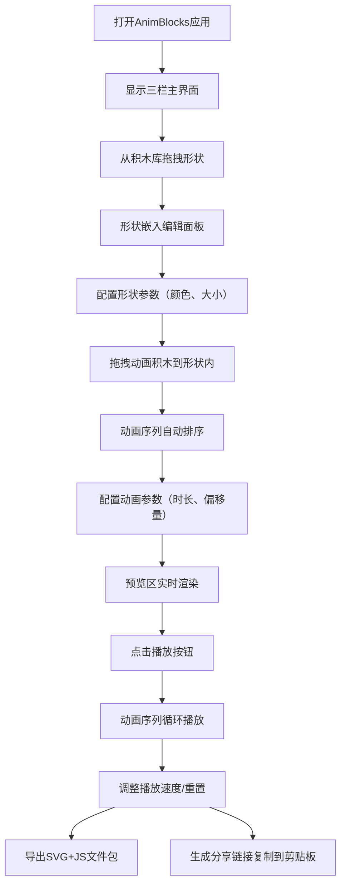

# AnimBlocks 产品需求文档

## 1. 产品概述

AnimBlocks 是一款面向8-12岁儿童初学者的可视化SVG动画编辑器，通过拖拽积木块组合的方式替代传统代码编写，让孩子们能够直观地创建生动的几何图形动画，降低编程学习门槛，培养计算思维和创造力。

- **核心价值**：将抽象的编程概念转化为具象的积木拼装游戏，让儿童在趣味交互中学习动画制作基础
- **目标市场**：儿童编程学习社区、K12教育机构、家庭编程启蒙教育

## 2. 核心功能

### 2.1 用户角色

| 角色 | 注册方式 | 核心权限 |
|------|----------|----------|
| 儿童用户 | 无需注册，直接使用 | 拖拽积木、编辑动画、预览播放、导出分享 |
| 教育工作者 | 无需注册 | 制作教学案例、导出教学素材 |

### 2.2 功能模块

1. **主应用界面**：三栏布局（积木库、编辑面板、预览区）、响应式适配、深色主题
2. **积木库模块**：可拖拽形状积木、可拖拽动画积木、积木样式与交互反馈
3. **编辑面板模块**：积木接收与排序、参数配置区域、形状与动画层级关系
4. **预览区模块**：SVG实时渲染、动画帧驱动引擎、播放控制组件
5. **导出分享模块**：SVG+JS文件包导出、唯一ID分享链接、复制到剪贴板

### 2.3 页面详情

| 页面名称 | 模块名称 | 功能描述 |
|---------|---------|---------|
| 主应用页 | 积木库侧边栏 | 显示4种形状积木（圆形、矩形、三角形、星形）和5种动画积木（移动、旋转、缩放、变色、闪烁），支持拖拽 |
| 主应用页 | 编辑面板 | 接收拖拽积木、形状卡片展示、动画序列排序、参数配置面板展开/收起 |
| 主应用页 | 预览区 | SVG画布渲染形状、requestAnimationFrame动画循环、播放/暂停/重置/速度控制 |
| 主应用页 | 导出功能 | 导出SVG+JS压缩包、生成分享链接、模态框展示下载 |

## 3. 核心流程

### 3.1 主要用户流程

用户打开应用 → 从左侧积木库拖拽形状积木到编辑面板 → 形状卡片显示并可配置参数 → 拖拽动画积木到形状卡片内部 → 动画积木形成序列，可拖拽排序 → 点击动画块展开参数配置 → 右侧预览区实时渲染 → 点击播放按钮观看动画效果 → 调整速度或重置 → 导出为SVG+JS文件包或生成分享链接

### 3.2 流程图

## 4. 用户界面设计

### 4.1 设计风格

- **主色调**：深蓝宇宙主题，背景 #1a1a2e，侧边栏 #16213e，卡片 #0f3460，交互强调色 #e94560（珊瑚红）
- **按钮样式**：圆角按钮，悬停有弹性缩放动画，播放按钮圆形带图标
- **字体**：标题使用富童趣感的粗体无衬线字体，正文使用清晰易读的等宽或圆润字体
- **布局风格**：三栏Flexbox布局，卡片式模块化设计，左侧彩色边框标识形状类型
- **图标风格**：几何形状SVG图标，动画图标使用方向箭头和变换符号，符合儿童视觉认知

### 4.2 页面设计概览

| 页面名称 | 模块名称 | UI元素 |
|---------|---------|--------|
| 主应用页 | 积木库侧边栏 | 宽度240px，圆角卡片（圆角12px），悬停上移4px阴影扩大，底部阴影 rgba(233,69,96,0.3) |
| 主应用页 | 编辑面板 | 占60%宽度，网格虚线背景（间距20px），形状卡片左侧彩色边框，动画块左侧4px实色条 |
| 主应用页 | 预览区 | 占35%宽度，背景 #0f3460，SVG居中最大400px，外框3秒脉动光晕，播放按钮悬停缩放 |
| 主应用页 | 响应式 | <768px时积木库变顶部可折叠面板，编辑区与预览区上下排列 |

### 4.3 响应式

- **桌面优先**设计，主分辨率适配1366×768及以上
- **断点768px**：三栏变上下布局，积木库折叠为顶部可展开条
- **断点480px**：编辑面板卡片简化参数显示，触控区域增大至44px最小点击尺寸

### 4.4 动画与交互

- **拖拽放置**：积木跟随鼠标移动，目标区域高亮提示，放置时0.3秒spring弹性动画
- **排序动画**：拖拽排序时其他块自动让位，间隙处虚线占位符提示
- **按钮反馈**：0.2秒transition过渡，播放按钮点击缩放0.9→1.0，重置按钮旋转180度回正
- **预览区光晕**：3秒周期脉动动画，透明度0.2↔0.6渐变，从中心向外扩展收缩

## 5. 性能约束

| 约束项 | 指标要求 | 降级策略 |
|--------|---------|---------|
| 拖拽排序帧率 | ≥50fps | 减少阴影渲染层级，使用CSS will-change优化 |
| 预览动画帧率 | 60fps（60Hz） | 帧率<30fps时自动减半路径点数量 |
| 形状数量上限 | ≤5个 | 超出显示"已达上限"气泡提示，禁用拖拽 |
| 动画序列上限 | ≤10个/形状 | 超出禁用放置，底部弹出2秒提示气泡 |
| 首屏加载 | ≤3s | 按需加载模块，SVG资源内联优化 |
