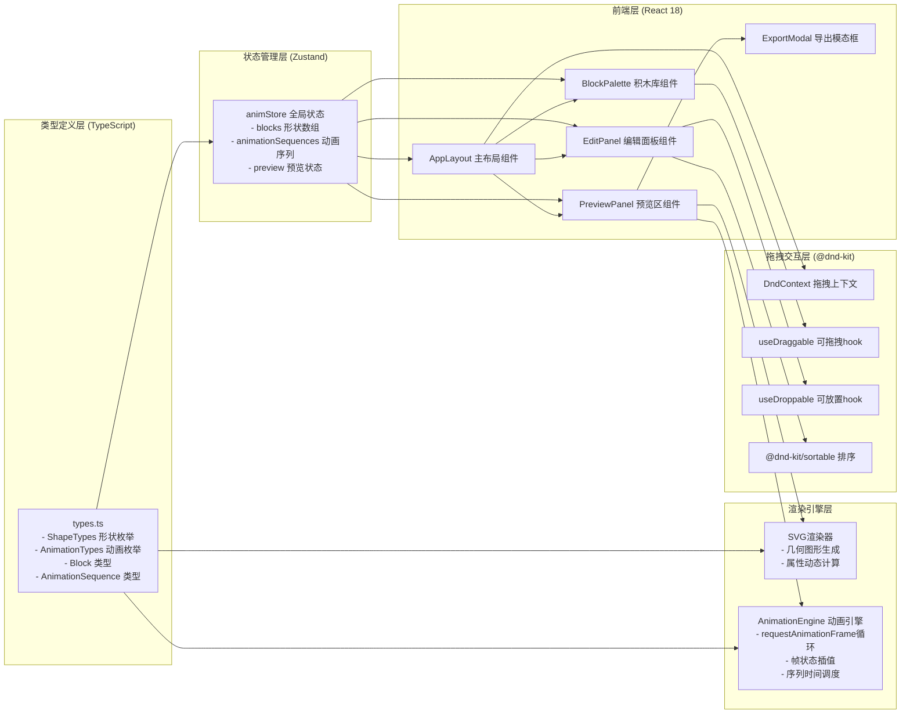
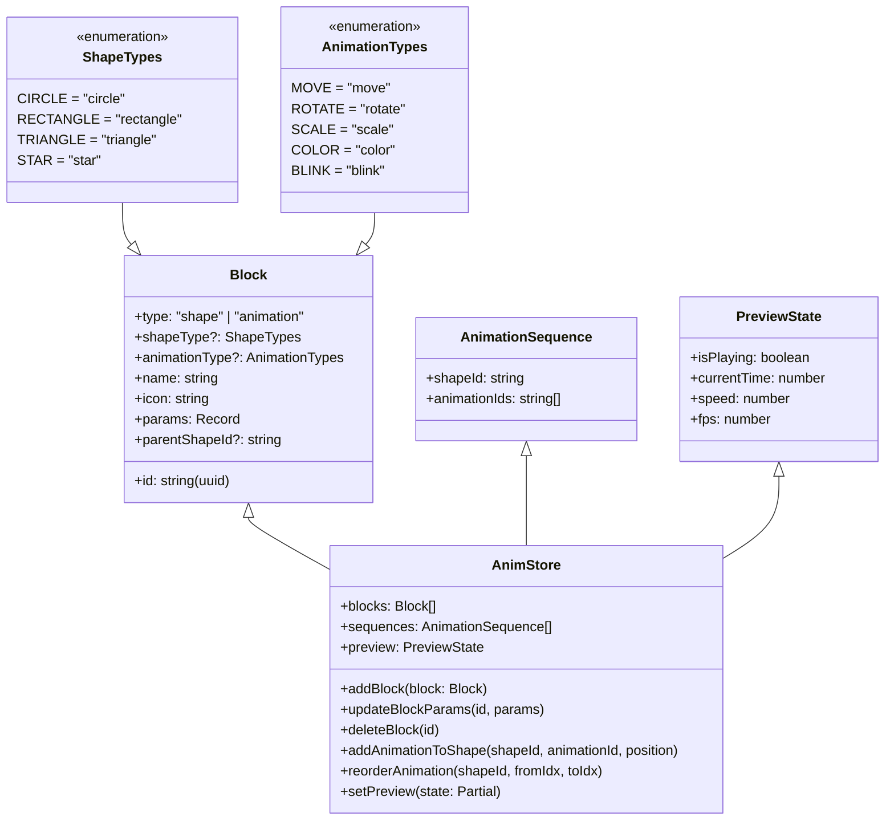

# AnimBlocks 技术架构文档

## 1. 架构设计



## 2. 技术描述

### 2.1 核心技术栈

| 层级 | 技术选型 | 版本要求 | 用途说明 |
|------|---------|---------|---------|
| 构建工具 | Vite | ^5.0 | 快速构建，HMR热更新，SVG内联支持 |
| 前端框架 | React | ^18.2 | 函数组件 + Hooks 开发模式 |
| 编程语言 | TypeScript | ^5.0 | strict模式，类型安全 |
| 状态管理 | Zustand | ^4.4 | 轻量store，blocks/sequences/preview状态 |
| 拖拽交互 | @dnd-kit/core | ^6.1 | 积木拖拽核心引擎 |
| 排序交互 | @dnd-kit/sortable | ^7.0 | 动画序列可排序 |
| 唯一ID生成 | uuid | ^9.0 | blockId, sequenceId 生成 |
| 动画引擎 | requestAnimationFrame | 浏览器原生 | 自定义SVG帧动画驱动 |

### 2.2 不使用第三方动画库

- 所有SVG动画通过**自定义动画引擎**实现：基于时间戳的帧插值算法
- 动画序列采用**相对时间线调度**：每个动作时长 + 0.2s过渡间隔
- 性能自适应：监控帧率，低于30fps自动降低插值密度

### 2.3 构建与开发

- **初始化命令**：`npm create vite@latest . -- --template react-ts`
- **启动脚本**：`npm run dev`（Vite开发服务器，端口默认5173）
- **构建脚本**：`npm run build`（输出dist目录，含chunk分割）
- **类型检查**：`tsc --noEmit`

## 3. 模块文件结构与调用关系

```
src/
├── main.tsx                      [入口] 挂载React应用
├── App.tsx                       [根组件] 引入AppLayout
├── types.ts                      [类型层] 被所有文件 import
├── store.ts                      [状态层] import types，被组件import
├── components/
│   ├── AppLayout.tsx             [布局层] import store + types + 子组件
│   ├── BlockPalette.tsx          [左侧栏] import store + useDraggable
│   ├── EditPanel.tsx             [中间区] import store + sortable
│   │   ├── ShapeCard.tsx         [子组件] 单个形状卡片（含动画序列区）
│   │   ├── AnimationBlock.tsx    [子组件] 单个动画块（可展开参数）
│   │   └── ParamsEditor.tsx      [子组件] 参数配置表单
│   ├── PreviewPanel.tsx          [右侧栏] import store + 动画引擎
│   │   ├── SvgRenderer.tsx       [子组件] SVG形状渲染
│   │   ├── PlaybackControls.tsx  [子组件] 播放/暂停/重置/速度滑块
│   │   └── ExportButton.tsx      [子组件] 导出按钮与模态框
│   └── Toast.tsx                 [通用] 提示气泡组件
├── engine/
│   ├── animationEngine.ts        [动画引擎] 帧循环、插值、序列调度
│   └── svgGenerator.ts           [导出器] 生成可独立运行的SVG+JS
└── hooks/
    └── useFpsMonitor.ts          [自定义hook] 帧率监控与自适应降级
```

### 3.1 数据流向

```
用户拖拽事件
    ↓
AppLayout (DndContext 捕获)
    ↓ onDragEnd
store.addBlock() / store.addAnimation()
    ↓ 状态更新
┌─────────────────────────────────────┐
│ EditPanel 重新渲染                  │
│   → 形状卡片 + 动画序列刷新          │
│ PreviewPanel 重新渲染               │
│   → SvgRenderer 绘制静态形状        │
│   → 点击播放时启动animationEngine   │
└─────────────────────────────────────┘
    ↓
用户修改参数 → store.updateBlockParams() → 组件刷新
```

## 4. 数据模型定义

### 4.1 types.ts 类型体系



### 4.2 形状与动画默认参数

| 形状类型 | 默认参数 | 可配置参数 |
|---------|---------|-----------|
| CIRCLE  | `{radius: 40, fill: "#e94560"}` | radius(10-100), fill(colorPicker) |
| RECTANGLE | `{width: 80, height: 60, fill: "#4ecdc4"}` | width(20-200), height(20-200), fill |
| TRIANGLE | `{sideLength: 80, fill: "#ffe66d"}` | sideLength(30-150), fill |
| STAR | `{points: 5, outerRadius: 45, innerRadius: 20, fill: "#a855f7"}` | points(3-10), outerRadius, innerRadius, fill |

| 动画类型 | 默认参数 | 可配置参数 |
|---------|---------|-----------|
| MOVE | `{dx: 50, dy: 0, duration: 1000, repeat: 1}` | dx(-200~200), dy(-200~200), duration(100-5000), repeat(1-10) |
| ROTATE | `{angle: 360, duration: 1000, repeat: 1}` | angle(0-720), duration, repeat |
| SCALE | `{factor: 1.5, duration: 1000, repeat: 1}` | factor(0.1-3), duration, repeat |
| COLOR | `{targetColor: "#4ecdc4", duration: 1000, repeat: 1}` | targetColor, duration, repeat |
| BLINK | `{frequency: 2, duration: 2000, repeat: 1}` | frequency(1-10Hz), duration, repeat |

## 5. 核心算法

### 5.1 动画帧插值引擎

```
AnimationEngine.run(sequences, speed):
    frameTime = performance.now()
    deltaT = frameTime - lastFrameTime
    currentTime += deltaT * speed
    for each shapeId, animIds in sequences:
        shapeState = getBaseShapeState(shapeId)
        sequenceCursor = 0
        elapsedInSeq = currentTime
        for each animId in animIds:
            anim = getBlock(animId)
            animDuration = anim.params.duration * anim.params.repeat + 200ms过渡
            if elapsedInSeq <= animDuration:
                progress = elapsedInSeq / anim.params.duration
                phase = floor(progress)
                if phase < anim.params.repeat:
                    localProgress = progress - phase
                    easedProgress = easeInOutQuad(localProgress)
                    shapeState = applyAnimation(shapeState, anim, easedProgress)
                break
            else:
                shapeState = applyFinalState(shapeState, anim)
                elapsedInSeq -= animDuration
        renderShape(shapeId, shapeState)
    if loopEnded: currentTime = 0
    requestAnimationFrame(run)
```

### 5.2 帧率自适应降级

```
useFpsMonitor:
    采样最近30帧的帧间隔
    计算平均FPS = 1000 / avgInterval
    if avgFPS < 30 and not degraded:
        degraded = true
        插值点数从60步/秒降至30步/秒
    else if avgFPS > 50 and degraded:
        degraded = false
        恢复60步/秒插值
```

## 6. 性能优化策略

| 优化点 | 实施方案 |
|-------|---------|
| 拖拽流畅性 | @dnd-kit 使用 transform 而非 position，GPU 加速，will-change: transform |
| 列表重排 | React.memo 包装 ShapeCard / AnimationBlock，useMemo 缓存排序结果 |
| SVG 渲染 | 形状属性变更仅更新对应 DOM 元素 attribute，不重建整棵 SVG 树 |
| 动画循环 | 仅在播放状态下运行 requestAnimationFrame，暂停时 cancelAnimationFrame |
| Store 订阅 | 使用 Zustand selector 避免不必要的重新渲染 |
| 打包优化 | Vite 代码分割，Zustand/@dnd-kit/uuid 分 chunk，SVG 资源内联 |
