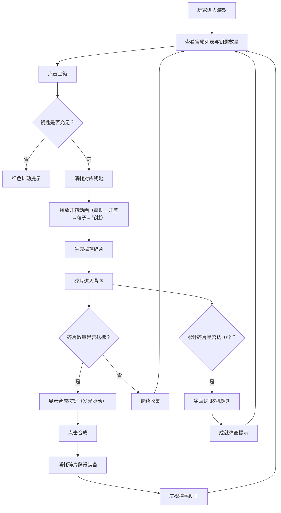

## 1. 产品概述

LootCrate 是一款虚拟宝箱开箱模拟与战利品管理游戏，玩家通过消耗钥匙开启不同稀有度的宝箱，获取并收集装备碎片，最终合成完整装备。游戏主打开箱爽感与收集养成体验，适合休闲玩家享受随机掉落的惊喜感。

- 核心玩法：开箱 → 收集碎片 → 合成装备 → 解锁成就
- 目标用户：喜爱开箱模拟、收集养成类游戏的玩家
- 产品价值：提供零成本的开箱体验与收藏成就感

## 2. 核心功能

### 2.1 功能模块

1. **宝箱系统**：四种稀有度宝箱（普通、稀有、史诗、传说），消耗对应钥匙开启
2. **开箱动画**：震动 → 开盖 → 粒子喷发 → 光柱特效（史诗/传说）
3. **背包系统**：6列网格展示物品，支持搜索、筛选、懒加载
4. **合成系统**：碎片集齐后可合成完整装备，带庆祝横幅动画
5. **成就系统**：每收集10个碎片奖励1把随机钥匙
6. **钥匙管理**：初始5把普通钥匙，开箱消耗，成就奖励

### 2.3 页面详情

| 页面名称 | 模块名称 | 功能描述 |
|---------|---------|---------|
| 主页面 | 宝箱展示区 | 四种稀有度宝箱卡片，钥匙数量显示，点击开箱 |
| 主页面 | 开箱动画层 | 全屏动画覆盖层，播放开箱特效序列 |
| 主页面 | 背包面板 | 网格展示碎片/装备，搜索筛选，合成面板 |
| 主页面 | 物品详情弹窗 | 显示碎片名称、套装、持有/需求数量 |
| 主页面 | 庆祝横幅 | 合成装备后从右侧滑入的庆祝提示 |
| 主页面 | 成就提示弹窗 | 达成成就奖励钥匙时的自动弹窗 |

## 3. 核心流程



## 4. 用户界面设计

### 4.1 设计风格

- **主色调**：深色科幻风格
  - 背景色：#0A0E17（深空蓝黑）
  - 面板色：#141A29（深蓝灰面板）
  - 文字色：#E0E0E0（浅灰文字）
  - 强调色：#00D4AA（青蓝科技感）
- **宝箱稀有度渐变**：
  - 普通：#7F8C8D（灰色）
  - 稀有：#2980B9（蓝色）
  - 史诗：#8E44AD（紫色）
  - 传说：#F39C12（金色）
- **字体**：Orbitron（科幻感字体）
- **按钮风格**：
  - 合成按钮：圆形渐变（#00D4AA → #008B74）
  - 点击反馈：缩放 0.95
- **图标风格**：几何形状区分装备部位
  - 武器：红色三角形
  - 护甲：蓝色正方形
  - 饰品：绿色菱形

### 4.2 页面设计概览

| 页面名称 | 模块名称 | UI 元素 |
|---------|---------|---------|
| 主页面 | 宝箱卡片 | Grid 自适应布局（minmax(220px, 1fr)），悬浮放大 1.05 倍，发光阴影，0.3s 过渡 |
| 主页面 | 开箱动画 | 三阶段动画序列，粒子 100-200 个，金色光柱（史诗/传说） |
| 主页面 | 背包网格 | 6 列网格，碎片图标+稀有度星星，懒加载，搜索筛选 |
| 主页面 | 弹窗 | 半透明黑色蒙版（rgba(0,0,0,0.6)），背景模糊 4px，中心缩放弹出（0.6→1.0，0.3s ease-out） |

### 4.3 响应式

- 桌面端优先，自适应网格布局
- 宝箱卡片：CSS Grid，minmax(220px, 1fr)
- 背包网格：6 列起步，窄屏自适应减少列数

## 5. 性能要求

- 开箱动画：稳定 60FPS，粒子 ≤200 时帧率 ≥55FPS
- 背包加载：100+ 物品时初始加载 <200ms
- 使用 CSS 动画与 transform 保证硬件加速
```
