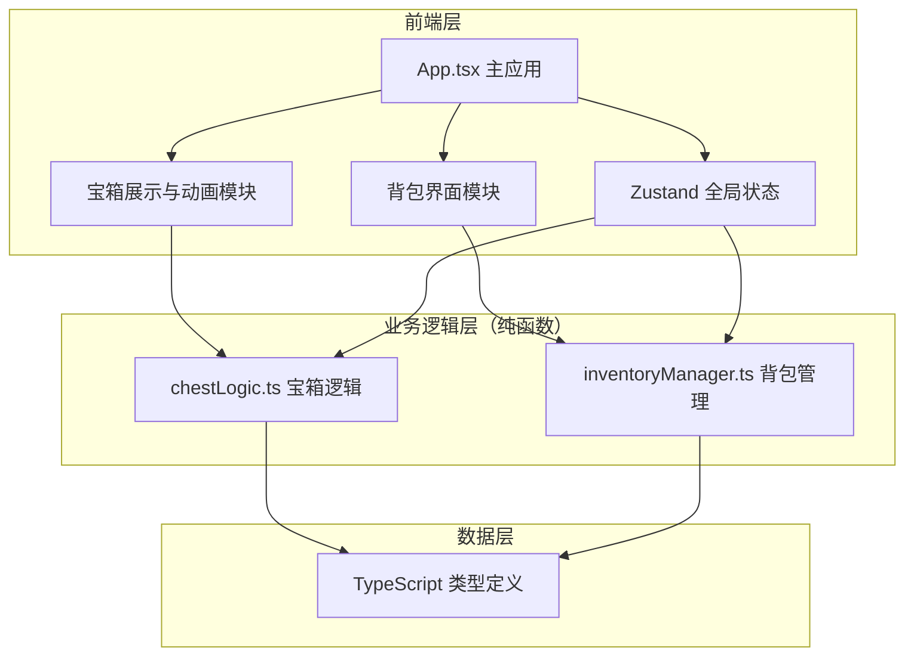

## 1. 架构设计



## 2. 技术选型说明

- **前端框架**：React@18 + TypeScript（严格模式）
- **构建工具**：Vite
- **状态管理**：Zustand（轻量、简洁、符合 React 哲学）
- **唯一 ID**：uuid
- **字体**：@fontsource/orbitron（科幻风格字体）
- **无第三方游戏引擎**：纯 CSS + React 实现动画与交互

## 3. 项目目录结构

```
d:\P\tasks\auto173/
├── package.json
├── index.html
├── vite.config.js
├── tsconfig.json
└── src/
    ├── App.tsx
    ├── main.tsx
    ├── index.css
    ├── modules/
    │   ├── chest/
    │   │   ├── chestLogic.ts          # 宝箱稀有度生成、掉落概率、开箱结果
    │   │   ├── chestRenderer.tsx      # 开箱动画组件
    │   │   └── chestUI.tsx            # 宝箱展示卡片组件
    │   └── inventory/
    │       ├── inventoryManager.ts    # 钥匙库存、物品碎片、成品装备管理
    │       └── inventoryUI.tsx        # 背包界面组件
    ├── store/
    │   └── useGameStore.ts            # Zustand 全局状态管理
    └── types/
        └── index.ts                   # 全局类型定义
```

## 4. 数据模型

### 4.1 核心类型定义

```typescript
// 稀有度枚举
type Rarity = 'common' | 'rare' | 'epic' | 'legendary';

// 装备部位
type EquipmentSlot = 'weapon' | 'armor' | 'accessory';

// 宝箱配置
interface ChestConfig {
  rarity: Rarity;
  name: string;
  keyCost: number;
  dropRates: Record<Rarity, number>;
  color: string;
}

// 物品碎片
interface ItemFragment {
  id: string;
  name: string;
  slot: EquipmentSlot;
  rarity: Rarity;
  setName: string;
  quantity: number;
  requiredForCraft: number;
}

// 成品装备
interface Equipment {
  id: string;
  name: string;
  slot: EquipmentSlot;
  rarity: Rarity;
  setName: string;
}

// 钥匙库存
interface KeyInventory {
  common: number;
  rare: number;
  epic: number;
  legendary: number;
}

// 开箱结果
interface ChestOpenResult {
  items: ItemFragment[];
  seed: number;
  highestRarity: Rarity;
}

// 游戏状态
interface GameState {
  keys: KeyInventory;
  fragments: ItemFragment[];
  equipment: Equipment[];
  totalFragmentsCollected: number;
  lastAchievementCount: number;
}
```

### 4.2 状态管理（Zustand）

- **keys**：四种钥匙的库存数量
- **fragments**：已获得的碎片列表（按套装+部位聚合）
- **equipment**：已合成的成品装备列表
- **totalFragmentsCollected**：累计收集碎片数（用于成就判定）
- **lastAchievementCount**：上次奖励成就时的累计数

## 5. 核心模块说明

### 5.1 chestLogic.ts（纯函数）

- `generateChestResult(chestRarity, keys, seed?)`：生成开箱结果
- `calculateDropRates(chestRarity)`：根据宝箱稀有度计算掉落概率表
- `rollRarity(dropRates, randomFn)`：按概率随机选取稀有度
- `generateFragment(slot, rarity)`：生成具体碎片数据

### 5.2 chestRenderer.tsx（动画组件）

- 三阶段动画：震动 → 开盖 → 粒子喷发
- 光柱特效：史诗/传说品质时显示
- 物品揭示：动画结束后弹出获得物品
- 使用 CSS keyframes + requestAnimationFrame 实现高性能动画

### 5.3 inventoryManager.ts（纯函数）

- `addFragment(inventory, fragment)`：添加碎片，自动聚合
- `canCraft(fragment)`：检查是否可合成
- `craftEquipment(fragment)`：消耗碎片合成装备
- `filterFragments(fragments, filter, search)`：筛选搜索
- `checkAchievement(totalCollected, lastCount)`：检查成就奖励

### 5.4 inventoryUI.tsx（背包组件）

- 6 列网格布局，懒加载
- 搜索框 + 筛选标签
- 碎片详情弹窗
- 合成按钮（发光脉动动画）
- 庆祝横幅（合成装备时）

## 6. 性能优化策略

1. **动画性能**：
   - 使用 `transform` 和 `opacity` 属性触发 GPU 加速
   - 粒子使用 CSS 动画，避免 JS 逐帧计算
   - 控制粒子数量在 200 以内

2. **背包渲染**：
   - 懒加载/虚拟滚动：只渲染视口内的物品
   - 使用 React.memo 避免不必要的重渲染
   - 碎片数据使用 ID 索引，O(1) 查找

3. **状态管理**：
   - Zustand 选择器（selector）精确订阅
   - 避免不必要的状态更新

4. **构建优化**：
   - Vite 原生 ESM 构建，开发时快速热更新
   - TypeScript 严格模式保证类型安全
```
