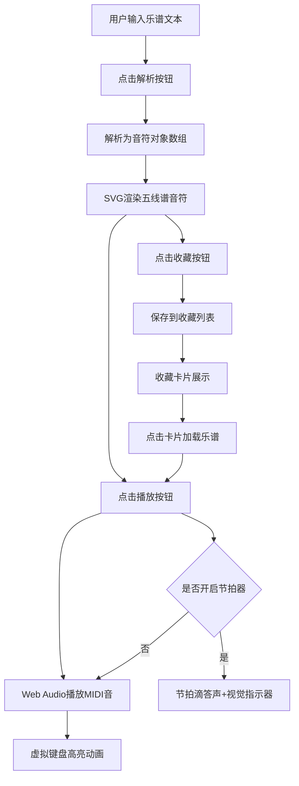

## 1. 产品概述

乐谱可视化学习应用，帮助音乐学习者将五线谱片段转换为可播放MIDI音乐，并在虚拟键盘上实时高亮对应按键，解决乐谱与钢琴键位对应困难、节拍判断不准确的问题。

- 核心功能：乐谱解析、MIDI播放、虚拟钢琴键盘交互、节拍器辅助、乐谱收藏管理
- 目标用户：钢琴初学者、音乐学习者、音乐教师
- 产品价值：提供直观的音高-键位映射可视化，降低乐谱阅读门槛，辅助节拍练习

## 2. 核心功能

### 2.1 功能模块

1. **乐谱编辑与解析**：文本输入五线谱符号，解析为MIDI序列并在SVG五线谱上渲染
2. **MIDI播放与键盘高亮**：按序列播放音符，虚拟键盘对应按键高亮动画
3. **节拍器辅助**：可调BPM节拍器，节拍指示器视觉反馈
4. **收藏管理**：乐谱收藏、列表展示、快速加载回放

### 2.2 页面详情

| 页面名称 | 模块名称 | 功能描述 |
|-----------|-------------|---------------------|
| 主页面 | 控制栏 | 乐谱输入、解析按钮、播放/暂停、BPM滑块、节拍器开关、收藏按钮 |
| 主页面 | 五线谱显示区 | SVG绘制五线谱，音符渲染（高音区红色、低音区蓝色），播放进度高亮 |
| 主页面 | 虚拟钢琴键盘 | 88键钢琴，按键悬停音名显示，点击试音，播放高亮 |
| 主页面 | 节拍指示器 | 圆形节拍闪烁指示器，强拍放大高亮 |
| 主页面 | 收藏列表 | 卡片网格展示收藏乐谱，支持加载和删除 |

## 3. 核心流程

用户输入乐谱文本 → 点击解析 → 生成音符序列并渲染到五线谱 → 点击播放 → MIDI声音播放同时键盘高亮 → 可开启节拍器辅助 → 满意后收藏乐谱 → 点击收藏卡片快速加载回放

## 4. 用户界面设计

### 4.1 设计风格

- **主色调**：深色暗调主题，背景#121212，卡片#1E1E1E，文字#ECF0F1
- **强调色**：橙色#F39C12（播放高亮）、青蓝#3498DB（交互元素）
- **音符色**：高音区#E74C3C（红）、低音区#2980B9（蓝）
- **按钮风格**：圆角8px，平滑过渡动画
- **字体**：Google Fonts - Inter
- **布局风格**：上中下三段式，控制栏顶部、五线谱中部、键盘底部
- **动画**：音符滑入动画0.3秒，按键高亮过渡0.1秒，节拍脉动周期0.6秒

### 4.2 页面设计概述

| 页面名称 | 模块名称 | UI元素 |
|-----------|-------------|-------------|
| 主页面 | 控制栏 | 背景#1C1C1C，圆角8px，内边距12px，包含文本输入框、功能按钮组、BPM滑块 |
| 主页面 | 五线谱区 | 背景#0D0D0D，高度300px，五条谱线#444，音符平滑滑入 |
| 主页面 | 钢琴键盘 | 水平居中，白键#F5F5F5宽24px高120px，黑键#1B1B1B宽14px高72px，高亮#F39C12带脉动 |
| 主页面 | 节拍指示器 | 圆形直径40px，背景#2C3E50，节拍闪烁，强拍放大1.1倍 |
| 主页面 | 收藏卡片 | 宽180px高120px，背景#1E1E1E，白色文字，标题左上，BPM和音符数右下 |

### 4.3 响应式

- Desktop优先设计
- 视口<768px时：钢琴键盘可水平滚动（隐藏滚动条），五线谱高度压缩至200px，控制栏元素垂直排列
- 触屏设备支持手势滑动键盘区域

### 4.4 性能要求

- 解析到渲染≤500ms
- 音符到键盘高亮延迟<50ms
- 节拍器最低BPM下CPU占用≤3%（requestAnimationFrame驱动）
