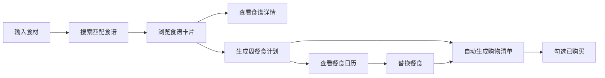

# RecipeRadar 产品需求文档

## 1. 产品概述

RecipeRadar 是一款线上食谱发现与餐食规划应用，帮助用户根据冰箱现有食材智能匹配食谱，自动生成一周餐食计划并创建购物清单。

- **核心价值**：解决"冰箱里有什么就能做什么菜"的痛点，减少食材浪费，简化每周餐食规划流程
- **目标用户**：忙碌的上班族、家庭主厨、健身人士等需要快速规划餐食的人群
- **市场定位**：轻量级本地优先的餐食规划工具，无需注册即用，数据本地存储

## 2. 核心功能

### 2.1 功能模块

1. **首页（食谱搜索）**：食材搜索栏、分类筛选标签、食谱卡片网格、推荐食谱展示
2. **食谱详情页**：完整烹饪步骤、食材用量列表、营养信息展示
3. **餐食计划页**：周计划日历视图、每日三餐详情、餐食替换功能
4. **购物清单页**：自动生成购物清单、分类折叠卡片、购买状态勾选

### 2.2 页面详情

| 页面名称 | 模块名称 | 功能描述 |
|---------|---------|---------|
| 首页 | 搜索区域 | 逗号分隔的多食材搜索、搜索按钮、分类筛选标签 |
| 首页 | 食谱列表 | 按匹配度排序的食谱卡片网格、食材匹配高亮、烹饪时间与难度显示 |
| 食谱详情页 | 步骤展示 | 编号步骤列表、每步预估时间、时钟图标 |
| 食谱详情页 | 食材用量 | 带单位的精确食材数量列表 |
| 食谱详情页 | 营养信息 | 卡路里/蛋白质/脂肪/碳水的彩色进度条 |
| 餐食计划页 | 周历视图 | 7天日历格子、每日三餐标签色、当天总热量与烹饪时间 |
| 餐食计划页 | 替换功能 | 食谱选择模态框、替换前后对比、自动更新购物清单 |
| 购物清单页 | 分类清单 | 按食材类别分组的可折叠卡片、计数徽章、复选框勾选动画 |

## 3. 核心流程

### 3.1 食材搜索流程

用户在搜索栏输入冰箱食材（逗号分隔）→ 点击搜索按钮 → 系统匹配本地20道食谱 → 按匹配食材数量排序 → 展示食谱卡片（已匹配食材绿色高亮，缺失灰色）

### 3.2 生成餐食计划流程

用户选择起始日期 → 点击"生成计划"按钮 → 系统从匹配食谱中随机分配至7天三餐 → 展示周历视图 → 自动计算购物清单

### 3.3 替换餐食流程

用户点击餐段旁"替换"按钮 → 弹出食谱选择模态框（底部滑入动画）→ 用户选择新食谱 → 系统更新该餐段 → 自动刷新购物清单并显示替换对比

## 4. 用户界面设计

### 4.1 设计风格

- **设计主题**：暖色调美食主题，温馨家常感
- **主背景色**：米白色 #FEF9E7
- **导航栏**：深橄榄绿色 #5D4037 配金色 #FFC107 品牌文字
- **卡片样式**：纯白色 #FFFFFF + 轻微阴影 box-shadow: 0 2px 8px rgba(0,0,0,0.08)
- **按钮主色**：橙红色 #E67E22，hover 深橙色 #D35400
- **匹配高亮**：绿色 #27AE60（已匹配），灰色 #95A5A6（缺失）
- **餐段标签色**：早餐黄色 #F1C40F、午餐绿色 #2ECC71、晚餐紫色 #9B59B6
- **字体**：Playfair Display（标题）+ 系统无衬线字体（正文）
- **交互动效**：hover 时卡片阴影加深 + 上移 2px（0.3s ease），可点击元素 scale 1.02（0.2s）

### 4.2 页面设计概览

| 页面名称 | 模块名称 | UI 元素 |
|---------|---------|--------|
| 首页 | 导航栏 | 深橄榄绿背景、金色品牌Logo、三个导航链接 |
| 首页 | 搜索区 | 圆角搜索框、橙红色搜索按钮、分类标签行 |
| 首页 | 食谱网格 | 三列卡片布局、卡片悬停动效、食材标签高亮 |
| 食谱详情页 | 内容区 | 大图标题、步骤编号列表、营养进度条 |
| 餐食计划页 | 周历区 | 7列日历格子、每日三色餐标、热量时间汇总 |
| 餐食计划页 | 模态框 | 半透明黑背景、白色圆角窗口、底部滑入动画 |
| 购物清单页 | 清单区 | 分类折叠卡片、计数徽章、勾选对勾动画 |

### 4.3 响应式设计

- **大屏（>1024px）**：三列食谱网格、完整周历布局
- **中屏（768-1024px）**：两列食谱网格
- **小屏（<768px）**：单列食谱网格、餐食计划切换为垂直列表布局
- **触摸优化**：可点击元素最小尺寸 44px，触控反馈

## 5. 性能要求

- 食材搜索响应时间 ≤ 100ms（本地搜索）
- 餐食计划生成时间 ≤ 50ms
- 页面路由切换保持 60fps 流畅滚动
- 所有动画使用 CSS transform/opacity 保证硬件加速
