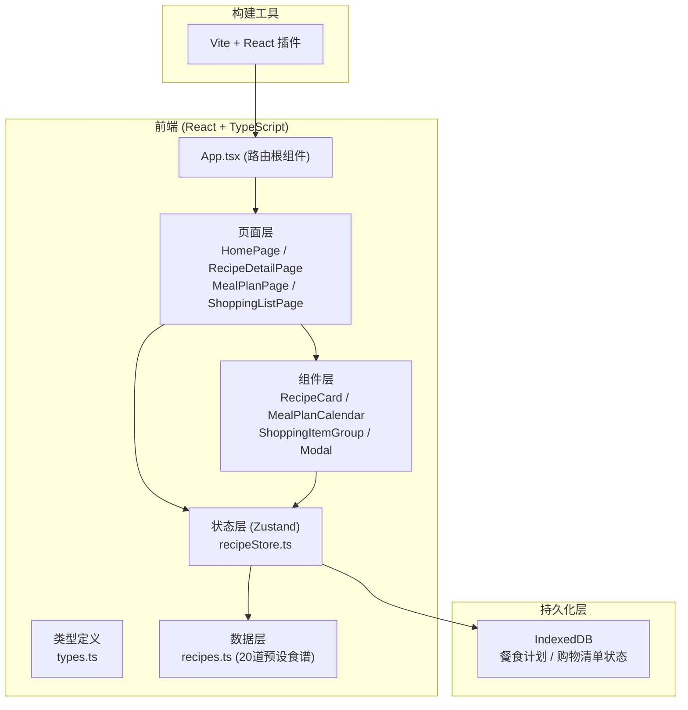

# RecipeRadar 技术架构文档

## 1. 架构设计



## 2. 技术栈说明

- **前端框架**：React 18 + TypeScript（严格模式）
- **构建工具**：Vite 6 + @vitejs/plugin-react
- **路由**：react-router-dom v6
- **状态管理**：Zustand
- **数据持久化**：IndexedDB（idb 库封装）
- **工具库**：uuid（唯一ID）、date-fns（日期处理）
- **字体**：@fontsource/playfair-display
- **样式方案**：CSS Modules + 全局 CSS 变量（不使用 Tailwind，按用户指定颜色体系实现）
- **图标**：lucide-react

## 3. 路由定义

| 路由路径 | 页面组件 | 用途说明 |
|---------|---------|---------|
| `/` | HomePage | 首页：食材搜索、食谱列表、生成计划入口 |
| `/recipe/:id` | RecipeDetailPage | 食谱详情页：烹饪步骤、食材用量、营养信息 |
| `/meal-plan` | MealPlanPage | 餐食计划页：周历视图、餐食替换 |
| `/shopping-list` | ShoppingListPage | 购物清单页：分类清单、勾选状态 |

## 4. 数据模型

### 4.1 核心类型定义

```typescript
interface Ingredient {
  name: string;
  amount: number;
  unit: string;
  category: '蔬菜' | '肉类' | '调味品' | '乳制品' | '谷物' | '其他';
}

interface CookingStep {
  step: number;
  description: string;
  duration: number; // 分钟
}

interface Nutrition {
  calories: number;    // 千卡
  protein: number;     // 克
  fat: number;         // 克
  carbs: number;       // 克
}

interface Recipe {
  id: string;
  name: string;
  image: string;
  category: string;    // 分类标签
  cookTime: number;    // 总烹饪时间（分钟）
  difficulty: 1 | 2 | 3; // 难度等级
  ingredients: Ingredient[];
  steps: CookingStep[];
  nutrition: Nutrition;
}

type MealType = 'breakfast' | 'lunch' | 'dinner';

interface DayMeal {
  breakfast: Recipe | null;
  lunch: Recipe | null;
  dinner: Recipe | null;
}

interface MealPlan {
  startDate: string;   // ISO 日期字符串
  days: DayMeal[];     // 7天
}

interface ShoppingItem {
  id: string;
  name: string;
  amount: number;
  unit: string;
  category: string;
  purchased: boolean;
}
```

### 4.2 Zustand Store 状态

```typescript
interface RecipeState {
  // 数据
  recipes: Recipe[];
  searchQuery: string;
  searchIngredients: string[];
  matchedRecipes: Recipe[];
  
  // 餐食计划
  mealPlan: MealPlan | null;
  
  // 购物清单
  shoppingList: ShoppingItem[];
  
  // 操作
  setSearchQuery: (query: string) => void;
  searchRecipes: () => void;
  generateMealPlan: (startDate: Date) => void;
  replaceMeal: (dayIndex: number, mealType: MealType, recipeId: string) => void;
  toggleShoppingItem: (id: string) => void;
  calculateShoppingList: () => void;
}
```

## 5. 项目文件结构

```
d:/P/tasks/auto176/
├── package.json
├── index.html
├── vite.config.js
├── tsconfig.json
├── src/
│   ├── App.tsx              # 根组件 + 路由 + 全局布局
│   ├── main.tsx             # 入口文件
│   ├── index.css            # 全局样式 + CSS 变量
│   ├── types.ts             # TypeScript 类型定义
│   ├── data/
│   │   └── recipes.ts       # 20道预设食谱数据
│   ├── store/
│   │   └── recipeStore.ts   # Zustand 状态管理
│   ├── utils/
│   │   ├── db.ts            # IndexedDB 封装
│   │   └── helpers.ts       # 工具函数
│   ├── pages/
│   │   ├── HomePage.tsx
│   │   ├── RecipeDetailPage.tsx
│   │   ├── MealPlanPage.tsx
│   │   └── ShoppingListPage.tsx
│   └── components/
│       ├── Navbar.tsx
│       ├── RecipeCard.tsx
│       ├── RecipeModal.tsx
│       ├── MealPlanCalendar.tsx
│       └── ShoppingItemGroup.tsx
```

## 6. 性能优化策略

- **本地搜索**：纯内存数组过滤，复杂度 O(n*m)（n=20食谱，m=平均食材数），远低于 100ms
- **计划生成**：Fisher-Yates 洗牌算法随机分配，O(7*3)=21 次操作
- **路由切换**：React Router v6 原生 + CSS 过渡动画，保持 60fps
- **渲染优化**：使用 React.memo 包裹卡片组件，避免不必要重渲染
- **动画优化**：所有过渡使用 transform 和 opacity，触发 GPU 加速
- **状态持久化**：IndexedDB 异步读写，不阻塞主线程
