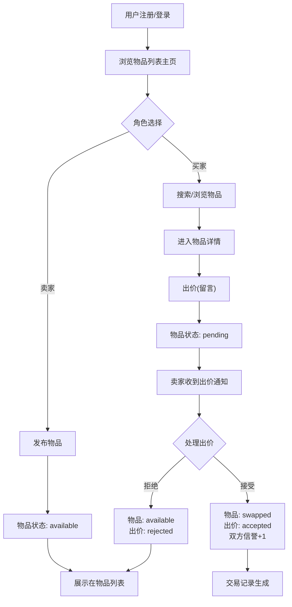

## 1. 产品概述

SwapBazaar 是一个社区闲置物品交换集市平台，旨在解决线下跳蚤市场信息混乱、交易流程不透明的问题。卖家可发布闲置物品，买家浏览并出价，双方在线完成物品交换状态追踪。

- 核心目标：为社区居民提供便捷、可信赖的闲置物品交易渠道
- 目标用户：希望处理闲置物品的卖家，以及寻找高性价比二手物品的买家
- 产品价值：通过在线化交易流程、信誉评分系统，提升交易效率与信任度

## 2. 核心功能

### 2.1 用户角色

| 角色 | 注册方式 | 核心权限 |
|------|---------|---------|
| 普通用户 | 用户名+头像注册 | 发布物品、浏览搜索、出价交易、查看个人面板 |

### 2.2 功能模块

1. **认证模块（Auth）**：用户注册、用户登录、退出登录
2. **交易模块（Trade）**：物品发布、物品列表、物品搜索、物品详情、出价管理、交易记录
3. **个人面板**：我的物品、交易记录、个人资料、信誉评分
4. **数据仪表盘**：平台统计、用户统计

### 2.3 页面详情

| 页面名称 | 模块名称 | 功能描述 |
|---------|---------|---------|
| 登录页 | Auth | 用户名密码登录，初始密码pass123，成功Toast提示 |
| 注册页 | Auth | 用户名(3-12字符字母数字下划线)+emoji头像+联系方式(可选)，注册后自动登录 |
| 主页 | Trade | 数据统计卡片+搜索框+瀑布流物品网格(响应式1/2/4列) |
| 发布页 | Trade | 物品信息表单+多图上传(拖拽+选择)+价格设定 |
| 物品详情页 | Trade | 物品大图+完整描述+出价模态框+出价列表+状态标签 |
| 个人面板 | User | Tab切换(水平滑动)：我的物品/交易记录/个人资料 |

## 3. 核心流程

### 3.1 主流程描述

用户注册登录后，可浏览主页所有available状态的物品，通过顶部搜索框实时搜索。买家进入物品详情页可出价（留言），出价后物品变为pending状态。卖家在个人面板查看自己发布的物品及出价，可接受或拒绝出价。接受后物品状态变为swapped，双方各+1信誉分。

### 3.2 核心流程图

## 4. 用户界面设计

### 4.1 设计风格

- **主色调**：#E67E22（橙色）
- **辅色调**：#2C3E50（深蓝）
- **背景色**：#FDF2E9（浅米色）
- **卡片背景**：#FFFFFF，阴影 0 2px 8px rgba(0,0,0,0.08)
- **状态色**：available #2ECC71 绿色 / pending #F39C12 橙色 / swapped #95A5A6 灰色
- **按钮样式**：圆角矩形，橙色填充，点击有0.15秒scale压感动画
- **字体**：Inter（用户指定）
- **布局风格**：顶部固定导航栏 + 卡片式网格布局
- **图标风格**：Emoji头像 + Lucide图标

### 4.2 页面设计概览

| 页面名称 | 模块名称 | UI元素与动效 |
|---------|---------|-------------|
| 主页 | 仪表盘 | 双统计卡片，数字从0递增动画(每帧+5，1秒完成) |
| 主页 | 物品网格 | 瀑布流，卡片hover阴影加深+上移5px(0.3s ease)，图片懒加载骨架屏淡入 |
| 物品卡片 | ItemCard | 图片缩略图+标题+价格+状态标签(条件颜色) |
| 物品详情 | ItemDetail | 大图+描述+出价按钮→模态框(半透明蒙版+中部弹出放大0.3s缓出) |
| 个人面板 | Tabs | 三个Tab页，水平滑动动画切换内容 |
| 全局 | Toast | 顶部滑入，3秒后滑出渐隐 |
| 全局 | Navbar | 滚动80px后背景透明度0.95 |
| 信誉星级 | Rating | 金色★灰色☆，间隔6px，过渡缩放动画 |

### 4.3 响应式设计

- **桌面端 (>=1200px)**：物品网格4列
- **平板端 (>=768px)**：物品网格2列
- **移动端 (<768px)**：物品网格1列，布局紧凑

### 4.4 动画与微交互

| 元素 | 动画描述 |
|-----|---------|
| 数字统计 | 0→真实值，每帧+5，持续1秒 |
| 模态框 | 背景半透明黑，内容从center缩放弹出0.3s ease-out |
| 卡片hover | 阴影0→4px 16px，translateY-5px，0.3s ease |
| 按钮点击 | scale(0.95)→scale(1)，0.15s |
| Toast | translateY(-100%)→0，3s后→translateY(-100%)+opacity 0 |
| 图片加载 | 骨架屏→淡入0.5s |
| Tab切换 | 内容水平滑动，transform translateX |
| 星级显示 | 过渡缩放动画 |
| 拖拽上传 | 虚线边框弹性缩放动画 |
