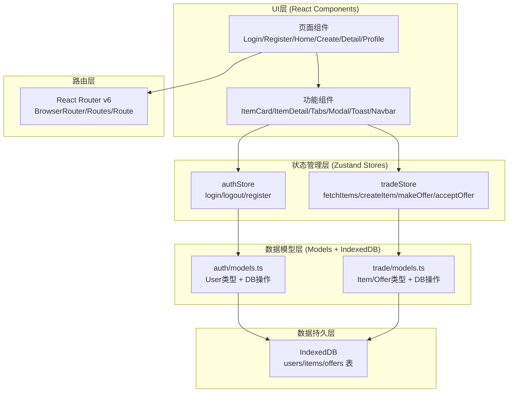
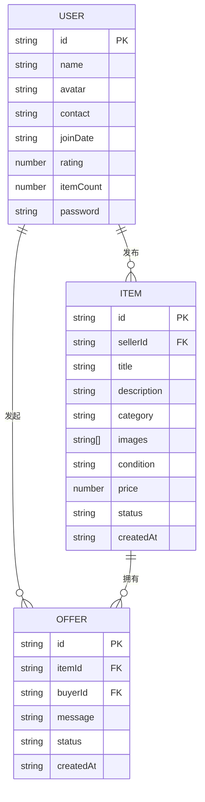

## 1. 架构设计



**数据流向说明**：
- 组件 → Store Action → Models函数 → IndexedDB操作 → 返回Promise → 更新Store状态 → 组件重渲染

## 2. 技术说明

- **前端框架**：React@18 + TypeScript
- **构建工具**：Vite
- **状态管理**：Zustand@4
- **路由管理**：React Router DOM@6 (RouterProvider + createBrowserRouter)
- **数据存储**：IndexedDB（通过models层封装，无真实后端）
- **唯一ID**：uuid
- **字体**：@fontsource/inter
- **图标**：lucide-react（遵循开发规范）

## 3. 路由定义

| 路由路径 | 页面组件 | 用途 |
|---------|---------|------|
| `/login` | LoginPage | 用户登录页 |
| `/register` | RegisterPage | 用户注册页 |
| `/` | HomePage | 主页 - 物品列表+搜索+仪表盘 |
| `/create` | CreateItemPage | 发布物品页 |
| `/item/:id` | ItemDetailPage | 物品详情页 |
| `/profile` | ProfilePage | 个人面板页（保护路由） |
| `*` | NotFoundPage | 404页（可选，重定向到/） |

## 4. 数据模型

### 4.1 实体关系图



### 4.2 类型定义

#### User 接口
```typescript
interface User {
  id: string;
  name: string;
  avatar: string;
  contact: string;
  joinDate: string;
  rating: number;
  itemCount: number;
  password: string;
}
```

#### Item 接口
```typescript
interface Item {
  id: string;
  sellerId: string;
  title: string;
  description: string;
  category: '电子产品' | '家居用品' | '书籍文具' | '服饰鞋包' | '运动户外' | '其他';
  images: string[];
  condition: '全新' | '九成新' | '八成新' | '七成新及以下';
  price: number;
  status: 'available' | 'pending' | 'swapped';
  createdAt: string;
}
```

#### Offer 接口
```typescript
interface Offer {
  id: string;
  itemId: string;
  buyerId: string;
  message: string;
  status: 'pending' | 'accepted' | 'rejected';
  createdAt: string;
}
```

### 4.3 IndexedDB Schema

**数据库名**：swapbazaar_db（版本1）

**Object Store 列表**：

| Store名 | 主键 | 索引 |
|--------|------|------|
| `users` | `id` | `name` (unique) |
| `items` | `id` | `sellerId`, `status`, `category`, `createdAt` |
| `offers` | `id` | `itemId`, `buyerId`, `status`, `createdAt` |

## 5. 文件结构与调用关系

```
src/
├── main.tsx                          # 入口：RouterProvider + IndexedDB初始化
├── App.tsx                           # 根组件
├── router.tsx                        # 路由配置 createBrowserRouter
│
├── modules/
│   ├── auth/
│   │   ├── models.ts                 # User类型 + IndexedDB操作函数
│   │   ├── store.ts                  # authStore (Zustand)
│   │   ├── pages/
│   │   │   ├── LoginPage.tsx         # 登录页 → authStore.login
│   │   │   └── RegisterPage.tsx      # 注册页 → authStore.register
│   │   └── components/
│   │       └── (Auth相关子组件)
│   │
│   └── trade/
│       ├── models.ts                 # Item/Offer类型 + IndexedDB操作函数
│       ├── store.ts                  # tradeStore (Zustand)
│       ├── pages/
│       │   ├── HomePage.tsx          # 主页 → tradeStore.fetchItems/searchItems
│       │   ├── CreateItemPage.tsx    # 发布页 → tradeStore.createItem
│       │   ├── ItemDetailPage.tsx    # 详情页 → tradeStore.fetchItemById/makeOffer
│       │   └── ProfilePage.tsx       # 个人面板(集成Tabs)
│       └── components/
│           ├── ItemCard.tsx          # 物品卡片 (共享)
│           ├── ItemDetail.tsx        # 物品详情视图
│           └── DashboardCards.tsx    # 仪表盘卡片
│
├── components/                       # 全局共享组件
│   ├── Navbar.tsx                    # 顶部导航栏
│   ├── Modal.tsx                     # 通用模态框
│   ├── Toast.tsx                     # Toast提示
│   ├── RatingStars.tsx               # 信誉星级
│   └── ImageUploader.tsx             # 图片上传(拖拽)
│
├── hooks/                            # 自定义Hooks
│   ├── useDebounce.ts                # 防抖Hook(300ms搜索)
│   └── useCountUp.ts                 # 数字递增动画Hook
│
├── utils/                            # 工具函数
│   ├── db.ts                         # IndexedDB封装
│   └── validators.ts                 # 表单验证
│
└── styles/
    └── globals.css                   # 全局样式 + CSS变量
```

**调用关系**：
1. `LoginPage.tsx` → `authStore.login()` → `models.ts:loginUser()` → `IndexedDB`
2. `RegisterPage.tsx` → `authStore.register()` → `models.ts:registerUser()` → `IndexedDB`
3. `HomePage.tsx` → `tradeStore.fetchItems()` → `models.ts:getItems()` → `IndexedDB`
4. `CreateItemPage.tsx` → `tradeStore.createItem()` → `models.ts:createItem()` → `IndexedDB`
5. `ItemDetailPage.tsx` → `tradeStore.makeOffer()` → `models.ts:createOffer()` → `IndexedDB`
6. `ProfilePage.tsx` → `tradeStore.acceptOffer()` → `models.ts:updateOfferStatus()` + `models.ts:updateItemStatus()` + `models.ts:updateUserRating()` → `IndexedDB`

## 6. 性能优化策略

| 优化项 | 实现方式 |
|-------|---------|
| 搜索防抖 | useDebounce Hook，延迟300ms执行 |
| 图片懒加载 | IntersectionObserver + 骨架屏 + opacity淡入 |
| 列表滚动 | CSS contain + will-change优化，保证60FPS |
| 首屏加载 | Vite代码分割 + 路由级组件 |
| 包体积 | 按需引入 + Tree-shaking，gzip后<200KB |
| 状态更新 | Zustand选择性订阅，避免不必要重渲染 |
