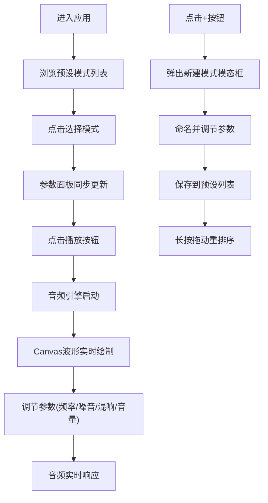

## 1. 产品概述

MindFreq 是一款基于 Web Audio API 的数字脑波同步音生成器，用户通过调节声音频率与背景白噪音的组合来辅助专注或放松。产品面向需要深度工作、冥想、小睡等场景的用户，提供沉浸式音频体验与实时波形可视化。

## 2. 核心功能

### 2.1 用户角色

| 角色 | 注册方式 | 核心权限 |
|------|----------|----------|
| 普通用户 | 无需注册 | 使用所有预设模式、自定义模式、参数调节 |

### 2.2 功能模块

1. **音频工作台主页**：预设模式列表、参数控制面板、波形可视化、播放控制栏
2. **自定义模式管理**：创建新混合模式、模式重排序
3. **实时音频可视化**：Canvas波形绘制、时长显示

### 2.3 页面详情

| 页面名称 | 模块名称 | 功能描述 |
|-----------|-------------|---------------------|
| 音频工作台 | 预设模式面板 | 卡片式排列预设，包含模式名称、描述、播放按钮，支持点击切换 |
| 音频工作台 | 参数控制面板 | 左右声道频率滑块、白噪音类型切换、混响深度滑块、主音量旋钮 |
| 音频工作台 | 波形可视化 | Canvas实时波形绘制，刷新率60FPS，随频率和音量变化 |
| 音频工作台 | 播放控制栏 | 播放/暂停按钮、进度条、模式名称标签、时长显示 |
| 自定义模态框 | 新建模式 | 命名模式、调节参数、保存到预设列表 |

## 3. 核心流程

用户进入应用 → 浏览预设模式卡片 → 点击选择模式 → 参数面板同步更新 → 点击播放 → 波形实时可视化 → 调节参数实时响应 → 可创建自定义模式 → 长按拖动重排序

## 4. 用户界面设计

### 4.1 设计风格

- **主色调**：深色背景 #0D1117，卡片背景 #161B22，强调色电光蓝 #58A6FF
- **字体**：Inter 字体家族，清晰现代的无衬线字体
- **按钮风格**：半透明滑块、圆形切换按钮、SVG音量旋钮
- **布局风格**：左右分栏布局（左侧预设列表 + 右侧控制面板），底部固定播放控制栏
- **动效风格**：弹性反馈动画、发光外圈脉冲、涟漪扩散、翻转动画、渐变弧线

### 4.2 页面设计概述

| 页面名称 | 模块名称 | UI 元素 |
|-----------|-------------|-------------|
| 音频工作台 | 预设面板 | 深色卡片、模式标题、描述文字、播放图标按钮、悬停高亮 |
| 音频工作台 | 控制面板 | 双列频率滑块、圆形噪音切换按钮、混响滑块、SVG音量旋钮 |
| 音频工作台 | 波形可视化 | Canvas画布、电光蓝波形线、时长数字翻转动画 |
| 音频工作台 | 播放控制栏 | 播放/暂停按钮（涟漪动画）、进度条（脉冲光点）、模式标签 |
| 模态框 | 新建模式 | 半透明模糊背景、底部滑入动画、表单输入、保存按钮 |

### 4.3 响应性

- 桌面端优先设计，采用固定宽度布局
- 控制栏固定在底部，不受页面滚动影响
- 滑块和按钮尺寸适配鼠标操作

### 4.4 性能指标

- 波形可视化帧率：稳定 55FPS 以上
- 参数调节响应延迟：不超过 50ms
- 音频切换平滑无爆音
