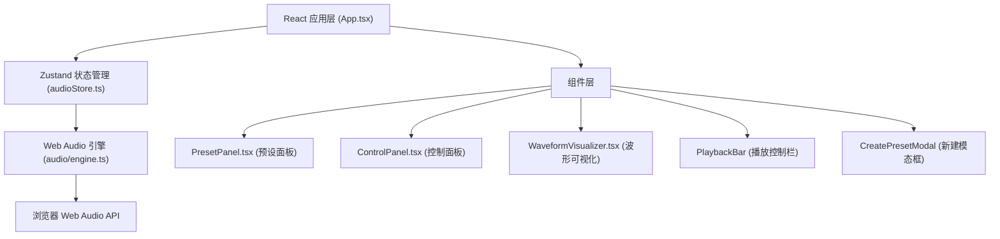

## 1. 架构设计



## 2. 技术描述

- **前端框架**：React@18 + TypeScript
- **构建工具**：Vite
- **状态管理**：Zustand
- **音频引擎**：原生 Web Audio API（无第三方音频库）
- **样式方案**：CSS Modules + 内联样式（动画与渐变）
- **唯一ID生成**：uuid
- **字体**：@fontsource/inter + Google Fonts 备用

## 3. 项目结构

```
src/
├── App.tsx                    # 主应用组件，顶层布局
├── store/
│   └── audioStore.ts          # Zustand store：音频参数与播放状态
├── components/
│   ├── PresetPanel.tsx        # 预设模式列表卡片
│   ├── ControlPanel.tsx       # 参数调节控制面板
│   ├── WaveformVisualizer.tsx # Canvas波形可视化
│   └── CreatePresetModal.tsx  # 新建模式模态框
└── audio/
    └── engine.ts              # Web Audio API 封装引擎
```

## 4. 核心数据模型

### 4.1 预设模式 (Preset)

```typescript
interface Preset {
  id: string;
  name: string;
  description: string;
  leftFrequency: number;   // 20-2000 Hz
  rightFrequency: number;  // 20-2000 Hz
  noiseType: 'rain' | 'fan' | 'ocean' | 'none';
  reverbDepth: number;     // 0-100 %
  volume: number;          // 0-1
  isCustom?: boolean;
}
```

### 4.2 音频状态 (AudioState)

```typescript
interface AudioState {
  presets: Preset[];
  currentPresetId: string | null;
  isPlaying: boolean;
  currentTime: number;     // 秒
  duration: number;        // 秒
  // 实时参数（可独立于预设调节）
  leftFrequency: number;
  rightFrequency: number;
  noiseType: string;
  reverbDepth: number;
  volume: number;
  // Actions
  setPreset: (id: string) => void;
  togglePlay: () => void;
  updateFrequency: (channel: 'left' | 'right', value: number) => void;
  setNoiseType: (type: string) => void;
  setReverbDepth: (value: number) => void;
  setVolume: (value: number) => void;
  addPreset: (preset: Omit<Preset, 'id'>) => void;
  reorderPresets: (fromIndex: number, toIndex: number) => void;
}
```

## 5. 音频引擎设计

### 5.1 音频节点图

```
左声道振荡器 ──┐
               ├─> 增益节点 ──> 混响节点(可选) ──> 分析节点 ──> 主增益 ──> 输出
右声道振荡器 ──┘
白噪音发生器 ───┘
```

### 5.2 核心方法

- `init()` - 初始化 AudioContext
- `start()` - 启动音频播放
- `stop()` - 停止音频播放
- `setFrequency(channel, value)` - 设置振荡器频率
- `setNoiseType(type)` - 切换白噪音类型
- `setReverbDepth(value)` - 设置混响深度
- `setVolume(value)` - 设置主音量
- `getAnalyser()` - 获取分析节点供可视化使用

## 6. 性能优化

- Canvas 绘制使用 requestAnimationFrame，目标 60FPS
- 参数变化通过 rAF 节流，避免频繁重绘
- 音频节点复用，不频繁创建销毁
- 使用 AnalyserNode 获取时域数据用于波形绘制
