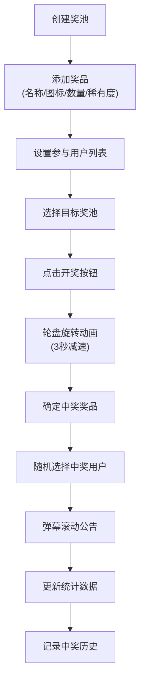

## 1. 产品概述

线上抽奖活动管理应用，帮助活动组织者轻松设计和管理互动抽奖环节。解决手动抽奖流程繁琐、中奖名单难以实时公示、奖品分配不透明以及缺乏参与互动氛围的痛点问题。

- **目标用户**：活动组织者、运营人员、社区管理者
- **核心价值**：提供可视化、可互动、透明公正的抽奖体验，增强活动参与感和氛围

## 2. 核心功能

### 2.1 用户角色
本应用为单用户系统，无需登录注册，所有数据本地持久化。

| 角色 | 权限说明 |
|------|----------|
| 活动组织者 | 创建奖池、管理奖品、设置参与用户、执行抽奖、查看历史记录 |

### 2.2 功能模块
1. **奖池管理模块**：创建/编辑/删除奖池，添加/编辑奖品（名称、图标、数量、稀有度）
2. **抽奖动画模块**：Canvas轮盘抽奖、3秒旋转减速动画、指针定位
3. **中奖公示模块**：弹幕滚动公告、最近5条记录面板、历史记录列表
4. **数据统计模块**：参与人数、已开奖品、剩余奖品、稀有度中奖率可视化

### 2.3 页面详情
| 页面名称 | 模块名称 | 功能描述 |
|-----------|-------------|---------------------|
| 主页 | 顶部统计栏 | 显示参与人数、已开/剩余奖品数、稀有度中奖率柱状图，数字递增动画 |
| 主页 | 奖池卡片网格 | 展示所有奖池，卡片显示奖品总数/已开出占比环形进度条，支持点击选择 |
| 主页 | 参与人数设置 | 可自定义虚拟用户列表，设置参与抽奖的用户 |
| 主页 | 抽奖轮盘区 | Canvas绘制轮盘，奖品扇形区域按稀有度着色，旋转动画 |
| 主页 | 中奖公告区 | 弹幕从右向左滚动，最近5条记录向上滑入，历史记录可展开详情 |
| 主页 | 操作按钮区 | 开奖按钮、重置奖池按钮，带点击反馈效果 |

## 3. 核心流程

### 主抽奖流程
活动组织者创建奖池 → 添加奖品设置数量和稀有度 → 设置参与用户列表 → 选择奖池 → 点击开奖 → 轮盘旋转动画 → 显示中奖结果 → 弹幕公告 → 更新统计数据 → 记录历史

## 4. 用户界面设计

### 4.1 设计风格
- **主色调**：渐变橙黄（#FF6B35 → #FFA502），强调活力与庆祝感
- **背景色**：浅灰色（#F5F5F5），营造轻松活泼的氛围
- **卡片色**：白色（#FFFFFF）带柔和阴影（box-shadow: 0 2px 8px rgba(0,0,0,0.1)）
- **稀有度配色**：普通-蓝色渐变、稀有-紫色渐变、传说-金色渐变
- **字体**：Nunito，圆润友好的无衬线字体
- **按钮风格**：圆角渐变按钮，悬停放大1.02倍，按下缩小0.95倍
- **图标**：使用emoji作为奖品图标，从预设库中选择

### 4.2 页面设计概述
| 模块名称 | UI元素 | 动画效果 |
|-----------|-------------|----------|
| 顶部统计栏 | 四个数据卡片、百分比柱状条 | 数字0→目标值递增动画（0.8秒），柱状条高度平滑过渡（0.5秒） |
| 奖池卡片网格 | 卡片网格布局、环形进度条、奖品图标 | 悬停放大1.02倍+阴影加深，过渡0.2秒 |
| 抽奖轮盘 | Canvas轮盘、指针、奖品扇形 | 3秒旋转减速动画，60FPS流畅运行 |
| 中奖弹幕 | 渐变背景文字条 | 从右向左滚动5秒后淡出 |
| 最近记录面板 | 头像圆点、奖品图标、时间 | 从下往上滑入动画 |
| 操作按钮 | 开奖按钮、重置按钮 | 按下缩小0.95倍+颜色加深，0.1秒恢复 |

### 4.3 响应式设计
- **桌面端（≥768px）**：奖池卡片多列网格，轮盘完整尺寸，三栏布局
- **移动端（<768px）**：卡片全宽单列，轮盘缩小至70%并居中，弹幕宽度自适应，单列垂直布局
- **触控优化**：按钮最小高度44px，触摸区域充足

### 4.4 性能要求
- 轮盘动画：60FPS稳定运行
- 弹幕滚动：无卡顿掉帧
- 数据更新：DOM重绘延迟≤50ms
- 状态持久化：localStorage异步写入，不阻塞UI
