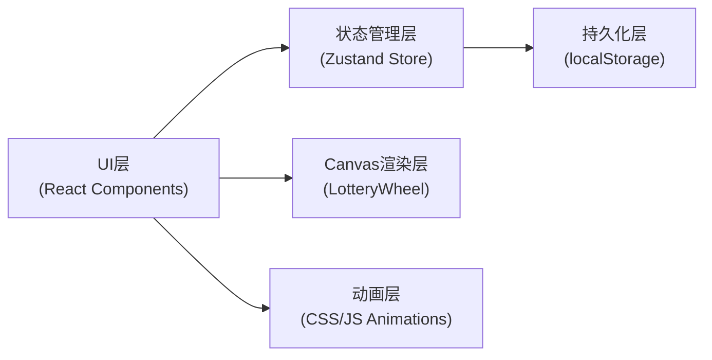
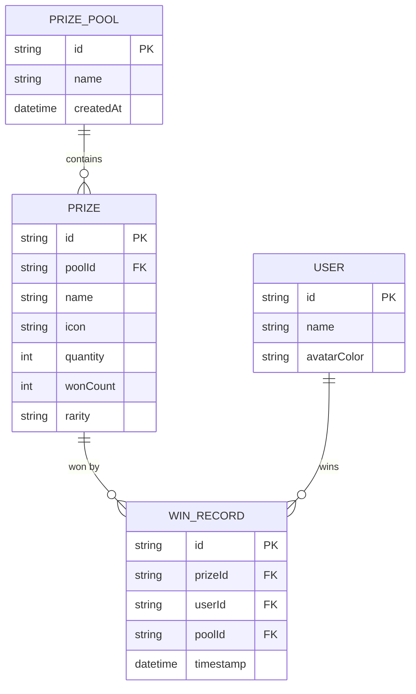

## 1. 架构设计

本项目为纯前端单页应用，无后端依赖，所有数据本地持久化。



## 2. 技术描述

- **前端框架**：React@18 + TypeScript + Vite@6
- **状态管理**：Zustand（带persist中间件）
- **样式方案**：原生CSS + CSS Variables
- **图标方案**：预设emoji库
- **唯一ID**：uuid
- **字体**：@fontsource/nunito
- **构建工具**：Vite
- **开发服务器**：Vite Dev Server

## 3. 项目结构

```
auto179/
├── src/
│   ├── components/
│   │   ├── LotteryWheel.tsx      # Canvas轮盘组件
│   │   ├── NotificationBar.tsx   # 弹幕公告组件
│   │   ├── PrizePoolCard.tsx     # 奖池卡片组件
│   │   ├── StatsBar.tsx          # 顶部统计栏组件
│   │   ├── WinnerPanel.tsx       # 中奖记录面板组件
│   │   └── UserSetupModal.tsx    # 用户设置弹窗
│   ├── store.ts                  # Zustand状态管理
│   ├── types.ts                  # TypeScript类型定义
│   ├── utils.ts                  # 工具函数
│   ├── App.tsx                   # 主应用组件
│   ├── main.tsx                  # 入口文件
│   └── index.css                 # 全局样式
├── index.html                    # HTML入口
├── vite.config.js                # Vite配置
├── tsconfig.json                 # TypeScript配置
└── package.json                  # 项目依赖
```

## 4. 数据模型

### 4.1 数据模型定义



### 4.2 TypeScript 类型定义

```typescript
type Rarity = 'common' | 'rare' | 'legendary';

interface Prize {
  id: string;
  name: string;
  icon: string;
  quantity: number;
  wonCount: number;
  rarity: Rarity;
}

interface PrizePool {
  id: string;
  name: string;
  prizes: Prize[];
  createdAt: number;
}

interface User {
  id: string;
  name: string;
  avatarColor: string;
}

interface WinRecord {
  id: string;
  prizeId: string;
  prizeName: string;
  prizeIcon: string;
  prizeRarity: Rarity;
  userId: string;
  userName: string;
  userAvatarColor: string;
  poolId: string;
  timestamp: number;
}

interface AppState {
  prizePools: PrizePool[];
  activePoolId: string | null;
  users: User[];
  winRecords: WinRecord[];
  isDrawing: boolean;
}
```

## 5. Store Actions

```typescript
interface AppActions {
  // 奖池管理
  createPrizePool: (name: string) => void;
  deletePrizePool: (poolId: string) => void;
  setActivePool: (poolId: string | null) => void;
  
  // 奖品管理
  addPrize: (poolId: string, prize: Omit<Prize, 'id' | 'wonCount'>) => void;
  updatePrize: (poolId: string, prizeId: string, updates: Partial<Prize>) => void;
  deletePrize: (poolId: string, prizeId: string) => void;
  
  // 用户管理
  addUser: (name: string) => void;
  removeUser: (userId: string) => void;
  updateUser: (userId: string, name: string) => void;
  
  // 抽奖逻辑
  startDraw: () => Promise<WinRecord | null>;
  resetPool: (poolId: string) => void;
  
  // 计算属性
  getActivePool: () => PrizePool | null;
  getStats: () => Stats;
}
```

## 6. 性能优化点

1. **Canvas轮盘优化**：使用requestAnimationFrame，离屏canvas预渲染扇形
2. **状态更新**：Zustand选择性订阅，避免不必要重渲染
3. **列表渲染**：中奖历史使用虚拟滚动（如数据量大）
4. **动画优化**：使用transform和opacity属性，触发GPU加速
5. **持久化**：localStorage写入使用节流，避免频繁IO
6. **重绘控制**：统计数据更新批量处理，DOM操作合并
