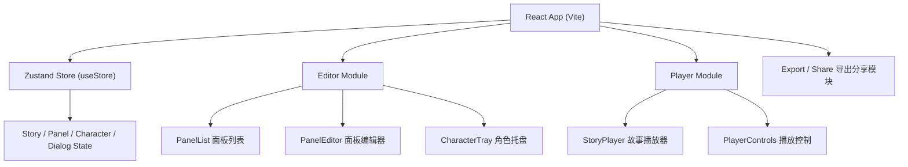
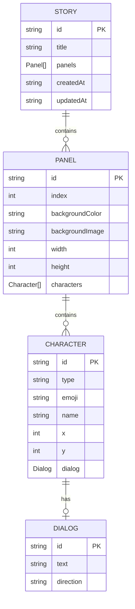

## 1. 架构设计



## 2. 技术说明

- **前端框架**：React@18 + TypeScript
- **构建工具**：Vite
- **状态管理**：Zustand（全局状态：故事数据、面板索引、播放状态）
- **渲染技术**：纯SVG + CSS动画（不依赖第三方动画库）
- **依赖包**：react@18, react-dom@18, zustand, uuid, @fontsource/bangers
- **启动方式**：npm run dev

## 3. 项目文件结构

| 路径 | 用途 |
|------|------|
| `package.json` | 依赖配置（react@18, react-dom@18, zustand, uuid, @fontsource/bangers） |
| `index.html` | 入口HTML页面 |
| `vite.config.js` | Vite React插件配置 |
| `tsconfig.json` | TypeScript严格模式，target ES2020 |
| `src/types/story.ts` | Story、Panel、Character、Dialog等核心类型定义 |
| `src/store/useStore.ts` | Zustand全局状态管理（故事数据、当前面板、播放状态、actions） |
| `src/modules/editor/PanelEditor.tsx` | 单面板编辑：角色增删、对话编辑、背景设置 |
| `src/modules/editor/PanelList.tsx` | 侧边栏缩略图列表、拖拽排序、删除确认、导航 |
| `src/modules/editor/CharacterTray.tsx` | 浮动角色托盘，4个预设角色拖拽源 |
| `src/modules/player/StoryPlayer.tsx` | 全屏播放、角色淡入、场景水平滑动、打字机动画 |
| `src/modules/player/PlayerControls.tsx` | 播放/暂停、进度条、速度调节 |
| `src/components/Toolbar.tsx` | 顶部工具栏：新建、保存、导出、播放 |
| `src/components/ConfirmDialog.tsx` | 通用确认弹窗组件 |
| `src/App.tsx` | 主应用组件，编辑器模式与播放模式切换 |
| `src/main.tsx` | 应用入口 |

## 4. 核心数据模型



## 5. 状态管理设计

### Store Actions
- **面板相关**：addPanel、deletePanel、reorderPanels、updatePanelBackground、setCurrentPanel
- **角色相关**：addCharacter、removeCharacter、updateCharacterPosition、updateCharacterDialog
- **播放相关**：play、pause、nextPanel、prevPanel、setPlaybackSpeed、setCurrentPanelIndex

### 播放状态机
```
IDLE → PLAYING → (自动切换面板) → PAUSED → PLAYING
                  ↓
              FINISHED
```

## 6. 动画实现方案

### 6.1 面板切换动画（场景滚动）
- **技术**：CSS transform + transition
- **实现**：当前面板 `translateX(-100%)`，下一面板 `translateX(0)`，duration 0.8s，ease-in-out

### 6.2 角色淡入动画
- **技术**：CSS opacity + transition
- **实现**：opacity 0 → 1，duration 0.5s，按角色顺序设置 animation-delay 实现错峰入场

### 6.3 对话打字机效果
- **技术**：useState + setInterval / requestAnimationFrame
- **实现**：按字符递增显示文本，速度受播放速度系数影响

### 6.4 UI过渡动画
- **新增面板卡片**：CSS keyframes slideUp（translateY 20px→0 + opacity 0→1），0.3s
- **删除面板卡片**：CSS keyframes slideOutLeft（translateX -100% + scale 0.8），0.3s
- **弹窗出现**：CSS keyframes zoomIn（scale 0.8→1 + opacity 0→1），0.2s
- **输入框聚焦**：CSS transition border-color，聚焦时 #E63946，失焦时 #ccc

## 7. 性能优化策略

- 播放模式帧率保证 ≥ 50fps：
  - 使用 CSS transform/opacity 动画（GPU加速）
  - 避免频繁触发重排重绘
  - 打字机效果使用 requestAnimationFrame 节流
- 拖拽排序流畅（每帧 < 16ms）：
  - 使用 HTML5 原生拖拽 API，减少 JS 计算
  - 拖拽预览使用 CSS 变换而非 DOM 操作
  - 目标位置指示使用伪元素，避免频繁 DOM 变更
