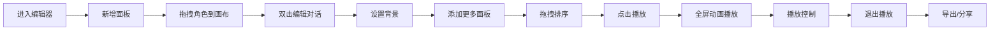

## 1. 产品概述

PixelStory是一款交互式连环漫画编辑器，让用户能够通过可视化界面创作、编辑和播放带有角色对话、场景切换和动画效果的连环漫画故事。

- 主要目的：为创作者提供直观易用的漫画创作工具，降低漫画制作门槛
- 解决的问题：传统漫画创作需要专业技能和工具，本产品提供无代码拖拽式创作体验
- 目标用户：漫画爱好者、教育工作者、故事创作者、儿童用户
- 产品价值：快速将创意转化为可播放的连环漫画作品，支持导出和分享

## 2. 核心功能

### 2.1 功能模块

1. **面板编辑器 (PanelEditor)**：角色拖拽放置、对话编辑、背景设置
2. **面板列表 (PanelList)**：侧边栏缩略图展示、新增/删除/排序面板
3. **故事播放器 (StoryPlayer)**：全屏播放模式、角色淡入动画、场景水平滑动切换
4. **播放控制栏 (PlayerControls)**：播放/暂停、进度条、速度调节
5. **工具栏**：新建、保存、导出、播放按钮
6. **导出与分享**：JSON导出、本地存储分享码

### 2.2 页面详情

| 页面名称 | 模块名称 | 功能描述 |
|-----------|-------------|---------------------|
| 编辑器主页 | 顶部工具栏 | 新建故事、保存、导出JSON、进入播放模式 |
| 编辑器主页 | 面板列表侧边栏 | 显示所有面板缩略图、新增面板、拖拽排序、删除面板（确认弹窗） |
| 编辑器主页 | 面板编辑画布 | 拖拽放置角色、双击编辑对话、设置背景色/图片 |
| 编辑器主页 | 角色托盘 | 浮动显示4种预设角色（👦👧🤖🐱），支持拖拽到画布 |
| 编辑器主页 | 底部状态栏 | 显示当前面板序号/总面板数 |
| 播放模式页 | 故事播放器 | 全屏渲染面板、角色淡入动画、场景滑动切换、打字机对话效果 |
| 播放模式页 | 播放控制栏 | 播放/暂停按钮、可点击进度条、速度调节（1x/1.5x/2x） |

## 3. 核心流程

用户进入编辑器 → 点击+新增面板 → 从角色托盘拖拽角色到画布 → 双击角色编辑对话文本 → 设置面板背景颜色或图片 → 重复添加多个面板 → 可拖拽调整面板顺序 → 点击播放按钮进入全屏播放 → 观看自动播放动画（场景切换、角色淡入、对话逐字显示） → 使用控制栏暂停/跳转/调节速度 → 退出播放 → 点击导出下载JSON或生成分享码

## 4. 用户界面设计

### 4.1 设计风格

- **整体风格**：漫画书风格，米白色背景营造纸张质感
- **主色调**：深棕色（#4A2C2A）用于工具栏和重要文字
- **强调色**：明亮红色（#E63946）用于激活状态、按钮悬停、边框高亮
- **背景色**：米白色（#FFF8E7）营造温暖的漫画书氛围
- **按钮样式**：圆角矩形，深棕色背景，悬停变亮（#6B3A3A）
- **字体**：标题使用 Bangers 字体营造漫画感，正文使用系统无衬线字体
- **布局**：左侧面板列表 + 右侧编辑画布的经典双栏布局
- **图标**：使用 emoji 作为角色头像，保持漫画趣味感

### 4.2 页面设计概述

| 页面名称 | 模块名称 | UI元素 |
|-----------|-------------|-------------|
| 编辑器主页 | 顶部工具栏 | 深棕色背景、圆角按钮、悬停高亮、Bangers标题字体 |
| 编辑器主页 | 面板列表 | 220px宽、圆角缩略图（8px）、阴影、当前面板红色边框、+按钮、删除确认弹窗 |
| 编辑器主页 | 角色托盘 | 浮动卡片、4个emoji角色、拖拽手势 |
| 编辑器主页 | 编辑画布 | 800x600px居中、浅灰色初始背景、角色可移动、SVG对话气泡、色盘横向滚动 |
| 播放模式页 | 播放器 | 全屏黑背景、面板水平滑入滑出、角色淡入、进度条半透明悬浮底部 |

### 4.3 响应式适配

- **桌面端（>1024px）**：左侧固定220px面板列表 + 右侧编辑区
- **平板/移动端（≤1024px）**：面板列表变为顶部可折叠抽屉，点击汉堡菜单展开/收起
- **播放模式**：全屏隐藏所有UI，仅保留半透明悬浮进度控制条
- **过渡动画**：
  - 新增面板：卡片从底部向上滑入（0.3s）
  - 删除面板：卡片向左侧滑出并缩小（0.3s）
  - 弹窗出现：内容从中心缩放出现（0.2s）
  - 输入框聚焦：边框变亮红色，失焦恢复灰色
