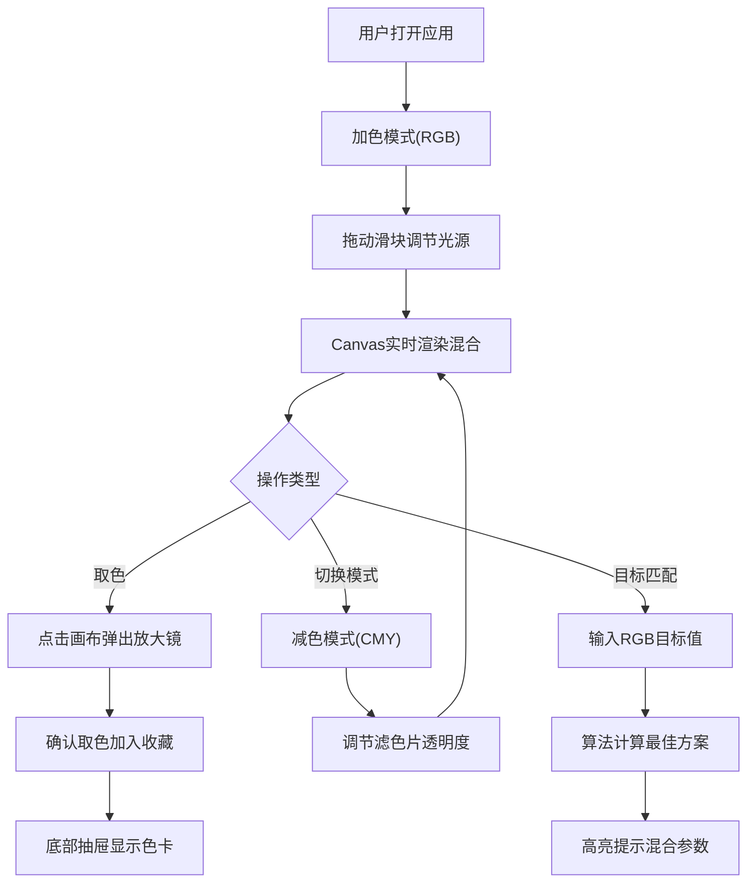

## 1. 产品概述
光谱色光混合模拟器是一款面向美术设计者和教育工作者的交互式色彩教学工具，通过可视化方式直观展示加色混合(RGB)与减色混合(CMY)原理。
- 解决传统色彩理论难以具象理解的问题，提供实时可调的交互体验
- 目标用户：平面设计师、美术教师、学生、色彩研究爱好者

## 2. 核心功能

### 2.1 用户角色
| 角色 | 描述 | 核心权限 |
|------|------|----------|
| 普通用户 | 直接使用Web应用 | 使用全部混合功能、取色收藏、目标色块匹配 |

### 2.2 功能模块
1. **加色混合模式**：红/绿/蓝三光源调节，半透明圆形光束叠加，实时显示RGB数值
2. **减色混合模式**：青/品红/黄三滤色片调节，矩形滤镜叠加，实时显示混合结果
3. **模式切换系统**：顶部标签切换，带动画过渡效果，目标色块匹配算法
4. **颜色拾取与收藏**：取色放大镜交互，底部抽屉式收藏面板，最多8个色卡

### 2.3 页面详情
| 页面名称 | 模块名称 | 功能描述 |
|-----------|-------------|---------------------|
| 主页面 | 顶部模式标签栏 | 圆角矩形标签，选中渐变色+下划线滑动动画，加色/减色模式切换 |
| 主页面 | 混合画布区域 | Canvas渲染：加色模式绘制圆形径向渐变光束叠加，减色模式绘制矩形滤镜叠加 |
| 主页面 | 控制面板 | 3个滑块(0-255或0-100%)，色值实时显示(带计数滚动动画)，目标色块输入框 |
| 主页面 | 取色放大镜 | 点击画布弹出，5x5像素放大预览，圆形蒙版，确认取色按钮 |
| 主页面 | 收藏面板 | 底部抽屉滑入，最多8个方形色卡，悬停显示HEX/RGB值 |

## 3. 核心流程

用户打开应用 → 默认进入加色混合模式 → 拖动滑块调节光源强度 → 观察光束叠加混合效果 → 点击画布任意区域取色 → 收藏颜色到底部面板 → 切换至减色模式 → 输入目标RGB值 → 系统计算最佳混合方案并高亮提示

## 4. 用户界面设计

### 4.1 设计风格
- **主色调**：深灰渐变背景(#1a1a2e → #16213e)，加色模式标签渐变：红→绿→蓝；减色模式标签渐变：青→品红→黄
- **组件样式**：滑块轨道半透明细条，滑块圆球带微光晕；光束径向渐变模拟聚光；面板圆角8px，阴影柔和
- **字体**：JetBrains Mono(等宽字体用于数值显示)，无衬线字体用于UI文字
- **布局**：桌面版80%宽度居中，移动版100%宽度+控制面板底部化
- **动画**：所有交互0.3s ease-in-out；模式切换0.5s淡入淡出；数值变化从下向上滚动计数

### 4.2 页面设计概述
| 页面名称 | 模块名称 | UI元素 |
|-----------|-------------|-------------|
| 主页面 | 模式标签栏 | 两个圆角矩形标签，选中状态渐变背景+底部下划线滑动，整体居中，内边距16px |
| 主页面 | 混合画布 | 深色背景，居中Canvas(600x500px桌面/100%移动)，光束/滤色片半透明叠加，中心显示数值文字 |
| 主页面 | 控制面板 | 竖向3组滑块，每组带标签+滑块+数值，目标色块输入区域，等宽字体显示RGB |
| 主页面 | 取色放大镜 | 圆形放大窗口(直径120px)，半透明黑色背景遮罩，十字准星，取色/取消按钮 |
| 主页面 | 收藏面板 | 底部抽屉(高度140px)，8个方形色块(64x64px)网格排列，悬停显示工具提示色值 |

### 4.3 响应式设计
- **桌面端(>768px)**：主容器max-width 1200px，画布80%宽度居左，控制面板20%居右并排布局
- **平板端(576-768px)**：画布100%宽度，控制面板在下方横向排列滑块
- **移动端(<576px)**：全屏自适应，控制面板固定在底部，滑块纵向排列，触摸优化

### 4.4 视觉动效
- 光束边缘使用radial-gradient从中心100%透明度向外过渡到30%
- 滑块拖动时：球头光晕增强(box-shadow扩张)，松开恢复
- 模式切换：当前内容opacity:1→0→1过渡0.5s，背景色同步过渡
- 数值变化：旧值向上位移消失，新值从下方位移进入，0.2s动画
- 收藏面板展开：translateY从100%到0，0.35s cubic-bezier(0.4,0,0.2,1)
