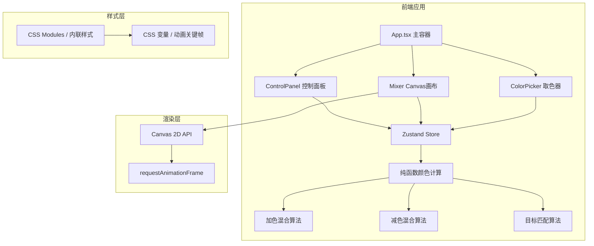

## 1. 架构设计



## 2. 技术说明
- **前端框架**：React@18 + TypeScript@5
- **构建工具**：Vite@5 (@vitejs/plugin-react)
- **状态管理**：Zustand@4
- **工具库**：uuid@9 (@fontsource/jetbrains-mono字体)
- **字体**：JetBrains Mono(数值显示专用)
- **渲染方式**：Canvas 2D原生API，无第三方图表/绘图库
- **颜色计算**：纯函数实现，无第三方颜色库
- **初始化方式**：vite-init react-ts模板

## 3. 路由定义
| 路由 | 用途 |
|-------|---------|
| / | 单页应用，无路由跳转，所有功能在主页面完成 |

## 4. 模块划分与文件结构

```
src/
├── types.ts              # 全局类型接口定义
├── main.tsx              # ReactDOM渲染入口
├── App.tsx               # 主应用组件，布局组合
├── store/
│   └── colorStore.ts     # Zustand状态管理核心
├── components/
│   ├── Mixer.tsx         # Canvas混合画布组件
│   ├── ControlPanel.tsx  # 控制面板(滑块+模式切换)
│   └── ColorPicker.tsx   # 取色放大镜+收藏面板
└── styles/
    └── global.css        # 全局样式与动画关键帧
```

## 5. 状态管理(Zustand Store)

### 5.1 状态字段
| 字段 | 类型 | 默认值 | 说明 |
|------|------|--------|------|
| mode | 'additive' \| 'subtractive' | 'additive' | 当前混合模式 |
| lights | {r:number, g:number, b:number} | {r:255,g:255,b:255} | 加色光源强度0-255 |
| filters | {c:number, m:number, y:number} | {c:100,m:100,y:100} | 减色滤镜透明度0-100% |
| targetColor | {r:number,g:number,b:number} | null | 用户输入的目标RGB |
| suggestedMix | object | null | 算法计算出的最佳参数提示 |
| favorites | FavoriteColor[] | [] | 收藏颜色数组(最多8) |
| pickerState | {visible,x,y,color,pixels} | null | 取色放大镜状态 |
| drawerOpen | boolean | false | 收藏面板抽屉开关 |

### 5.2 核心方法
| 方法 | 参数 | 说明 |
|------|------|------|
| setMode | mode | 切换加色/减色模式 |
| setLight | key, value | 更新单个光源强度 |
| setFilter | key, value | 更新单个滤镜透明度 |
| setTargetColor | r,g,b | 设置目标RGB并触发匹配计算 |
| addFavorite | color, name | 添加颜色到收藏(超出8个则替换最旧) |
| removeFavorite | id | 从收藏中移除 |
| openPicker | x,y,pixels | 显示取色放大镜 |
| closePicker | | 关闭取色放大镜 |
| toggleDrawer | | 切换收藏面板展开/收起 |

## 6. 纯函数颜色算法

### 6.1 加色混合 (Additive / RGB)
```
混合原理：红+绿=黄, 绿+蓝=青, 蓝+红=品红, 红+绿+蓝=白
公式：result = 255 - ((255 - c1) * (255 - c2) * ...) / 255^(n-1)
      简化版本：各通道直接取Max或加权求和
实现：逐像素处理，每通道 = Min(光源1通道 + 光源2通道 + ..., 255)
```

### 6.2 减色混合 (Subtractive / CMY)
```
混合原理：青+品红=蓝, 品红+黄=红, 黄+青=绿, 青+品红+黄=黑
公式：C=1-R, M=1-G, Y=1-B
      叠乘：C合 = 1 - (1-C1)*(1-C2)*... 
      R合 = 1 - C合, G合 = 1 - M合, B合 = 1 - Y合
实现：RGB转换到CMY后按透明度权重叠乘，再转回RGB
```

### 6.3 目标匹配算法
```
输入：目标RGB (Rt, Gt, Bt)
步骤：
  1. 建立参数空间：3个参数，每个32步(0-255分32阶) = 32768组合
  2. 对每个组合计算混合结果RGB
  3. 计算色差 ΔE = √[(ΔR)² + (ΔG)² + (ΔB)²]
  4. 找出ΔE最小的前5个组合
  5. 若ΔE < 阈值(10)则标记为"接近匹配"，否则"最接近匹配"
输出：最佳参数组合 + 实际输出RGB + 相似度百分比
性能：预计算查表，避免每帧重算
```

## 7. 关键实现细节

### 7.1 Canvas渲染优化
- 使用requestAnimationFrame节流渲染，滑块变化标记dirty flag
- 加色模式：使用globalCompositeOperation='lighter'实现光束叠加
- 减色模式：使用globalCompositeOperation='multiply' + 白色背景
- 每像素计算通过离屏Canvas批量处理，性能<16ms/帧

### 7.2 性能保障
- 状态变更通过Zustand浅比较，避免不必要的re-render
- 滑块onChange事件通过debounce(0ms)即同步写入但异步渲染
- 颜色计算函数纯函数化，可被React.memo缓存
- 目标匹配使用Web Worker异步计算，不阻塞主线程

### 7.3 取色放大镜实现
- 点击Canvas获取event坐标 → 转换为canvas内部坐标
- 通过getImageData获取5x5=25像素区域数据
- 放大绘制到放大镜画布(每像素16x16放大)
- 中间像素作为选取颜色，点击确认写入收藏

## 8. 数据结构定义 (types.ts)

```typescript
export type ColorMode = 'additive' | 'subtractive';

export interface RGB {
  r: number; // 0-255
  g: number;
  b: number;
}

export interface LightState {
  r: number; // 0-255 红光源强度
  g: number; // 0-255 绿光源强度
  b: number; // 0-255 蓝光源强度
}

export interface FilterState {
  c: number; // 0-100% 青滤镜浓度
  m: number; // 0-100% 品红滤镜浓度
  y: number; // 0-100% 黄滤镜浓度
}

export interface FavoriteColor {
  id: string; // uuid
  rgb: RGB;
  hex: string;
  timestamp: number;
  source: 'picker' | 'target' | 'manual';
}

export interface PickerPixel {
  x: number;
  y: number;
  rgb: RGB;
}

export interface PickerState {
  visible: boolean;
  canvasX: number;      // 点击的canvas坐标
  canvasY: number;
  pixels: PickerPixel[]; // 5x5像素数据
  centerColor: RGB;      // 中心点颜色
}

export interface MatchSuggestion {
  params: LightState | FilterState;
  result: RGB;
  deltaE: number;
  similarity: number; // 0-100%
  mode: ColorMode;
}
```
