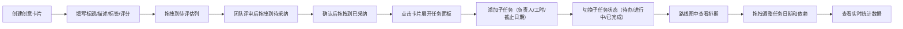

## 1. 产品概述

创意管理平台是一款面向小型创业团队的协作工具，帮助团队从创意构思到任务拆解实现全流程管理。解决头脑风暴阶段想法杂乱难以追踪、优先级不明确以及从点子落地为具体开发任务时缺乏衔接的核心痛点。

- 目标用户：小型创业团队的产品经理、开发人员、设计师、市场人员
- 核心价值：通过可视化看板、任务拆解和路线图规划，让创意高效落地

## 2. 核心 Features

### 2.1 用户角色

| 角色 | 注册方式 | 核心权限 |
|------|----------|----------|
| 团队成员 | 无需注册，本地使用 | 创建/编辑创意卡片、管理子任务、查看路线图和统计数据 |

### 2.2 Feature Module

1. **创意看板模块**：看板列展示、卡片拖拽、状态管理、评分和标签分类
2. **任务拆解模块**：子任务面板、任务CRUD、状态切换、负责人和工时管理
3. **项目路线图模块**：甘特图时间轴、周/月视图切换、任务条拖拽、依赖连线
4. **数据统计模块**：实时统计面板、圆形进度条、关键指标展示

### 2.3 Page Details

| 页面名称 | 模块名称 | 功能描述 |
|----------|----------|----------|
| 主应用页面 | 创意看板 | 三列看板布局（待评估、待采纳、已采纳），支持卡片拖拽排序和状态切换，卡片显示标题、标签、评分 |
| 主应用页面 | 任务拆解面板 | 右侧滑入式面板，展示选中创意的子任务列表，支持添加、编辑、删除子任务，切换任务状态 |
| 主应用页面 | 项目路线图 | 基于时间轴的甘特图视图，周/月切换，任务条颜色与创意标签对应，支持拖拽调整日期和连线设置依赖 |
| 顶部导航栏 | 数据统计面板 | 下拉式统计面板，展示待评估创意数、已采纳创意数、进行中任务数、完成率圆形进度条 |

## 3. 核心流程

## 4. 界面设计

### 4.1 设计风格

- **主色调**：深色主题，主背景 `#1E1E2E`，卡片背景 `#2D2D44`，主文字 `#E0E0E0`
- **标签配色**：产品紫色 `#9B59B6`、技术蓝色 `#3498DB`、设计粉色 `#E91E63`、市场橙色 `#F39C12`
- **进度条**：绿色渐变 `#2ECC71` 到 `#27AE60`
- **按钮风格**：圆角8px，点击水波纹涟漪效果
- **字体**：Inter 字体家族，标题16px semibold，正文14px regular
- **布局**：左侧固定侧边栏240px，主内容区网格布局，看板列间距16px，卡片间距12px
- **图标风格**：线性简约图标，与深色主题协调

### 4.2 页面设计概览

| 页面名称 | 模块名称 | UI Elements |
|----------|----------|-------------|
| 主应用 | 创意看板 | 三列网格布局，磨砂玻璃侧边栏，卡片悬停阴影，拖拽半透明跟随效果，目标列高亮边框动画 |
| 主应用 | 任务面板 | 右侧滑入动画（300ms内），背景半透明模糊蒙版，子任务列表，复选框勾选动画，已完成项灰显删除线 |
| 主应用 | 路线图 | 时间轴网格，任务条圆角设计，拖拽调整，连线动画 |
| 顶部导航 | 统计面板 | 下拉缓动动画，圆形进度条，实时数据更新 |

### 4.3 响应式设计

- **桌面端**：侧边栏展开240px，看板三列横向布局
- **平板端（768px以上）**：侧边栏可折叠为图标模式
- **手机端（768px以下）**：看板列纵向堆叠，侧边栏隐藏为汉堡菜单

### 4.4 动效规范

- 拖拽操作帧率不低于50fps
- 子任务面板滑入动画时长 ≤ 300ms
- 模态框背景蒙版0.3秒淡入
- 按钮点击水波纹涟漪效果
- 复选框勾选动画（对号从左上角飞出）
- 统计面板下拉缓动动画
