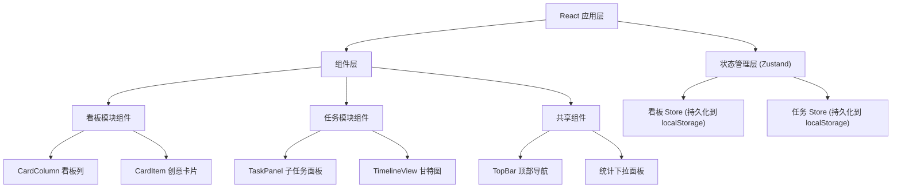
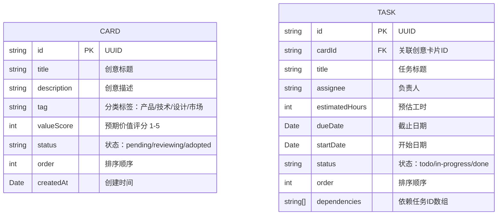

## 1. 架构设计



## 2. 技术选型

- **前端框架**：React@18 + TypeScript
- **构建工具**：Vite
- **状态管理**：Zustand + persist 中间件
- **路由**：React Router v6
- **拖拽库**：@dnd-kit/core + @dnd-kit/sortable
- **工具库**：uuid, date-fns
- **字体**：@fontsource/inter
- **样式方案**：CSS Modules / CSS Variables (自定义实现)

## 3. 路由定义

| 路由 | 用途 |
|------|------|
| /board | 创意看板页面 |
| /timeline | 项目路线图页面 |

## 4. 数据模型

### 4.1 数据模型定义



### 4.2 类型定义

**看板模块类型 (src/board/types.ts):**
```typescript
export type CardTag = 'product' | 'tech' | 'design' | 'marketing';
export type CardStatus = 'pending' | 'reviewing' | 'adopted';

export interface Card {
  id: string;
  title: string;
  description: string;
  tag: CardTag;
  valueScore: number;
  status: CardStatus;
  order: number;
  createdAt: string;
}
```

**任务模块类型 (src/task/types.ts):**
```typescript
export type TaskStatus = 'todo' | 'in-progress' | 'done';

export interface Task {
  id: string;
  cardId: string;
  title: string;
  assignee: string;
  estimatedHours: number;
  dueDate: string;
  startDate: string;
  status: TaskStatus;
  order: number;
  dependencies: string[];
}
```

## 5. 项目结构

```
d:\P\tasks\auto186/
├── package.json
├── index.html
├── vite.config.js
├── tsconfig.json
└── src/
    ├── App.tsx
    ├── main.tsx
    ├── index.css
    ├── board/
    │   ├── types.ts
    │   ├── store.ts
    │   └── components/
    │       ├── CardColumn.tsx
    │       └── CardItem.tsx
    ├── task/
    │   ├── types.ts
    │   ├── store.ts
    │   └── components/
    │       ├── TaskPanel.tsx
    │       └── TimelineView.tsx
    └── shared/
        ├── components/
        │   ├── TopBar.tsx
        │   └── Sidebar.tsx
        └── hooks/
            └── useRipple.ts
```

## 6. Store 设计

### 6.1 看板 Store (src/board/store.ts)

```typescript
import { create } from 'zustand';
import { persist } from 'zustand/middleware';
import { Card, CardStatus, CardTag } from './types';

interface BoardState {
  cards: Card[];
  selectedCardId: string | null;
  addCard: (card: Omit<Card, 'id' | 'createdAt' | 'order'>) => void;
  updateCard: (id: string, updates: Partial<Card>) => void;
  deleteCard: (id: string) => void;
  moveCard: (cardId: string, newStatus: CardStatus, newOrder: number) => void;
  selectCard: (id: string | null) => void;
}
```

### 6.2 任务 Store (src/task/store.ts)

```typescript
import { create } from 'zustand';
import { persist } from 'zustand/middleware';
import { Task, TaskStatus } from './types';

interface TaskState {
  tasks: Task[];
  addTask: (task: Omit<Task, 'id' | 'order'>) => void;
  updateTask: (id: string, updates: Partial<Task>) => void;
  deleteTask: (id: string) => void;
  updateTaskStatus: (id: string, status: TaskStatus) => void;
  reorderTasks: (cardId: string, fromIndex: number, toIndex: number) => void;
  updateTaskDates: (id: string, startDate: string, dueDate: string) => void;
  addDependency: (taskId: string, dependencyId: string) => void;
  removeDependency: (taskId: string, dependencyId: string) => void;
  getTasksByCardId: (cardId: string) => Task[];
  getStats: () => {
    pendingCards: number;
    adoptedCards: number;
    inProgressTasks: number;
    completionRate: number;
  };
}
```

## 7. 关键组件实现要点

### 7.1 CardItem.tsx (拖拽实现)
- 使用 `useDraggable` hook
- 拖拽时 transform: scale(1.05) + opacity: 0.8
- 已采纳卡片根据标签显示对应颜色边框
- 点击时调用 `selectCard` 触发右侧面板

### 7.2 CardColumn.tsx (放置区域)
- 使用 `useDroppable` hook
- 拖拽悬停时高亮边框动画
- 根据状态筛选卡片列表

### 7.3 TaskPanel.tsx (滑入面板)
- CSS transition: transform 300ms ease-out
- 背景蒙版: backdrop-filter: blur(8px) + opacity 0.3s 淡入
- 子任务列表使用 `SortableContext` 支持拖拽排序

### 7.4 TimelineView.tsx (甘特图)
- SVG 或 div 实现时间轴网格
- 周/月切换计算日期范围
- 任务条水平拖动更新 startDate/dueDate
- SVG 路径绘制依赖连线

### 7.5 TopBar.tsx (统计面板)
- 下拉动画: max-height 0.3s ease-in-out
- 圆形进度条: SVG circle + stroke-dasharray
- 实时订阅 store 数据更新

## 8. 性能优化

- 使用 `React.memo` 包装 CardItem、Task 列表项
- 拖拽操作使用 `transform` 而非 `top/left` 保证 GPU 加速
- Zustand 订阅使用 selector 避免不必要重渲染
- 列表项使用稳定的 key (id 而非 index)
