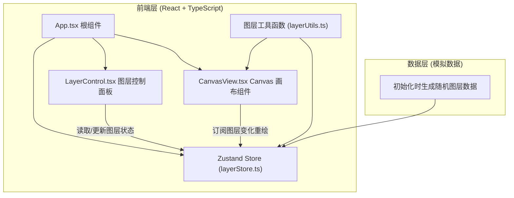

## 1. 架构设计



## 2. 技术说明

- **前端框架**：React@18 + React-DOM@18
- **构建工具**：Vite（vite.config.js 配置 React 插件）
- **语言**：TypeScript（严格模式 strict: true）
- **状态管理**：Zustand（轻量级状态仓库）
- **辅助库**：uuid（生成图层唯一 ID）、@fontsource/nunito（字体）
- **Canvas 绑定**：原生 HTML5 Canvas API，无第三方图形库依赖
- **样式方案**：CSS Modules / 内联样式（纯 CSS 过渡动画，无 CSS 框架依赖）

## 3. 路由定义

| 路由 | 用途 |
|-------|---------|
| / | 单页应用主入口，无路由切换 |

本项目为单页面应用，不引入 React Router。

## 4. 数据模型定义

### 4.1 图层元素类型 (LayerElement)

```typescript
interface LayerElement {
  id: string;
  type: 'rect' | 'circle' | 'triangle';
  x: number;
  y: number;
  width: number;
  height: number;
  color: string;
  alpha: number;
  rotation: number;
}
```

### 4.2 图层类型 (Layer)

```typescript
interface Layer {
  id: string;
  name: string;
  colorLabel: string;
  visible: boolean;
  elements: LayerElement[];
  elementCount: number;
  averageColor: string;
}
```

### 4.3 状态仓库类型 (LayerStore)

```typescript
interface LayerStore {
  layers: Layer[];
  initialLayers: Layer[];
  compareMode: boolean;
  splitPosition: number;
  toggleLayerVisibility: (id: string) => void;
  reorderLayers: (fromIndex: number, toIndex: number) => void;
  toggleCompareMode: () => void;
  setSplitPosition: (pos: number) => void;
  resetAll: () => void;
  initLayers: () => void;
}
```

## 5. 文件结构与职责

```
d:\P\tasks\auto187\
├── package.json
├── vite.config.js
├── tsconfig.json
├── index.html
├── src/
│   ├── App.tsx                 # 根组件，组装控制面板和画布，初始化数据
│   ├── main.tsx                # React 入口，挂载 App
│   ├── index.css               # 全局样式 + Nunito 字体引入
│   ├── store/
│   │   └── layerStore.ts       # Zustand 状态仓库
│   ├── components/
│   │   ├── LayerControl.tsx    # 图层控制面板（开关、拖拽、排序）
│   │   └── CanvasView.tsx      # Canvas 画布（图层绘制、对比模式、分割线）
│   └── utils/
│       └── layerUtils.ts       # 图层生成、颜色计算、绘制辅助函数
```

### 数据流向说明
1. **初始化**：`App.tsx` 加载时调用 `layerStore.initLayers()` → `layerUtils.generateRandomLayers()` 生成 8-12 个模拟图层 → 存入 `store.layers` 和 `store.initialLayers`
2. **图层控制**：`LayerControl.tsx` 读取 `store.layers` → 用户点击开关 → 调用 `store.toggleLayerVisibility(id)` → `CanvasView.tsx` 订阅状态变更 → `requestAnimationFrame` 触发重绘
3. **拖拽排序**：`LayerControl.tsx` 使用原生拖拽 API → 结束时调用 `store.reorderLayers(from, to)` → 顺序更新 → Canvas 重绘
4. **对比模式**：顶部按钮调用 `store.toggleCompareMode()` → `CanvasView` 切换单图/分屏模式，`splitPosition` 控制分割线位置
5. **重置操作**：点击重置调用 `store.resetAll()` → 将 `initialLayers` 深拷贝回 `layers`，恢复 splitPosition → Canvas 清空重绘

## 6. 性能优化策略

- **Canvas 脏标记渲染**：仅当 store 中图层数据（可见性、顺序）或 splitPosition 变化时才触发重绘，避免无意义的逐帧渲染
- **批量绘制优化**：同一图层所有元素一次性绘制，减少 save/restore 调用
- **对比模式双缓冲**：使用两个 offscreen canvas 分别缓存原始图和编辑图，分屏时直接 drawImage 而非重复逐元素绘制
- **拖拽节流**：splitPosition 更新使用 requestAnimationFrame 节流，避免过度重绘
- **目标性能指标**：≤12 图层时，可见性切换/排序重绘响应 <50ms，整体帧率 ≥45FPS
