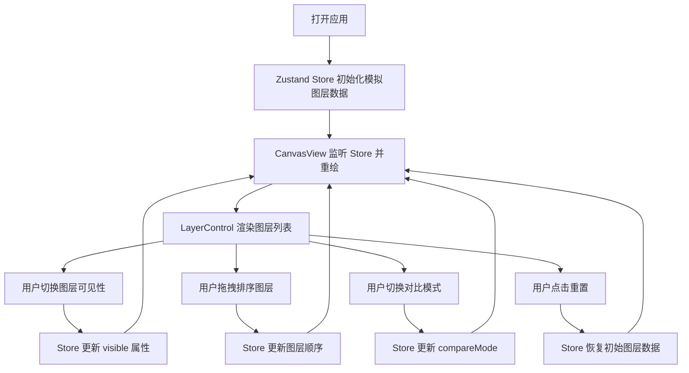

## 1. 产品概述
LayerPeek 是一款面向职业插画师的多图层 PSD 在线预览与对比工具，通过模拟 Canvas 绘制多图层几何形状数据，让用户快速预览图层叠加效果，支持在线给客户展示图层开关和效果对比。
- 核心价值：解决插画师需要反复导出不同图层组合图片给客户确认的低效痛点，提供实时、可交互的在线预览体验
- 目标用户：职业插画师、平面设计师、创意团队及其客户

## 2. 核心特性

### 2.1 用户角色
| 角色 | 注册方式 | 核心权限 |
|------|----------|----------|
| 插画师/设计师 | 无需注册，本地浏览器使用 | 上传/生成模拟图层数据、调整图层可见性与顺序、切换对比模式、重置操作 |
| 客户/预览者 | 无需注册，通过链接访问 | 查看图层叠加效果、操作开关与对比模式 |

### 2.2 功能模块
1. **图层控制面板**：图层可见性开关、拖拽排序、图层信息展示（元素数量 + 主色调）
2. **Canvas 画布显示区**：多图层叠加绘制、16:9 比例自适应居中
3. **对比模式**：左右分屏（原始图 vs 编辑图）、可拖拽分割线
4. **顶部工具栏**：对比模式切换按钮、重置按钮

### 2.3 页面详情
| 页面名称 | 模块名称 | 功能描述 |
|-----------|-------------|---------------------|
| 主页面（单页应用） | 左侧图层控制面板 | 垂直列表展示图层卡片，支持开关切换、拖拽排序，显示图层元信息 |
| 主页面 | 顶部工具栏 | 对比模式切换（单图/左右对比）、重置所有状态按钮 |
| 主页面 | Canvas 画布区域 | 按图层顺序绘制可见图层，支持对比模式分屏显示、拖拽分割线 |

## 3. 核心流程

用户打开应用 → 系统自动生成 8-12 层模拟多图层数据（随机几何形状与颜色）→ Canvas 按默认顺序叠加绘制所有图层 → 用户通过左侧开关控制单个图层可见性 → Canvas 实时重绘 → 用户可拖拽调整图层顺序 → 叠加效果实时更新 → 切换对比模式查看原始与编辑效果差异 → 拖拽中间分割线调整两侧比例 → 点击重置恢复初始状态

## 4. 用户界面设计

### 4.1 设计风格
- **主色调**：深灰底色 `#111827`（主体背景）、`#1F2937`（控制面板）、`#374151`（画布背景）
- **强调色**：翠绿色 `#10B981`（开关开启状态、主操作）、琥珀色 `#F59E0B`（辅助强调）
- **按钮样式**：圆角半透明按钮，开关按钮 200ms ease-out 过渡动画
- **字体**：Nunito（通过 @fontsource/nunito 引入），现代圆润无衬线字体
- **布局风格**：左侧固定 280px 控制面板 + 右侧自适应画布区域，桌面优先
- **图标风格**：简洁线性风格（重置按钮使用旋转箭头 SVG）

### 4.2 页面设计概述
| 页面名称 | 模块名称 | UI 元素 |
|-----------|-------------|----------|
| 主页面 | 左侧控制面板 | 固定宽度 280px，垂直分割线分隔，深灰 `#1F2937` 背景，图层卡片圆角 12px 间距 16px，悬停变亮 `#374151`，200ms 过渡 |
| 主页面 | 图层卡片 | 左侧 24px 彩色圆点标签 + 图层名称，右侧开关按钮（灰色`#6B7280`/翠绿`#10B981`，弹性缩放 0.95→1.05 动画），底部显示元素数量和主色调色块 |
| 主页面 | 顶部工具栏 | 对比模式切换按钮（文字切换：单图/左右对比）、右上角圆形重置按钮（悬停时箭头 1s 旋转 360°） |
| 主页面 | Canvas 画布区域 | 16:9 比例居中，背景 `#374151`，对比模式下垂直白色 1px 分割线 + 圆形拖拽手柄（拖拽放大 1.2 倍 + 阴影） |

### 4.3 响应式设计
- **桌面端（≥768px）**：左侧固定 280px 控制面板 + 右侧画布，标准布局
- **移动端（<768px）**：控制面板折叠为顶部横条，汉堡图标点击展开下拉面板，画布自适应调整大小，触摸拖拽优化

### 4.4 动画与交互规范
- 开关切换：200ms ease-out，背景色渐变 + 弹性缩放 0.95→1.05
- 拖拽排序：拖拽中卡片半透明 + 放大 1.05 倍，位置指示器虚影，松开 200ms 过渡归位
- 分割线拖拽：手柄放大 1.2 倍 + 阴影效果，位置实时更新
- 重置按钮：悬停 1s 箭头 360° 旋转
- 对比模式切换：画布 300ms 淡入淡出过渡
- 所有交互：统一 200ms ease-out 的 opacity 和 transform 变化
