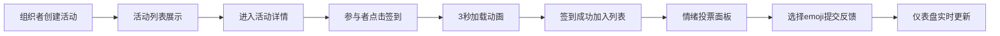

## 1. 产品概述

EventPulse是一款活动签到与即时反馈系统，解决线下活动组织者快速收集签到数据和参与者情绪反馈的痛点。

- 目标用户：活动组织者、会议主办方、线下社群管理者
- 核心价值：简化签到流程、实时收集情绪反馈、提供数据可视化面板

## 2. 核心功能

### 2.1 用户角色
| 角色 | 核心权限 |
|------|----------|
| 组织者 | 创建活动、查看仪表盘、管理活动数据 |
| 参与者 | 扫码/点击签到、提交情绪反馈 |

### 2.2 功能模块
1. **活动列表页**：展示活动卡片、创建活动弹窗
2. **活动详情页**：签到功能、签到列表、情绪投票面板
3. **数据仪表盘**：签到趋势图、情绪分布饼图、实时数据统计

### 2.3 页面详情
| 页面名称 | 模块名称 | 功能描述 |
|-----------|-------------|---------------------|
| 活动列表页 | 活动卡片网格 | 展示活动名称、日期、签到人数，卡片进入动画、悬停高亮 |
| 活动列表页 | 创建活动弹窗 | 半透明蒙层、居中表单、圆角设计、日期选择器、人数输入 |
| 活动详情页 | 签到按钮 | 圆形渐变按钮、3秒加载动画、成功对勾弹性效果 |
| 活动详情页 | 签到列表 | 滑入动画、错开延迟、参与者信息展示 |
| 活动详情页 | 情绪投票面板 | 5个emoji按钮、弹动动画、实时计数更新 |
| 数据仪表盘 | 统计卡片 | 总签到人数滚动动画、平均情绪分计算 |
| 数据仪表盘 | 签到趋势图 | Canvas绘制折线图、渐变色彩、光晕数据点、阴影面积 |
| 数据仪表盘 | 情绪饼图 | Canvas绘制5分区饼图、旋转动画、图例说明 |
| 数据仪表盘 | 实时签到列表 | 最新签到动态展示 |

## 3. 核心流程

组织者登录系统 → 创建活动 → 生成活动入口 → 参与者进入活动详情 → 点击签到按钮 → 显示3秒加载动画 → 签到成功并加入列表 → 参与者选择emoji提交反馈 → 组织者在仪表盘查看实时数据

## 4. 用户界面设计

### 4.1 设计风格
- **主色调**：深色主题，背景#0F172A，卡片背景#1E293B
- **强调色**：渐变色从#667eea到#764ba2（按钮、链接、进度条）
- **文字颜色**：主色#E2E8F0
- **按钮样式**：圆形签到按钮（渐变背景），圆角20px弹窗表单
- **字体**：Inter字体（@fontsource/inter）
- **布局风格**：卡片式布局，顶部固定导航，响应式网格
- **emoji样式**：😊 😐 😢 😡 🎉 五种情绪图标

### 4.2 页面设计概述
| 页面名称 | 模块名称 | UI元素 |
|-----------|-------------|-------------|
| 活动列表页 | 活动卡片网格 | 卡片圆角16px、边框rgba(255,255,255,0.05)、悬停边框高亮、0.3秒淡入动画、网格布局 |
| 活动列表页 | 创建活动弹窗 | 半透明黑色蒙层、表单居中、圆角20px、投影效果、日期选择器日历样式 |
| 活动详情页 | 签到按钮 | 大圆形按钮、渐变#667eea到#764ba2、白色文字、悬停阴影加深、3秒旋转加载圈、弹性对勾效果 |
| 活动详情页 | 签到列表 | 从右向左滑入、透明度渐变、每项0.1秒错开动画 |
| 活动详情页 | 情绪投票面板 | 5个emoji按钮、悬停放大1.1倍、点击1.2倍放大弹动两次、半透明计数数字 |
| 数据仪表盘 | 统计卡片 | 大号数字从0滚动到当前值、向上翻滚动画、平均情绪分小卡片 |
| 数据仪表盘 | 签到趋势图 | Canvas绘制、横轴时间纵轴人数、渐变折线、半透明阴影面积、数据点光晕 |
| 数据仪表盘 | 情绪饼图 | Canvas绘制、5种颜色分区（#10B981、#F59E0B、#EF4444、#8B5CF6、#3B82F6）、旋转进入动画 |
| 导航栏 | 顶部导航 | 固定顶部、背景#1E293B、白色文字 |

### 4.3 响应式适配
- 桌面端：多列网格布局、顶部导航
- 移动端（<768px）：单列布局、表单全屏显示、图表上下排列、底部标签栏导航
- 触摸优化：所有按钮触摸区域至少44x44px
- 设计策略：桌面优先，移动端适配

## 5. 性能要求
- 签到操作响应延迟≤200ms（数据异步写入，3秒仅为视觉动画）
- Canvas绘图帧率≥30fps
- 所有转场动画使用ease-in-out，持续0.3秒
