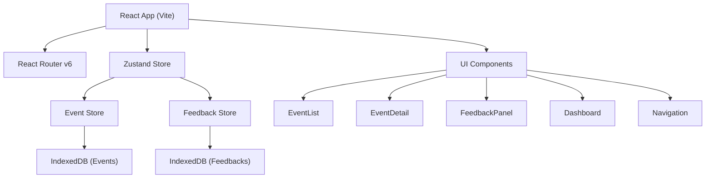
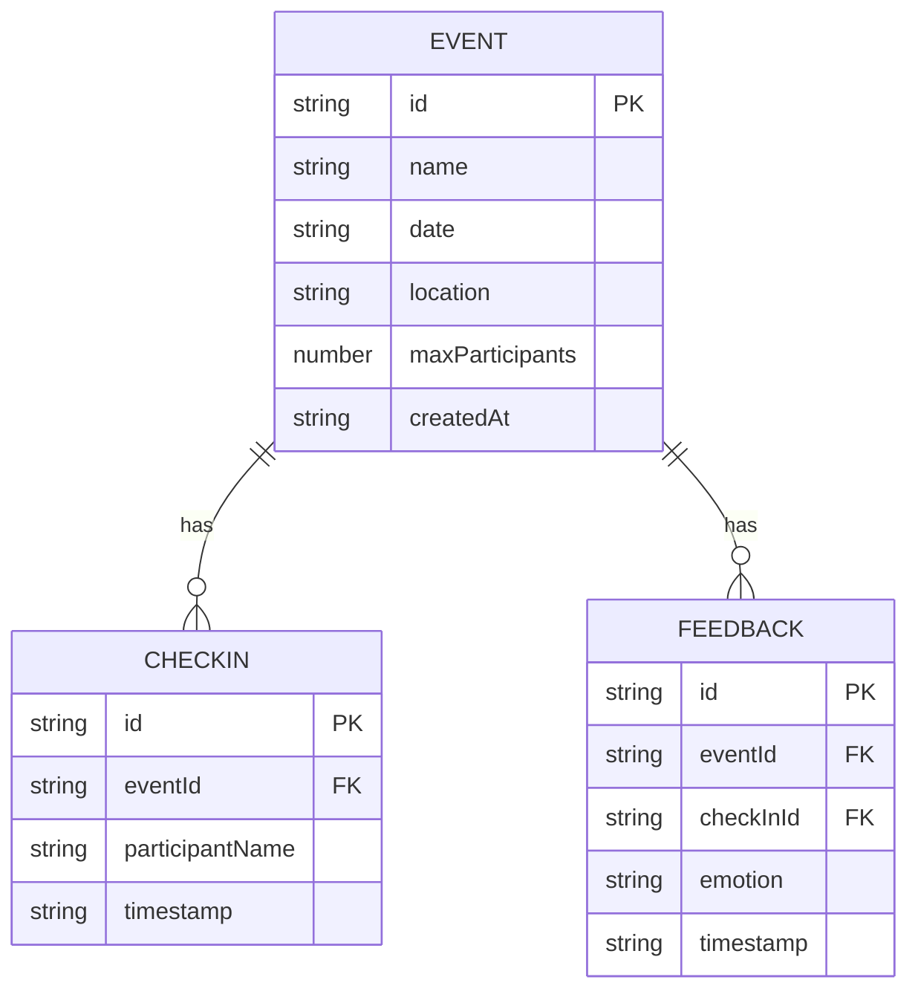

## 1. 架构设计



## 2. 技术描述

- **前端框架**：React@18 + TypeScript
- **构建工具**：Vite
- **路由**：react-router-dom@6
- **状态管理**：Zustand
- **数据库**：IndexedDB（自定义封装）
- **工具库**：uuid（唯一ID生成）、date-fns（日期处理）
- **字体**：@fontsource/inter

## 3. 路由定义
| 路由 | 页面 | 说明 |
|-------|---------|------|
| / | EventList | 活动列表首页 |
| /event/:id | EventDetail | 活动详情页，包含签到和反馈 |
| /dashboard | Dashboard | 组织者数据仪表盘 |

## 4. 数据模型

### 4.1 数据模型定义



### 4.2 TypeScript类型定义

```typescript
interface Event {
  id: string;
  name: string;
  date: string;
  location: string;
  maxParticipants: number;
  createdAt: string;
  checkIns: CheckIn[];
}

interface CheckIn {
  id: string;
  eventId: string;
  participantName: string;
  timestamp: string;
}

interface Feedback {
  id: string;
  eventId: string;
  checkInId: string;
  emotion: 'happy' | 'neutral' | 'sad' | 'angry' | 'excited';
  timestamp: string;
}
```

## 5. 项目文件结构

```
d:\P\tasks\auto190\
├── package.json
├── index.html
├── vite.config.js
├── tsconfig.json
└── src/
    ├── main.tsx
    ├── App.tsx
    ├── styles/
    │   └── global.css
    ├── components/
    │   └── Navigation.tsx
    ├── modules/
    │   ├── event/
    │   │   ├── eventStore.ts
    │   │   ├── EventList.tsx
    │   │   ├── EventDetail.tsx
    │   │   └── CreateEventModal.tsx
    │   ├── feedback/
    │   │   ├── feedbackStore.ts
    │   │   └── FeedbackPanel.tsx
    │   └── dashboard/
    │       └── Dashboard.tsx
    └── utils/
        ├── indexedDB.ts
        └── canvas.ts
```

## 6. 模块说明

### 6.1 Event Store (src/modules/event/eventStore.ts)
- Zustand store封装
- IndexedDB读写封装
- 导出函数：createEvent, getEvent, checkIn, getAllEvents
- 状态：events列表、currentEvent、loading状态

### 6.2 Feedback Store (src/modules/feedback/feedbackStore.ts)
- Zustand store封装
- IndexedDB读写封装
- 导出函数：submitFeedback, getFeedbackStats
- 状态：feedbacks列表、emotion统计数据

### 6.3 EventList组件
- 活动卡片网格展示
- 创建活动弹窗
- 卡片进入动画

### 6.4 EventDetail组件
- 活动信息展示
- 签到按钮（加载动画、成功效果）
- 签到列表（滑入动画）
- 集成FeedbackPanel

### 6.5 FeedbackPanel组件
- 5个emoji按钮
- 弹动动画效果
- 实时投票计数

### 6.6 Dashboard组件
- 统计卡片（滚动数字动画）
- Canvas折线图（签到趋势）
- Canvas饼图（情绪分布）
- 实时签到列表
