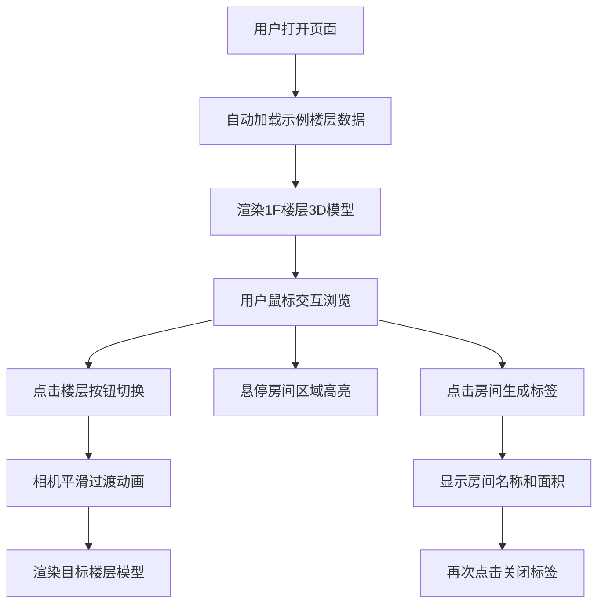

## 1. 产品概述

FloorViewer是一款面向建筑设计师的3D建筑平面可视化工具，可将CAD导出的JSON格式楼层平面数据快速转化为可交互的3D模型，支持楼层切换、房间标注和简单漫游功能。

- **核心价值**：帮助建筑设计师快速预览和展示建筑设计方案，提升设计沟通效率
- **目标用户**：建筑设计师、室内设计师、建筑相关从业者
- **市场定位**：轻量级、高效率的建筑平面3D可视化工具

## 2. 核心功能

### 2.1 用户角色
| 角色 | 注册方式 | 核心权限 |
|------|----------|----------|
| 建筑设计师 | 无需注册，直接使用 | 加载数据、浏览3D模型、切换楼层、标注房间 |

### 2.2 功能模块
1. **3D场景渲染模块**：墙体半透明渲染、门窗彩色高亮、模型边缘线框
2. **楼层管理模块**：内置两层示例数据、楼层切换按钮、平滑过渡动画
3. **交互控制模块**：鼠标拖拽旋转、右键平移、滚轮缩放、阻尼效果
4. **房间标注模块**：悬停高亮、点击生成标签、显示房间名称和面积、再次点击关闭
5. **性能优化模块**：共享BufferGeometry、InstanceMesh渲染、帧率保障

### 2.3 页面详情
| 页面名称 | 模块名称 | 功能描述 |
|----------|----------|----------|
| 主页面 | 3D场景区域 | 全屏Three.js渲染场景，暗色背景，支持鼠标交互 |
| 主页面 | 楼层切换按钮 | 右上角圆形按钮，1F/2F切换，平滑过渡动画 |
| 主页面 | 标题区域 | 左上角显示应用名称和当前楼层 |
| 主页面 | 操作提示 | 底部显示操作指南，半透明悬停效果 |
| 主页面 | 房间标签 | 悬浮卡片，显示房间名称和面积 |

## 3. 核心流程

用户打开页面→自动加载内置两层示例数据→渲染1F楼层3D模型→用户通过鼠标交互浏览→点击右上角按钮切换楼层→点击房间生成标签→悬停查看房间高亮

## 4. 用户界面设计

### 4.1 设计风格
- **主色调**：深色背景(#1a1a2e)，蓝色强调(#3f8efc)，浅灰墙体(#CCCCCC)
- **按钮风格**：圆形半透明按钮，圆角8px，扁平化设计
- **字体**：Inter字体，白色细体，带阴影效果
- **布局**：全屏3D场景，UI元素悬浮于场景之上，毛玻璃背景效果
- **动效**：0.3秒淡入动画，0.8秒楼层切换ease-out缓动

### 4.2 页面设计概述
| 页面名称 | 模块名称 | UI元素 |
|----------|----------|--------|
| 主页面 | 3D场景 | 暗色背景，半透明墙体，蓝色窗户，棕色门，黑色线框 |
| 主页面 | 左上角标题 | "FloorViewer 1F"，白色细体，0.1rem阴影，毛玻璃背景 |
| 主页面 | 右上角按钮 | 两个并排圆形按钮，40px直径，0.5rem间距，选中态蓝色 |
| 主页面 | 底部提示 | "拖拽旋转 | 滚轮缩放 | 点击标注房间"，半透明，悬停不透明度变化 |
| 主页面 | 房间标签 | 白色半透明卡片，黑色阴影，14px字体，显示"客厅 35m²"格式 |

### 4.3 响应式设计
- **桌面端(≥768px)**：标题正常大小，按钮40px直径，底部提示可见
- **移动端(<768px)**：标题缩小为14px，按钮30px直径，底部提示隐藏
- **触摸优化**：支持触摸手势操作

### 4.4 3D场景设计
- **环境**：暗色背景(#1a1a2e)，简洁无多余元素
- **光照**：环境光+方向光组合，确保模型清晰可见
- **相机**：透视相机，初始位置可俯瞰整个楼层平面
- **交互**：OrbitControls改造，支持旋转、平移、缩放，缩放范围0.5x-5x
- **材质**：墙体半透明(透明度0.6)，窗户亮蓝色半透明，门棕色不透明
- **性能**：共享BufferGeometry，InstanceMesh渲染，帧率≥45fps
