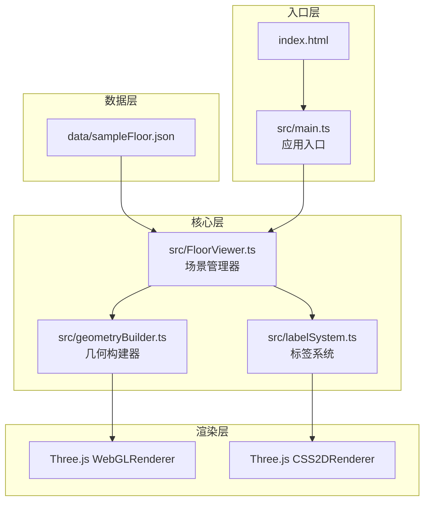

## 1. 架构设计

本项目采用模块化架构设计，核心3D渲染和交互逻辑集中管理，各模块职责清晰，数据流向明确。



## 2. 技术描述

- **前端框架**：无前端框架，原生TypeScript + Three.js
- **构建工具**：Vite 5.x
- **3D引擎**：Three.js 0.160.0
- **类型支持**：@types/three 0.160.0
- **辅助工具**：uuid 9.x
- **渲染器**：WebGLRenderer（3D场景）+ CSS2DRenderer（标签）
- **控制器**：自定义OrbitControls（旋转、平移、缩放）

## 3. 项目结构

```
auto191/
├── data/
│   └── sampleFloor.json      # 示例楼层数据（两层楼）
├── src/
│   ├── FloorViewer.ts        # 核心场景管理
│   ├── geometryBuilder.ts    # 几何构建器
│   ├── labelSystem.ts        # 标签系统
│   └── main.ts               # 应用入口
├── index.html                # 入口HTML
├── package.json              # 项目依赖
├── tsconfig.json             # TypeScript配置
└── vite.config.js            # Vite配置
```

### 模块调用关系与数据流向

1. **FloorViewer.ts → geometryBuilder.ts**
   - 调用方向：FloorViewer调用geometryBuilder
   - 数据流向：楼层JSON数据 → 几何构建器 → Three.js Group对象 → FloorViewer场景
   - 接口：`buildFloorGroup(floorData: FloorData): Group`

2. **FloorViewer.ts → labelSystem.ts**
   - 调用方向：FloorViewer调用labelSystem
   - 数据流向：点击事件坐标 → 射线检测 → 交点信息 → 创建CSS2D标签 → 添加到场景
   - 接口：`handleClick(event: MouseEvent): void`, `handleHover(event: MouseEvent): void`

3. **main.ts → FloorViewer.ts**
   - 调用方向：main.ts实例化FloorViewer
   - 数据流向：DOM容器 → FloorViewer初始化 → 加载数据 → 渲染循环

## 4. 数据模型

### 4.1 楼层数据结构

```typescript
interface Point {
  x: number;
  y: number;
}

interface Wall {
  start: Point;
  end: Point;
  height: number;
}

interface Window {
  position: Point;
  width: number;
  height: number;
}

interface Door {
  position: Point;
  width: number;
  height: number;
}

interface Room {
  id: string;
  name: string;
  area: number;
  boundary: Point[];
}

interface FloorData {
  id: string;
  name: string;
  walls: Wall[];
  windows: Window[];
  doors: Door[];
  rooms: Room[];
}

interface BuildingData {
  floors: FloorData[];
}
```

### 4.2 示例数据内容

- **1F**：包含客厅、厨房、卫生间、卧室，外墙周长40m×30m
- **2F**：包含主卧、次卧、书房、露台，外墙周长40m×30m
- 每层墙体厚度统一为0.2单位
- 墙体高度统一为3单位

## 5. 核心实现方案

### 5.1 3D渲染方案
- **墙体**：使用ExtrudeGeometry将2D线段挤压为3D墙体，厚度0.2单位
- **门窗**：使用BoxGeometry创建立方体，按类型设置不同颜色材质
- **线框**：使用EdgesGeometry为所有模型添加黑色边缘线
- **地板**：为每个房间创建单独的PlaneGeometry，支持射线检测和高亮
- **共享几何**：所有墙体共享基础BoxGeometry，通过矩阵变换定位

### 5.2 性能优化方案
- **BufferGeometry复用**：同种类型模型共享BufferGeometry
- **InstanceMesh**：墙体和门窗使用InstanceMesh批量渲染
- **材质复用**：同种材质对象在多个网格间共享
- **视锥剔除**：Three.js内置视锥剔除优化
- **LOD**：远距离模型简化渲染

### 5.3 交互方案
- **相机控制**：基于OrbitControls改造，支持旋转、平移、缩放
- **射线检测**：Raycaster检测鼠标与房间地板的交点
- **标签渲染**：CSS2DRenderer将DOM元素渲染到3D空间
- **动画系统**：自定义tween动画实现楼层切换的平滑过渡

## 6. 性能指标

- **初始加载时间**：≤3秒（Chrome、4核CPU、8GB内存）
- **运行帧率**：≥45fps（加载两层模型后）
- **内存占用**：≤200MB
- **Draw Call**：≤50（两层模型同时加载）
